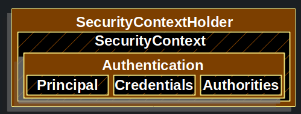
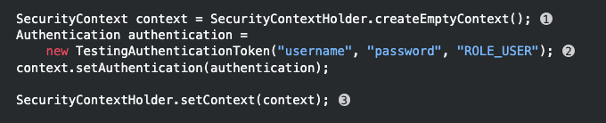
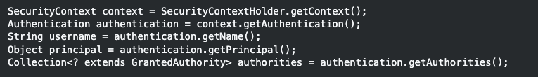
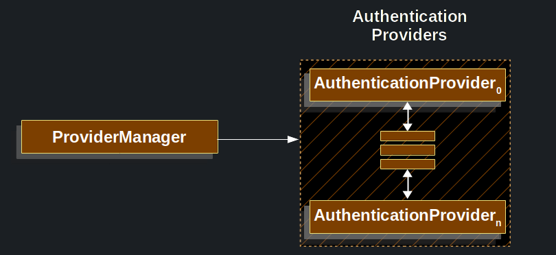
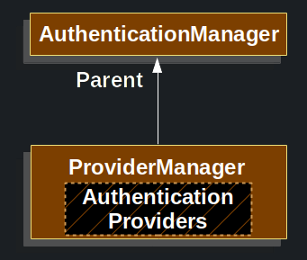
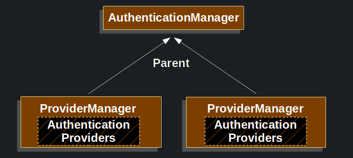
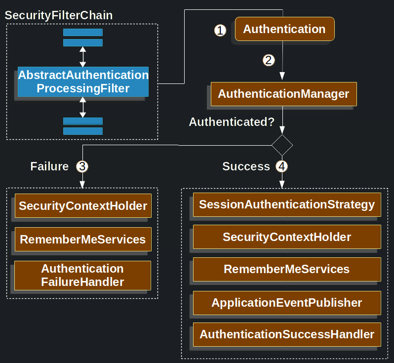

# Servlet Authentication Architecture

- **SecurityContextHolder** Kimin kimlik bilgilerinin dogrulandiginin ayrintilarinin saklandigi yerdir
- **SecurityContext** SecurityContextHolder'dan alinir ve su anda Authenticated olmus kullanicinin Authentication
bilgisini icerir
- **Authentication** AuthenticationManager iki farklı sekilde kullanilabilir

1 - Kullanıcının doğrulamak için sağladığı kimlik bilgileri:
Bu durumda, kullanıcı tarafından sağlanan kimlik bilgileri (örneğin kullanıcı adı ve şifre) AuthenticationManager'a 
iletilir ve bu bilgilerin doğruluğu kontrol edilir.

2 - SecurityContext'teki geçerli kullanıcı: Bu durumda, mevcut oturum açmış kullanıcının kimlik bilgileri 
AuthenticationManager tarafından SecurityContext'ten alınır. Bu şekilde, mevcut kullanıcının doğrulanması sağlanır.

- **GrantedAuthority** Bir Authentication'da sorumluya verilen yetki (i.e. roles,scopes, etc.)
- **AuthenticationManager** Spring Security Filter'larinin authentication'i nasil gerceklestirdigini tanimlayan API
- **ProviderManager** AuthenticationManager'in en yaygin implementasyonu
- **AuthenticationProvider** ProviderManager tarafindan belirlenen bir authentication tipini gerceklestirmek icin
kullanilir
- **Request Credentials with AuthenticationEntryPoint** Client'dan credentials(kimlik bilgileri)'lari istemek icin
kullanilir. (orn. bir login sayfasina yonlendirme, WWW-Authenticate response'u dondurme)
- **AbstractAuthenticationProcessingFilter** Authentication icin kullanilan base bir filter'dir. Ayni zamanda ust duzey
authentication akisi icin ve parcalarin birlikte nasil calistigi hakkinda bir fikir verir.

## SecurityContextHolder

Spring Security'nin Authentication modelinin merkezinde SecurityContextHolder bulunur. SecurityContextHolder, 
SecurityContext'i içerir.

SecurityContextHolder, SecurityContext tutmak ve paylaşmak için kullanılan bir araçtır. SecurityContext, 
Authentication ve yetkilendirme süreçlerinde kullanılan bilgileri içeren nesnelerin bir konteyneridir.
Authentication işlemi başarılı olduğunda, SecurityContext içinde oturum açmış kullanıcının kimlik bilgileri 
(Authenticated) ve yetkileri (GrantedAuthority) bulunur. SecurityContextHolder, bu SecurityContext'i güvenli bir 
şekilde depolar ve kullanılabilir hale getirir. Böylece, uygulama genelinde farklı bileşenler veya thread'ler arasında 
mevcut Authentication bilgilerinin paylaşılması sağlanır. SecurityContextHolder, SecurityContext'i statik bir şekilde 
yönetir ve başvurulan thread için mevcut SecurityContext'i sağlar.

SecurityContextHolder, Spring Security tarafından kimin doğrulandığına dair ayrıntıların depolandığı yerdir. 
Spring Security, SecurityContextHolder'ın nasıl doldurulduğunu önemsemez. Değer içeriyorsa, mevcut olarak doğrulanmış 
kullanıcı olarak kullanılır.Bu, farklı Authentication mekanizmalarını kullanmanıza veya SecurityContextHolder'ı 
manuel olarak doldurmanıza olanak sağlar. Örneğin, bir kullanıcının kimlik bilgilerini kullanıcı adı/parola tabanlı 
doğrulama veya bir dış kimlik sağlayıcı (OAuth, SAML vb.) ile doğrulama yaparak SecurityContextHolder'a 
yerleştirebilirsiniz. Spring Security, SecurityContextHolder içindeki değeri kullanarak mevcut kullanıcıyı belirler ve 
yetkilendirme süreçlerinde kullanır.

Bir kullanicinin kimliginin dogrulandigini gostermenin en basit yolu SecurityContextHolder'i dogrudan ayarlamaktir

1 - Bos bir SecurityContext olusturarak basliyoruz. MultipleThread'lerde race condition'dan kacinmak icin;

SecurityContextHolder.getContext().setAuthentication(authentication) kullanmak yerine yeni bir SecurityContext 
instance'i olusturmalisiniz

2 - Ardindan yeni bir Authentication object'i olusturuyoruz. Spring Security, SecurityContext'de ne tur bir 
Authentication implementasyonunun set edildigini umursamaz.Ornekte TestingAuthenticationToken kullaniyoruz cunku
cok basit. Daha yaygin olarak Production senaryolarinda;

UsernamePasswordAuthenticationToken(userDetails,password,Authority) seklindedir.

3 - Son olarak SecurityContextHolder'da SecurityContext'i set ediyoruz. SpringSecurity authorization icin bu bilgileri
kullanir

Kimligi dogrulanmis sorumlu hakkinda bilgi almak icin SecurityContextHolder'a erisin

ThreadLocal, bir iş parçacığı içindeki herhangi bir yöntem tarafından erişilebilen ve değeri her iş parçacığı için ayrı 
olarak saklanan bir tür değişkendir. Varsayilan olarak SecurityContextHolder bu ayrintilari depolamak icin bir 
ThreadLocal kullanir. Bu SecurityContext'in aynı methodlara bir bagimsiz degisken olarak acikca aktarilmasa 
bile SecurityContext'in her zaman ayni threadde'ki methodlar tarafından kullanilabilir oldugu anlamina gelir. 
Bu şekilde bir ThreadLocal kullanmak, geçerli principal'ın isteği işlendikten sonra thread'i boşaltmaya dikkat 
ederseniz oldukça güvenlidir. SpringSecurity'nin FilterChainProxy'si SecurityContext'in her zaman 
temizlenmesini saglar

FilterChainProxy : FilterChainProxy'nin temel amacı, gelen HTTP isteğini doğru sırayla işlemek için tanımlanan 
filtrelerin çalışmasını sağlamaktır. Spring Security'deki filtreler, güvenlik önlemlerini uygulamak, kullanıcı kimlik 
doğrulamasını gerçekleştirmek, yetkilendirme kontrollerini yapmak ve diğer güvenlik işlemlerini gerçekleştirmek 
için kullanılır.

Bazı uygulamalar, thread'lerle çalışma şekilleri nedeniyle ThreadLocal kullanmak için tamamen uygun değildir

Örneğin, bir Swing istemcisi bir Java Sanal Makinesindeki tüm thread'lerin aynı SecurityContext'i kullanmasını 
isteyebilir. SecurityContextHolder'ı, context'in nasıl saklanmasını istediğinizi belirtmek için başlangıçta bir 
strateji ile yapılandırabilirsiniz.

Bağımsız bir uygulama için **SecurityContextHolder.MODE_GLOBAL** stratejisini kullanırsınız. Diğer uygulamalar, 
secure thread tarafından ortaya çıkarılan thread'lerin de aynı güvenlik kimliğine sahip olmasını isteyebilir. Bunu
**SecurityContextHolder.MODE_INHERITABLETHREADLOCAL** kullanarak gerçekleştirebilirsiniz. Modu varsayılan 
**SecurityContextHolder.MODE_THREADLOCAL'den** iki şekilde değiştirebilirsiniz.

Birincisi bir system property ayarlamaktır. İkincisi ise SecurityContextHolder üzerinde statik bir yöntem çağırmaktır. 
Çoğu uygulamanın varsayılan değerden değişiklik yapması gerekmez. 

## SecurityContext

SecurityContext, Authentication bilgileri ve güvenlikle ilgili diğer detayları içeren bir nesnedir. SecurityContext,
bir kullanıcının Authentication durumunu temsil eder.

SecurityContextHolder üzerinden getCurrentContext() yöntemi çağrılarak mevcut SecurityContext alınır. 
Bu SecurityContext, içinde bulunulan iş parçacığına özgüdür ve aynı iş parçacığı içindeki diğer yöntemler tarafından 
erişilebilir hale gelir. SecurityContext içindeki en önemli nesne Authentication'dır. Authentication, kullanıcının 
kimliğini doğrulayan bilgileri taşır. Bu nesne, kullanıcının kimlik bilgilerini (principal), 
Authentication yöntemini (credentials), yetkileri (authorities) ve diğer ilgili bilgileri içerir. 
Authentication nesnesi, kullanıcının Authentication sonucunda oluşturulur ve SecurityContext içinde saklanır.

SecurityContext, SecurityContextHolder'dan alınır. Bir Authentication object'i icerir

## Authentication

Authentication Interface'i Spring Security icersinde ki iki ana amaca hizmet eder

An input to AuthenticationManager to provide the credentials a user has provided to authenticate. 
When used in this scenario, isAuthenticated() returns false.

Yukarida ki ifade;

- bir AuthenticationManager, kullanıcının sağladığı kimlik bilgilerini iletmek için bir giriş yapılması gerektiğini 
belirtiyor. Örneğin, bir kullanıcının kullanıcı adı ve şifresini doğrulamak için AuthenticationManager'a bilgi 
verilmelidir. "isAuthenticated()" yöntemi, bu senaryoda kullanıldığında ise yanıt olarak "false" değerini döndürür. 
Bu durumda, kullanıcının sağladığı kimlik bilgilerinin henüz doğrulanmadığını veya geçerli olmadığını gösterir.
- Su anda authenticate olmus kullaniciyi temsil eder. Gecerli Authentication'i SecurityContext'ten alabilirsiniz

Authentication sürecinde, bir kullanıcı Authentication başarıyla gerçekleştirdiğinde, Authenticated nesnesi 
oluşturulur ve bu doğrulanmış kullanıcıyı temsil eder. Bu nesne, kullanıcının kimlik bilgilerini 
(kullanıcı adı, roller, diğer ilgili ayrıntılar) içerir.

SecurityContext, belirli bir bağlamda (genellikle oturum veya istek) geçerli kullanıcı için güvenlikle ilgili bilgileri 
tutan bir mekanizmadır. SecurityContext, Authentication yapılan kullanıcının bilgilerini saklar.

Mevcut kimlik doğrulanmış kullanıcıyı elde etmek için SecurityContext'in Authentication nesnesini alabilirsiniz. 
Authentication nesnesi, kullanıcının kimlik bilgilerini, rollerini ve Authentication ile  ilişkili diğer ilgili 
verileri içerir. SecurityContext Authenticated nesnesine erişerek, şu anki kimliği doğrulanmış kullanıcının kimliğini 
ve diğer ayrıntılarını belirleyebilirsiniz.

Authentication şunları içerir;
- Principal, kullanıcının kimliğini temsil eden terimdir. Bir Authentication sürecinde, kullanıcının kimliğini 
belirlemek için bu terim kullanılır. Kullanıcı adı/şifreyle Authentication yapılıyorsa, "principal" terimi genellikle 
UserDetails türünden bir nesneye işaret eder. UserDetails , kullanıcının ayrıntılarını (username, password, roles, vs.) 
tutan bir interface'dir. Bu interface, Authentication sürecinde kullanıcıya ait bilgileri sağlar. 
Örneğin, kullanıcının kimlik bilgileri, rolleri, yetkileri gibi bilgiler "UserDetails" interface'ine ait özelliklerde
saklanır.

UserDetails interface'ine sahip bir sınıf, genellikle kullanıcı verilerini UserDetails nesnesi olarak döndüren bir 
UserDetailsService isimli class create edilerek kullanılır. Bu şekilde, kullanıcı bilgileri doğru bir şekilde 
alınabilir ve kimlik doğrulama ve yetkilendirme işlemleri için kullanılabilir. UserDetails arabirimi, kullanıcı 
bilgilerini sağlamak için gerekli metotları tanımlar ve Spring Security ile entegrasyonu kolaylaştırır. Kullanıcı adı, 
parola, roller ve yetkiler gibi kullanıcı bilgilerinin doğru şekilde temsil edilmesini sağlar.

- Credentials terimi, Authentication sürecinde kullanılan bilgileri temsil eder. Bu genellikle bir şifre olabilir. 
Kullanıcı Authentication yaparken şifresini sağlar ve bu şifre, kullanıcının kimlik doğrulanması için kullanılır.
Güvenlik açısından önemli bir adım, kullanıcının Authenticated olduktan sonra şifrenin silinmesidir. Bu, şifrenin 
gereksiz yere bellekte tutulmasını önlemek ve sızdırılma riskini en aza indirmek için yapılır. Şifre, Authenticated 
olduktan sonra hafızadan silinirse, bellek sızıntılarına veya yetkisiz erişime karşı daha güvenli bir durum 
sağlanır.

- Authorities : "GrantedAuthority" nesneleri, kullanıcıya verilen yüksek düzeyde yetkileri ifade eder. 
Bu yetkiler, genellikle roller (roles) veya kapsamlar (scopes) şeklinde olabilir. Rollere örnek olarak "ADMIN" veya 
"USER" gibi isimler verilebilir. Kapsamlar ise belirli bir işlev veya kaynağa erişimi temsil edebilir, 
örneğin "read", "write", "delete" gibi.

## GrantedAuthority 

Kullanıcıya verilen üst düzey izinlerdir. Roller ve kapsamlar.

Authentication bağlamında, "Authentication" nesnesi kullanıcının Authentication durumunu temsil eder ve 
kullanıcıyla ilgili bilgileri içerir, bunlar arasında verilen yetkiler de yer alır. 
Authentication.getAuthorities() metodu, bir Authentication nesnesi üzerinde çağrıldığında, kullanıcıyla 
ilişkilendirilmiş GrantedAuthority örneklerinin bir koleksiyonunu elde etmenizi sağlar.

Bir GrantedAuthority, genellikle bir role (rol) veya yetkiye (permission) atıfta bulunan bir nesnedir. 
Örneğin, "ADMIN" veya "USER" gibi roller GrantedAuthority örnekleri olabilir. Bu yetkiler, uygulamada principal'lara 
belirli eylemleri gerçekleştirme veya belirli kaynaklara erişme izni vermek amacıyla kullanılır. Bu roller daha sonra
Web Authorization, Method authorization ve domain object authorization yetkilendirmeleri icin yapilandirilirlar.

Spring security'nin diger bolumleri bu yetkilendirmeleri yorumlar ve hazir bulunmalarini bekler.

Kullanıcı adı/parola tabanlı Authentication sürecinde, kullanıcının kimlik bilgileri (kullanıcı adı ve parola) ile 
doğrulama yapılır. Authentication başarılı olduğunda, kullanıcının rolleri veya yetkileri gibi yüksek düzeydeki 
yetkilerin belirlenmesi gerekebilir. Bu rol veya yetkiler, kullanıcının uygulamadaki erişim haklarını belirler. 
UserDetailsService, kullanıcının kimlik bilgileriyle ilgili işlemleri gerçekleştiren bir hizmet sağlar. 
Bu hizmet, kullanıcı bilgilerini veritabanından veya başka bir kaynaktan alabilir. Kullanıcının yetkilerini belirlemek 
için UserDetailsService genellikle kullanıcıyı temsil eden bir UserDetails nesnesi döndürür.

Genellikle, GrantedAuthority nesneleri uygulama çapında izinlerdir. Belli bir domain object'ine özgü değillerdir.

Şöyle ki;

54 numaralı bir Employee nesnesine bir izni temsil etmek için GrantedAuthority'ye sahip olmanız pek olası değildir, 
çünkü binlerce benzer yetki varsa hızlı bir şekilde bellek tükenir (veya en azından uygulamanın bir kullanıcının kimlik 
doğrulamasını uzun süre almaya başlar). Bu ifade, GrantedAuthority'nin genellikle yüksek düzeyde yetkileri temsil etmek 
için kullanıldığını ve tek bir nesnenin özgün izinleri temsil etmek için GrantedAuthority'nin uygun olmadığını ifade 
eder. Örnekte belirtilen durumda, Employee (Çalışan) nesnesinin numarasına dayalı bir izni temsil etmek için 
GrantedAuthority kullanmak uygun bir yaklaşım değildir. Bu tür bir durumda, genellikle daha ince yetkilendirme veya 
erişim kontrol mekanizmaları kullanılır. Bu mekanizmalar, belirli bir kaynağa veya nesneye yönelik izinleri daha 
ayrıntılı bir şekilde temsil etmeye ve yönetmeye olanak sağlar. Örneğin, veritabanı tabanlı izin sistemi veya özel bir 
yetkilendirme yönetim çözümü kullanılabilir.

Proje içindeki domain object'leri, genellikle veritabanında veya başka bir depolama mekanizmasında temsil edilen iş 
mantığı nesneleridir. Örneğin, bir Çalışan (Employee) veya bir Müşteri (Customer) gibi. Bu nesneler üzerindeki 
yetkilendirme gereksinimlerinizi doğrudan Spring Security ile ele almak yerine, Spring Security'nin sağladığı 
Domain Object güvenlik yeteneklerini kullanarak daha uygun bir yaklaşım elde edebilirsiniz.

## AuthenticationManager

Spring Security'nin Authentication sürecini yönetmek için kullanılan AuthenticationManager, güvenlik filtrelerinin 
Authentication taleplerini işlemesini sağlar. Authentication, kullanıcının kimlik 
bilgilerinin (kullanıcı adı, parola vb.) doğrulanması ve kullanıcının yetkilendirilmesi işlemini içerir

AuthenticationManager, genellikle Spring Security konfigürasyonunda tanımlanır ve kimlik doğrulama sağlamak için 
kullanılan bir veya daha fazla kimlik doğrulama sağlayıcısını (AuthenticationProvider) yönetir. 
Kimlik doğrulama sağlayıcıları, farklı kimlik doğrulama mekanizmalarını (kullanıcı adı/parola tabanlı, OAuth, SAML vb.) 
uygulayan bileşenlerdir.

Kimlik doğrulama süreci, güvenlik filtrelerinin AuthenticationManager üzerinden kimlik doğrulama isteklerini alması ve 
AuthenticationManager tarafından belirli bir kimlik doğrulama sağlayıcısına iletilmesiyle gerçekleşir. Kimlik doğrulama 
sağlayıcısı, gelen kimlik doğrulama isteğini işleyerek kullanıcının kimliğini doğrular ve bir Authentication nesnesi 
oluşturur. Bu oluşturulan Authentication nesnesi, AuthenticationManager tarafından filtreler arasında iletilir ve 
kimlik doğrulama süreci tamamlanır.

AuthenticationManager, Authentication sürecini yönetir ve sonuç olarak bir Authentication nesnesi döndürür. 
Bu Authentication nesnesi, kullanıcının kimlik doğrulama durumunu temsil eder. Kimlik doğrulama sürecinin 
tamamlanmasının ardından, AuthenticationManager tarafından oluşturulan ve döndürülen bu Authentication nesnesi, 
doğrulama işlemini gerçekleştiren controller (örneğin, Spring Security filtrelerinin biri) tarafından 
SecurityContextHolder üzerinde ayarlanır.

Spring Security'ye ait filtre örnekleriyle entegrasyon yapmıyorsanız, SecurityContextHolder'ı doğrudan ayarlayabilir
ve AuthenticationManager kullanmayabilirsiniz.Spring Security, genellikle filtreler kullanarak kimlik doğrulama ve 
yetkilendirme işlemlerini gerçekleştirir. Bu durumda, AuthenticationManager aracılığıyla kimlik doğrulama işlemini 
yönetmek önemlidir. Ancak, bazı durumlarda doğrudan SecurityContextHolder üzerinde ayarlamalar yapmak isteyebilirsiniz.

Örneğin, özel bir yetkilendirme mekanizması kullanıyorsanız ve kimlik doğrulama işlemini kendi kodunuzda 
gerçekleştiriyorsanız, Authentication nesnesini oluşturabilir ve doğrudan SecurityContextHolder üzerinde 
ayarlayabilirsiniz. Bu şekilde, mevcut kimlik doğrulama durumunu SecurityContextHolder üzerinde güncelleyebilir ve 
diğer bileşenlerin bu duruma erişmesini sağlayabilirsiniz.

Spring Security'nin sunduğu mekanizmaların sağladığı güvenlik katmanlarının doğru bir şekilde uygulanmasını sağlamak 
önemlidir. Özellikle, güvenlik açıklarını önlemek ve kimlik doğrulama işlemlerini güvenli bir şekilde gerçekleştirmek 
için dikkatli olmanız gerekmektedir.

ProviderManager, AuthenticationManager arayüzünü uygulayan bir sınıftır ve genellikle Spring Security'nin temel kimlik 
doğrulama mekanizması olarak kullanılır. ProviderManager, birden çok kimlik doğrulama sağlayıcısını yönetir ve kimlik 
doğrulama isteğini bu sağlayıcılara yönlendirir. ProviderManager, AuthenticationManager arayüzünün genel bir 
uygulamasını sağlar ve çeşitli kimlik doğrulama sağlayıcılarını destekler. Örneğin, kullanıcı adı/parola tabanlı kimlik 
doğrulama sağlayıcısı, OAuth tabanlı kimlik doğrulama sağlayıcısı veya SAML tabanlı kimlik doğrulama sağlayıcısı gibi 
farklı sağlayıcıları bir arada kullanmanıza olanak tanır.

## ProviderManager

ProviderManager, AuthenticationManager'in en sık kullanılan implementasyonudur

ProviderManager sınıfı, AuthenticationProvider interface'ini uygulayan birden fazla kimlik doğrulama sağlayıcısını 
yönetir.Bu sağlayıcılar, farklı kimlik doğrulama mekanizmalarını uygulayan ve kullanıcının kimlik doğrulama bilgilerini 
doğrulayan bileşenlerdir.

ProviderManager'in kurucu yöntemi, bir AuthenticationProvider listesi alır ve bu listeyi içerisinde depolar. 
Kimlik doğrulama isteği aldığında, ProviderManager, depolanan AuthenticationProvider örneklerini sırayla kontrol eder. 
Her bir sağlayıcıya kimlik doğrulama isteği iletilir ve sağlayıcının belirli bir kimlik doğrulama mekanizmasını 
uygulaması beklenir. İlk başarılı kimlik doğrulama sağlayıcısından gelen Authentication nesnesi, ProviderManager 
tarafından döndürülür.

Bu yapı, farklı kimlik doğrulama mekanizmalarını desteklemek ve esnek bir kimlik doğrulama süreci sağlamak için 
kullanılır. Örneğin, kullanıcı adı/parola tabanlı kimlik doğrulama sağlayıcısı, OAuth tabanlı kimlik doğrulama 
sağlayıcısı ve SAML tabanlı kimlik doğrulama sağlayıcısı gibi farklı sağlayıcıları bir arada kullanmanızı sağlar.

Bir AuthenticationProvider, kimlik doğrulamanın başarılı olduğunu belirtmek için Authentication nesnesini günceller ve 
bu nesneyi döndürür. Böylece, kimlik doğrulama sürecinin başarılı bir şekilde tamamlandığı ve kullanıcının 
yetkilendirileceği belirtilir.

Bir AuthenticationProvider, kimlik doğrulamanın başarısız olduğunu belirtmek için bir ProviderNotFound exception 
fırlatır veya Authentication nesnesinin başarısızlık durumunu günceller ve bu nesneyi döndürür. Böylece, kimlik 
doğrulama sürecinin başarısız olduğu ve kullanıcının yetkilendirilemeyeceği belirtilir.

Bir AuthenticationProvider, karar veremediği durumlarda, Authentication nesnesini değiştirmeden null veya boş bir değer 
döndürerek kararı downstream bir AuthenticationProvider'a bırakabilir. Böylece, diğer AuthenticationProvider'ların 
kimlik doğrulama sürecine devam etmesine izin verilir ve bir sonraki sağlayıcı, kimlik doğrulama kararını verebilir.

Bu yaklaşım, birden çok AuthenticationProvider'ın zincirleme olarak çalışabilmesini sağlar. Her sağlayıcı, 
kimlik doğrulama kararını belirlemek için kendi doğrulama stratejisini uygular ve gerektiğinde bir sonraki sağlayıcıya 
kararı bırakabilir. Bu sayede, farklı kimlik doğrulama mekanizmalarını bir arada kullanarak esnek bir kimlik doğrulama 
süreci oluşturulabilir.

Uygulamada, her AuthenticationProvider belirli bir kimlik doğrulama türünü gerçekleştirmek için bilgi sahibidir.

AuthenticationProvider'lar, farklı kimlik doğrulama mekanizmalarını veya kaynaklarını yönetmek için tasarlanmıştır. 
Kullanıcı adı/parola kimlik doğrulaması, token tabanlı kimlik doğrulaması veya sosyal medya kimlik doğrulaması gibi 
farklı kimlik doğrulama türlerini işlemek üzere tasarlanmıştır.

Farklı AuthenticationProvider'lar sayesinde, Spring Security kimlik doğrulama sürecinde modülerlik ve 
genişletilebilirlik sağlar. Her AuthenticationProvider, belirli bir kimlik doğrulama türüne odaklanır ve o türe özgü 
kimlik doğrulama bilgilerini veya token'ları doğrulamak için gerekli mantığı uygular.

Kimlik doğrulama süreci sırasında Spring Security, kullanılan kimlik doğrulama mekanizmasına bağlı olarak ilgili 
AuthenticationProvider'a kimlik doğrulama isteğini devreder. Seçilen AuthenticationProvider, kendi özel mantığına göre 
kimlik doğrulamasını gerçekleştirir ve başarılı bir şekilde kimlik doğrulandığında doğrulanmış bir Authentication 
nesnesini döndürür.

Bu, her AuthenticationProvider'ın çok özel bir kimlik doğrulama türü gerçekleştirmesine izin verirken, birden fazla 
kimlik doğrulama türünü desteklemesini ve yalnızca tek bir AuthenticationManager bean'ini sunmasını sağlar.

Birden çok AuthenticationProvider'ı içeren bir AuthenticationManager bean'ı yapılandırılarak, farklı kimlik doğrulama 
mekanizmalarını destekleyebilirsiniz. Her AuthenticationProvider, kendi kimlik doğrulama türüne özgü mantığı uygular ve 
yalnızca ilgili kimlik doğrulama mekanizması için sorumludur.

ProviderManager, kimlik doğrulama işlemini gerçekleştirebilecek bir AuthenticationProvider bulunamadığında danışılacak 
isteğe bağlı bir üst AuthenticationManager'ı yapılandırmaya da izin verir. Bu yapı, bir hiyerarşik kimlik doğrulama 
yaklaşımını destekler. AuthenticationManager zinciri içinde, alt seviyedeki ProviderManager'lar 
AuthenticationProvider'ları yönetirken, üst seviyedeki AuthenticationManager, çeşitli alternatif kimlik doğrulama 
stratejilerini veya işlemlerini sağlar. Bu sayede, bir AuthenticationProvider'ın kimlik doğrulama işlemini 
gerçekleştiremediği durumlarda, üst AuthenticationManager'da tanımlanan bir başka kimlik doğrulama yöntemi veya 
işlemi denenebilir. Üst öğe herhangi bir AuthenticationManager türü olabilir, ancak genellikle bir ProviderManager
örneğidir.

Örneğin, farklı kimlik doğrulama senaryoları veya farklı güvenlik bölgeleri için ayrı ProviderManager örneklerine 
ihtiyaç duyabilirsiniz. Her ProviderManager, kendi AuthenticationProvider'larını yönetir ve belirli bir kimlik 
doğrulama türüne odaklanır. Ancak, bu ProviderManager'lar aynı üst AuthenticationManager'ı paylaşabilir. Bu durumda, 
üst AuthenticationManager, tüm ProviderManager'lar tarafından kullanılan ortak kimlik doğrulama mantığını ve 
yapılandırmayı sağlar.

Örneğin, uygulamanızda farklı güvenlik bölgeleri veya yolları olabilir ve bu farklı bölgelerde veya yollarda farklı 
kimlik doğrulama mekanizmalarını kullanmak isteyebilirsiniz. Ancak, bazı ortak kimlik doğrulama işlemleri de 
paylaşılabilir. Bu durumda, farklı SecurityFilterChain örnekleri oluşturarak farklı kimlik doğrulama mekanizmalarını 
yapılandırabilirsiniz. Ancak bu SecurityFilterChain örnekleri, aynı üst AuthenticationManager'ı paylaşır.

Bu yapı, uygulamanızda birden fazla güvenlik bölgesi veya yolunun yönetilmesi gerektiği senaryolarda kullanışlı 
olabilir. Her bir SecurityFilterChain, kendi kimlik doğrulama mekanizmalarını yönetirken, aynı zamanda ortak kimlik 
doğrulama işlemlerini üst AuthenticationManager üzerinden gerçekleştirebilir.

SecurityFilterChain : Spring Security'nin bir parçası olan ve güvenlik filtrelerinin sırasını ve yapılandırmasını 
belirlemek için kullanılan bir yapıdır. Spring Security, gelen istekleri işlemek ve güvenlik kontrollerini uygulamak 
için birden fazla güvenlik filtresi kullanır. Bu güvenlik filtreleri, kimlik doğrulama, yetkilendirme, oturum yönetimi 
gibi çeşitli güvenlik kontrollerini gerçekleştirir.

Kimlik doğrulama işlemi genellikle kullanıcı adı ve parola gibi hassas kimlik bilgileriyle gerçekleştirilir. 
ProviderManager, bu hassas bilgilerin güvenliğini korumak için Authentication nesnesini temizler veya siler. Bu, 
Authentication nesnesinin içerisindeki hassas bilgilerin sızmasını veya yanlış ellere geçmesini engellemeye 
yardımcı olur. Temizlenen kimlik bilgileri, bellekte veya diğer geçici depolama alanlarında mümkün olduğunca az süreyle 
tutulur ve ardından silinir. Bu, güvenlik açısından önemlidir, çünkü kimlik bilgilerinin korunması, yetkisiz erişime 
karşı savunma sağlar. Bu tip bilgilerin HttpSession'da gerekenden daha uzun süre tutulmasını önler

Stateless uygulamalarda, her bir istek bağımsızdır ve kimlik doğrulama bilgilerini sürekli olarak doğrulama sunucusuna 
göndermek gerekmeyebilir. Bu tür uygulamalarda, kullanıcı nesneleri genellikle bir önbellekte saklanır ve kimlik 
doğrulama işlemi sırasında kullanıcı bilgileri önbellekten alınır. Bu, performansı artırabilir ve kimlik doğrulama 
sunucusuna gereksiz istek trafiği oluşmadan kullanıcı bilgilerinin elde edilmesini sağlar. Ancak, ProviderManager 
tarafından yapılan varsayılan davranış, başarılı bir kimlik doğrulama isteği sonrasında Authentication nesnesindeki 
hassas kimlik bilgilerini temizlemeyi içerir. Bu durumda, kullanıcı nesnelerinin önbelleğindeki Authentication 
nesnesi de etkilenir ve hassas kimlik bilgileri temizlendikten sonra bu bilgilere erişilemez hale gelir.Bu durum, 
Stateless bir uygulamada kullanıcı nesnelerinin önbelleğini kullandığınızda sorunlara yol açabilir. Çünkü kimlik 
bilgilerine tekrar erişim gerektiğinde, bu bilgilerin tekrar doğrulama sunucusundan alınması veya farklı bir yöntem 
kullanılması gerekebilir. Bu, performansı etkileyebilir ve gereksiz istek trafiğine neden olabilir. Bu durumu yönetmek 
için, önbellekteki kullanıcı nesnelerinin kimlik bilgilerinin güvenli bir şekilde saklandığından emin olmanız ve 
ProviderManager'ın hassas kimlik bilgilerini temizlemesini engellemek veya kontrol etmek için gerekli önlemleri 
almanız gerekebilir.

Eğer Authentication, önbellekteki bir nesneye (örneğin UserDetails örneği) referans içeriyorsa ve bu nesnenin 
kimlik bilgileri kaldırılırsa, önbelleğe alınan değer üzerinde kimlik doğrulama yapılamaz hale gelir. ProviderManager 
gibi AuthenticationManager'ın varsayılan davranışı, Authentication nesnesindeki kimlik bilgilerini temizlemektir. 
Bu, güvenlik amacıyla hassas bilgilerin korunmasına yardımcı olur. Ancak, bu aynı zamanda, Authentication nesnesinin, 
önbellekteki nesneye olan referansını etkileyebilir. Bu durumu yönetmek için, önbellekte tutulan nesnenin kimlik 
bilgilerinin güncel ve doğru olmasını sağlamalı ve kimlik bilgileri temizlendikten sonra gerektiğinde bu bilgilere 
yeniden erişim sağlayabilmelisiniz. Böylece, Authentication nesnesi önbellekteki nesneye doğru şekilde referans 
gösterebilir ve kimlik doğrulama süreci sorunsuz bir şekilde gerçekleştirilebilir. Önbellek kullanıyorsanız bunu
dikkate almanız gerekir.

Bu durumu yönetmek için, öncelikle önbellekteki nesnenin bir kopyasının yapılması önerilir. Bu kopya, döndürülen 
Authentication nesnesini oluşturan AuthenticationProvider tarafından yapılabilir. Böylece, Authentication nesnesi 
önbelleğe alınan nesne yerine kopyasına referans gösterir ve kimlik doğrulama sonrasında yapılan değişiklikler 
önbelleğe alınan nesneyi etkilemez. Bu yaklaşım, önbellekteki nesnenin orijinal halini korurken, kimlik doğrulama 
işlemi sırasında gerekli temizlik işlemlerinin yapılmasını sağlar. Böylece, önbellekteki nesne, güncel ve doğru kimlik 
bilgilerini içermeye devam eder ve Authentication nesnesi de doğru referansı gösterebilir. Alternatif olarak da
ProviderManager'da eraseCredentialsAfterAuthentication özelliğini devre dışı bırakabilirsiniz.

## AuthenticationProvider

Birden fazla AuthenticationProvider instance'ini ProviderManager'a inject edebilirsiniz. Her AuthenticationProvider
belirli bir authentication doğrulama türü gerçekleştirir.Örneğin DAOAuthenticationProvider username/password tabanlı
doğrulamayı desteklerken, JwtAuthenticationProvider bir JWT token ile authentication'i destekler.

**DaoAuthenticationProvider**, kullanıcı adı ve parola ile kimlik doğrulama yapmayı sağlar. Genellikle kullanıcıların 
sağladığı kullanıcı adı ve parola bilgilerini kullanarak kimlik doğrulama yapmak için kullanılır. Örneğin, kullanıcının 
bir veritabanındaki kullanıcı tablosunda kayıtlı olduğu ve bu bilgilerin doğruluğunun kontrol edilmesi gerektiği 
durumlarda kullanılır.

**JwtAuthenticationProvider** ise JWT tabanlı kimlik doğrulama yapmayı destekler. JWT, JSON Web Token'ın kısaltmasıdır 
ve yaygın olarak kullanılan bir kimlik doğrulama mekanizmasıdır. Bu mekanizmada, kullanıcılar tarafından sağlanan token 
bilgisi kullanılarak kimlik doğrulama yapılır. JwtAuthenticationProvider, JWT token'ın geçerliliğini doğrulayarak, 
içindeki bilgileri kullanarak kimlik doğrulama işlemini gerçekleştirir. Bu genellikle stateless (durumsuz) 
uygulamalarda kullanılan bir kimlik doğrulama yöntemidir.

## Request Credentials with AuthenticationEntryPoint

AuthenticationEntryPoint bir client'dan kimlik bilgilerini isteyen bir HTTP response'u göndermek için kullanılır

AuthenticationEntryPoint, genellikle 401 Unauthorized HTTP durum koduyla birlikte bir kimlik doğrulama talebi mesajı 
içeren bir response üretir. Bu response, istemcinin kimlik bilgilerini sağlaması gerektiğini belirtir. İstemci, 
bu kimlik bilgilerini sağladığında, yeniden kimlik doğrulama işlemi gerçekleştirilir ve istemciye yetkilendirilmiş 
erişim sağlanır.

AuthenticationEntryPoint, Spring Security'de bir bileşendir ve bir istemcinin yetkilendirme gerektiren bir kaynağa 
erişmeye çalıştığında, yetkilendirme olmadığında veya yetkilendirme başarısız olduğunda nasıl davranılacağını belirler.
"Request Credentials with AuthenticationEntryPoint" ifadesi ise, istemcinin yetkilendirme gerektiren bir kaynağa erişim 
sağlamak için kimlik bilgilerini sağlaması gerektiği durumu ifade eder. Normalde, bir istemci yetkilendirme gerektiren 
bir kaynağa erişmeye çalıştığında, AuthenticationEntryPoint devreye girer. Bu noktada, AuthenticationEntryPoint, 
istemciye kimlik bilgilerini sağlaması için bir istek yapmasını gerektirir. Örneğin, bir tarayıcı tabanlı uygulamada, 
AuthenticationEntryPoint, bir kimlik doğrulama formu veya kimlik bilgilerinin istendiği bir diyalog kutusu gibi bir 
mekanizma sağlayabilir. İstemci bu kimlik bilgilerini sağladığında, AuthenticationEntryPoint, kimlik doğrulama işlemini 
gerçekleştirir ve kaynağa erişim izni sağlar.

Bazen istemci, BasicAuthentication kullanarak kimlik bilgilerini "Authorization" header'inda veya JWT gibi 
Token Authentication kullanarak "Authorization" header'inda bir belirteç sağlayarak request'e dahil edebilir. 
Kimlik bilgilerini request'e dahil ederek, istemci, zaten kimlik doğrulanmış ve istenen kaynağa erişmek için 
yetkilendirilmiş olduğunu belirtir. Bu durumlarda SpringSecurity'nin client'dan kimlik bilgilerini isteyen bir
HTTP response'u sağlamasına gerek yoktur. 

Diğer durumda client erişim yetkisi olmayan bir kaynağa not authorized olarak request'de bulunur. Bu durumda client'dan
kimlik bilgilerini istemek için bir AuthenticationEntryPoint implementasyonu kullanılır

AuthenticationEntryPoint bir login sayfasına yönlendirme gerçekleştirebilir ya da bir WWW-Authenticate header'i ile
yanıt verebilir veya başka bir işlem gerçekleştirebilir.

## AbstractAuthenticationProcessingFilter

AbstractAuthenticationProcessingFilter, kullanıcının kimlik bilgilerini doğrulamak için kullanılan bir temel filtre 
olarak görev yapar. Bu filtre, kimlik bilgilerini doğrulamadan önce AuthenticationEntryPoint kullanarak kimlik 
bilgilerini talep eder. Bu sayede, kullanıcının kimlik bilgileri doğrulanmadan önce gerekli kimlik bilgilerini 
sağlaması sağlanır. Ardından, AbstractAuthenticationProcessingFilter kendisine gönderilen herhangi bir kimlik doğrulama 
isteğinin kimliğini doğrulayabilir.

AbstractAuthenticationProcessingFilter :  genellikle kullanıcı tarafından sağlanan kimlik bilgilerini 
(kullanıcı adı ve şifre gibi) almak için POST veya PUT gibi HTTP isteklerini dinler. Bu isteklerdeki kimlik bilgilerini 
kullanarak bir Authentication nesnesi oluşturur ve bu nesneyi AuthenticationManager'a gönderir. AuthenticationManager, 
Authentication nesnesini alır ve kimlik doğrulama işlemini gerçekleştirir. Bunun sonucunda başarılı bir kimlik 
doğrulama gerçekleşirse, Authentication nesnesine gerekli yetkilendirmeler ve diğer bilgiler eklenir. Başarısız bir 
kimlik doğrulama durumunda ise hata bilgileri Authentication nesnesine eklenir. AbstractAuthenticationProcessingFilter, 
Authentication nesnesinin başarılı veya başarısız olduğu durumları ele almak için AuthenticationSuccessHandler ve 
AuthenticationFailureHandler ile birlikte çalışır. Kimlik doğrulama başarılıysa AuthenticationSuccessHandler tetiklenir 
ve gerekli işlemler yapılır. Kimlik doğrulama başarısızsa ise AuthenticationFailureHandler devreye girer ve hata işleme 
sürecini yönetir.

AuthenticationEntryPoint : istemciye kimlik doğrulama gerektiren bir istek yaptığını bildiren bir HTTP yanıt döndürür. 
Bu yanıt, istemcinin kimlik bilgilerini sağlamasını veya yetkilendirme sürecini başlatmasını isteyebilir. 
AuthenticationEntryPoint'in temel amacı, yetkisiz erişim durumunda istemciye uygun bir tepki vermek ve kimlik doğrulama 
sürecini başlatmaktır. Örneğin, bir AuthenticationEntryPoint uygulaması, kullanıcıyı oturum açma sayfasına 
yönlendirebilir, bir 401 Unauthorized yanıtıyla birlikte kimlik doğrulama bilgilerini talep edebilir veya bir 
WWW-Authenticate başlığı ekleyerek kimlik doğrulama yöntemlerini belirtebilir.

1 - Kullanıcı kimlik bilgilerini gönderdiğinde, AbstractAuthenticationProcessingFilter, doğrulama işlemi için 
HttpServletRequest üzerinden bir Authentication nesnesi oluşturur. Bu işlemde, AbstractAuthenticationProcessingFilter, 
HttpServletRequest üzerinden gelen bilgileri kullanarak kimlik doğrulama için gerekli olan Authentication nesnesini 
oluşturur. Bu nesne, kullanıcının kimlik bilgilerini (kullanıcı adı, şifre vb.) ve kimlik doğrulama süreciyle ilgili 
diğer ilgili bilgileri içerir. "AbstractAuthenticationProcessingFilter" alt sınıfı, kimlik doğrulama sürecinin spesifik 
bir uygulamasını içerir ve farklı bir Authentication nesnesi türü oluşturabilir. Kullanıcı, giriş isteğiyle birlikte 
kimlik bilgilerini (kullanıcı adı ve şifre) sunar. UsernamePasswordAuthenticationFilter, HttpServletRequest'ten bu 
kimlik bilgilerini alır ve bunları kullanarak UsernamePasswordAuthenticationToken oluşturur. Bu işlem, kullanıcının 
kimlik bilgilerini sunucuya iletmek ve kimlik doğrulama sürecini başlatmak için kullanılır. Oluşturulan 
UsernamePasswordAuthenticationToken daha sonra AuthenticationManager tarafından işlenerek kullanıcının kimlik 
doğrulaması gerçekleştirilir.

UsernamePasswordAuthenticationToken : kullanıcının kimlik bilgilerini temsil eden bir Authentication nesnesidir. 
Genellikle kullanıcı adı, parola ve yetkileri içerir. Bu token, kimlik doğrulama işlemlerinde kullanılmak üzere 
AuthenticationManager'a iletilir. UsernamePasswordAuthenticationToken, kimlik doğrulama sürecinde oluşturulurken 
kullanıcı tarafından sağlanan kimlik bilgileriyle doldurulur. Bu token, AuthenticationProvider'lar tarafından işlenerek 
kimlik doğrulaması yapılır ve sonucunda kullanıcının yetkilendirme durumu belirlenir.

2 - Authentication nesnesi daha sonra kimlik doğrulaması için AuthenticationManager'a iletilir.

3 - Kimlik doğrulama sürecinde, sağlanan kimlik bilgileri veya doğrulama bilgileri geçerli değil veya beklenen 
kriterlere uymuyorsa, kimlik doğrulama başarısız olur.

- SecurityContextHolder temizlenir
- RememberMeServices.loginFail çağrılır. Eğer "Remember Me" özelliği yapılandırılmamışsa, bu bir işlem yapmaz.
- AuthenticationFailureHandler, genellikle kimlik doğrulama başarısız olduğunda alınacak aksiyonları yönetmek için 
kullanılır. 
- Örneğin, başarısızlık durumunda kullanıcıyı belirli bir hata sayfasına yönlendirebilir, hata mesajını 
döndürebilir veya özel bir işlem gerçekleştirebilir. AuthenticationFailureHandler, Spring Security tarafından sağlanan 
bir arayüzdür ve uygulama tarafından özelleştirilebilir. Uygulama, AuthenticationFailureHandler'ı kendi ihtiyaçlarına 
göre uyarlayabilir ve kimlik doğrulama başarısızlık durumunda yapılacak işlemleri belirleyebilir.

AuthenticationFailureHandler : kimlik doğrulama işlemi başarısız olduğunda çağrılan bir yönteme sahip bir nesnedir. 
Bu yöntem, kullanıcıya yönlendirme yapma, hata mesajı gösterme veya özel işlemler gerçekleştirme gibi farklı işlemleri 
gerçekleştirebilir.

public class CustomAuthenticationFailureHandler implements AuthenticationFailureHandler {
    @Override
    public void onAuthenticationFailure(HttpServletRequest request, HttpServletResponse response,AuthenticationException 
             exception) throws IOException, ServletException {
        // Kimlik doğrulama başarısız olduğunda yapılacak işlemler burada tanımlanır
        // Örneğin, kullanıcıya hata mesajı gösterme veya yönlendirme yapma gibi işlemler yapılabilir
    }
}

4 - Başarılı kimlik doğrulama durumunda, Spring Security tarafından farklı aksiyonlar alınabilir. Örneğin, kullanıcı 
oturum açtıktan sonra yönlendirileceği sayfaya yönlendirme yapılabilir, belirli bir işlem gerçekleştirilebilir veya 
kullanıcıya bir mesaj gösterilebilir.

- SessionAuthenticationStrategy, Spring Security tarafından kullanılan bir stratejidir ve oturum yönetimi ile ilgili 
işlemleri gerçekleştirir. Yeni bir oturum açma durumunda, yani kullanıcı başarılı bir şekilde kimlik doğrulandığında, 
SessionAuthenticationStrategy bilgilendirilir.

Bazı yaygın SessionAuthenticationStrategy uygulamaları şunlardır:

1 - ChangeSessionIdAuthenticationStrategy: Kimlik doğrulaması başarılı olduğunda, oturum kimliğini değiştirerek 
oturumun yeniden oluşturulmasını sağlar. Bu, oturum kimliğinin güvenliğini artırır.

2 - CompositeSessionAuthenticationStrategy: Birden fazla SessionAuthenticationStrategy bileşenini birleştirir ve 
birleşik bir strateji olarak kullanılmasını sağlar.

3 - RegisterSessionAuthenticationStrategy: Kimlik doğrulaması başarılı olduğunda, kullanıcının oturumunu kaydetmek için 
oturum kimliği kaydediciye kaydeder.

Bu stratejiler, oturum yönetimi ve kimlik doğrulama sürecinin istenen davranışını sağlamak için kullanılabilir. 
Farklı uygulamalar ve gereksinimler için farklı SessionAuthenticationStrategy stratejileri tercih edilebilir.

- Authentication, SecurityContextHolder'da set edilir. SecurityContextRepository interface'i bir kullanıcının 
oturumuyla ilişkili SecurityContext'in yüklenmesi ve kaydedilmesi işlemlerini gerçekleştirir. Bir kullanıcının 
kimliği doğrulandığında, SecurityContext genellikle SecurityContextHolder'a ayarlanır ve kullanıcının oturumu boyunca 
kullanılabilir durumdadır. Bununla birlikte, SecurityContext'in gelecekteki isteklerde otomatik olarak ayarlanabilmesi 
için, SecurityContextRepository#saveContext yöntemini açıkça çağırmak gerekmektedir. Bu yöntem, SecurityContext'i 
geçerli kullanıcının oturumuyla ilişkili bir depolama mekanizmasına kaydetmek için kullanılır.

SecurityContextHolderFilter, bir HTTP isteği geldiğinde SecurityContextHolder üzerindeki SecurityContext'i ayarlar ve 
isteği işlerken SecurityContext'i geçerli tutar. Daha sonra, istek tamamlandığında SecurityContext'i temizler.

- RememberMeServices.loginSuccess cagirilir. RememberMe yapilandırılmadı ise bu işlem yapılmaz.

RememberMeServices.loginSuccess metodu, oturum açma işlemi tamamlandığında çağrılır ve Remember-Me işlemlerini 
gerçekleştirir. Bu işlemler genellikle kullanıcının kimlik bilgilerini hatırlama (remember-me) seçeneğini 
işaretlemesine dayanır. Eğer kullanıcı hatırlama seçeneğini işaretlemişse, RememberMeServices.loginSuccess metodu 
kullanıcının kimlik bilgilerini hatırlama için gerekli işlemleri gerçekleştirir.

- ApplicationEventPublisher, bir InteractiveAuthenticationSuccessEvent yayinlar.

ApplicationEventPublisher, Spring Framework tarafından sağlanan bir arabirimdir ve olayları yayınlamak için kullanılır. 
InteractiveAuthenticationSuccessEvent ise Spring Security tarafından sağlanan bir olaydır. 

InteractiveAuthenticationSuccessEvent, bir kullanıcının etkileşimli olarak (yani kullanıcı adı ve parolayla) oturum 
açma işleminin başarıyla tamamlandığını temsil eder. Bu olay, oturum açma işlemi tamamlandığında yayınlanır ve ilgili 
dinleyicilere bilgi verir.

ApplicationEventPublisher.publishEvent metodu kullanılarak InteractiveAuthenticationSuccessEvent olayı yayınlanır. 
Bu sayede, ilgili olay dinleyicileri (event listeners) oturum açma işleminin başarıyla tamamlandığı hakkında 
bilgilendirilebilir. Dinleyiciler, bu olayı yakalayarak belirli işlemler gerçekleştirebilir, örneğin kullanıcıya 
hoş geldin mesajı gönderme, günlük kayıtları tutma veya kullanıcı aktivitesini izleme gibi işlemler yapabilir.

ApplicationEventPublisher.publishEvent metodu, yayınlamak istediğimiz olay nesnesini parametre olarak alır. 
InteractiveAuthenticationSuccessEvent, oturum açma işleminin başarıyla tamamlandığını temsil eden bir nesnedir. 
Bu metod çağrıldığında, ilgili dinleyiciler bu olayı dinlemek için kayıtlıysa onlara bildirim gönderilir.

- AuthenticationSuccessHandler cagirilir.

AuthenticationSuccessHandler, oturum açma işlemi başarılı olduğunda gerçekleştirilecek işlemleri yönetmek için 
kullanılan bir arabirimdir. Bu sayede, oturum açma işlemi başarıyla tamamlandığında özel davranışlar uygulayabilir ve 
isteğe bağlı olarak kullanıcıyı yönlendirebilir, mesaj gösterebilir veya diğer özel işlemleri gerçekleştirebilirsiniz.