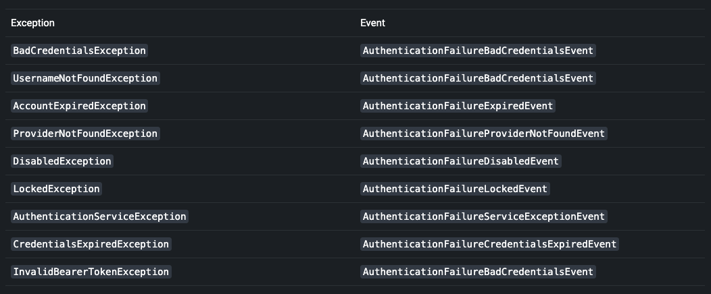

# Authentication Events

Başarılı olan veya başarısız olan her kimlik doğrulama için sırasıyla bir AuthenticationSuccessEvent veya
AuthenticationFailureEvent tetiklenir. Bu olayları dinlemek için önce bir AuthenticationEventPublisher yayınlamanız
gerekir. Spring Security'nin DefaultAuthenticationEventPublisher'ı bu amaç için gayet iyi çalışır:

```
@Bean
public AuthenticationEventPublisher authenticationEventPublisher
        (ApplicationEventPublisher applicationEventPublisher) {
    return new DefaultAuthenticationEventPublisher(applicationEventPublisher);
}
```

Daha sonra Spring'in @EventListener desteğini kullanabilirsiniz:

```
@Component
public class AuthenticationEvents {
	@EventListener
    public void onSuccess(AuthenticationSuccessEvent success) {
		// ...
    }

    @EventListener
    public void onFailure(AbstractAuthenticationFailureEvent failures) {
		// ...
    }
}
```

AuthenticationSuccessHandler ve AuthenticationFailureHandler'a benzer olsalar da bunlar, servlet API'sinden bağımsız
olarak kullanılabilmeleri bakımından güzeldir

## Adding Exception Mappings

Varsayılan olarak, DefaultAuthenticationEventPublisher aşağıdaki olaylar için bir AuthenticationFailureEvent yayınlar:



Publisher, exception türünde tam eşleme yapar, yani bu exception'ların alt sınıfları da event üretmez. Bu davranış,
@EventListener yönteminde belirtilen belirli exception tiplerinin yalnızca event'leri tetiklemesini ve alt sınıflarının
event'leri oluşturmamasını sağlar.

Bu amaçla, setAdditionalExceptionMappings methody aracılığıyla publisher'a ek eşlemeler sağlamak isteyebilirsiniz:

```
@Bean
public AuthenticationEventPublisher authenticationEventPublisher
        (ApplicationEventPublisher applicationEventPublisher) {
    Map<Class<? extends AuthenticationException>,
        Class<? extends AbstractAuthenticationFailureEvent>> mapping =
            Collections.singletonMap(FooException.class, FooEvent.class);
    AuthenticationEventPublisher authenticationEventPublisher =
        new DefaultAuthenticationEventPublisher(applicationEventPublisher);
    authenticationEventPublisher.setAdditionalExceptionMappings(mapping);
    return authenticationEventPublisher;
}
```

## Default Event

Herhangi bir AuthenticationException durumunda tetiklenecek bir catch-all eventi'de sağlayabilirsiniz:

```
@Bean
public AuthenticationEventPublisher authenticationEventPublisher
        (ApplicationEventPublisher applicationEventPublisher) {
    AuthenticationEventPublisher authenticationEventPublisher =
        new DefaultAuthenticationEventPublisher(applicationEventPublisher);
    authenticationEventPublisher.setDefaultAuthenticationFailureEvent
        (GenericAuthenticationFailureEvent.class);
    return authenticationEventPublisher;
}
```