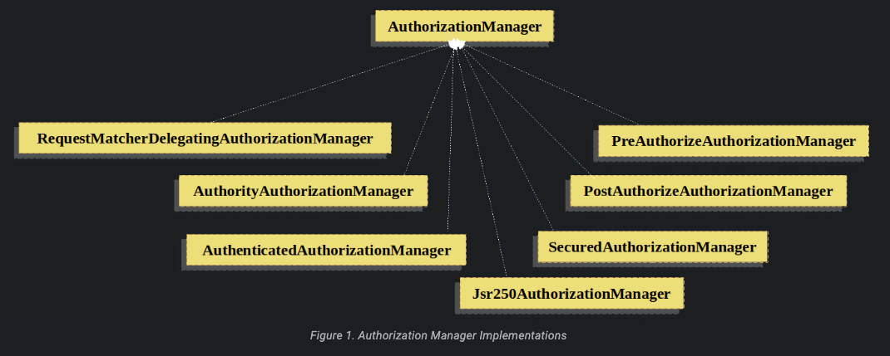

# Authorization Architecture

## Authorities

Authentication, tüm Authentication implementasyonlarının GrantedAuthority nesnelerinin bir listesini nasıl sakladığını
tartışır. Authentication, tüm Authentication implementasyonlarının GrantedAuthority nesnelerinin bir listesini
depoladığını açıklar. Bu nesneler, principal'a verilen yetkileri temsil eder. GrantedAuthority nesneleri,
AuthenticationManager tarafından Authentication nesnesine eklenir ve daha sonra yetkilendirme kararları verilirken
AccessDecisionManager örnekleri tarafından okunur. Bu yetkiler, bir principal'ın (kullanıcının veya sisteminki) belirli
kaynaklara erişme yetkisini belirlemek için kullanılır. AccessDecisionManager, yetkilendirme kararları verirken bu
yetkileri kullanarak belirli bir kaynağa erişim izni verme veya reddetme işlemini gerçekleştirir. Bu sayede, güvenlik ve
yetkilendirme süreçleri tutarlı bir şekilde yönetilebilir.

The GrantedAuthority interface'nin sadece bir methodu vardır:

```
String getAuthority();
```

Bu method, bir AuthorizationManager instance'i tarafından GrantedAuthority'nin kesin String represtation'ini elde etmek
için kullanılır. GrantedAuthority'nin bir String olarak representation'inini döndürerek, çoğu AuthorizationManager
implementasyonu tarafından kolayca "read" hale getirilebilir. Bir GrantedAuthority'nin kesin bir String olarak temsil
edilememesi durumunda, GrantedAuthority "complex" olarak kabul edilir ve getAuthority() null değerini dönmelidir.
Complex bir GrantedAuthority instance'i, farklı müşteri hesap numaralarına uygulanan işlemler listesini ve authority
threshold'ları depolayan bir implementasyon olabilir. Bu complex GrantedAuthority'nin bir String olarak temsil edilmesi
oldukça zor olacaktır. Sonuç olarak, getAuthority() yöntemi null değerini döndürmelidir. Bu durum, herhangi bir
AuthorizationManager'a, içeriğini anlamak için belirli GrantedAuthority implementasyonu desteklemesi gerektiğini
gösterir.

Spring Security, concrete bir GrantedAuthority implementasyonu içerir: SimpleGrantedAuthority. Bu implementasyon,
herhangi bir kullanıcı tarafından belirtilen String'in GrantedAuthority'ye dönüştürülmesine izin verir. Güvenlik
mimarisiyle birlikte gelen tüm AuthenticationProvider örnekleri, Authentication nesnesini doldurmak için
SimpleGrantedAuthority kullanır. Varsayılan olarak, rol tabanlı yetkilendirme kuralları ROLE_ önekiyle birlikte gelir
Bu, SecurityContext'in "USER" rolüne sahip olmasını gerektiren bir yetkilendirme kuralı varsa, Spring Security
varsayılan olarak "ROLE_USER" olarak dönen GrantedAuthority#getAuthority'yi arayacaktır.

GrantedAuthorityDefaults, role-based yetkilendirme kuralları için kullanılacak prefixi özelleştirmenizi sağlar. Bu
sayede özel bir prefix belirleyebilirsiniz.

Aşağıdaki gibi bir GrantedAuthorityDefaults bean'i göstererek yetkilendirme kurallarını farklı bir prefix kullanacak
şekilde yapılandırabilirsiniz:

```
@Bean
static GrantedAuthorityDefaults grantedAuthorityDefaults() {
	return new GrantedAuthorityDefaults("MYPREFIX_");
}
```

Spring, Spring Security'nin method security @Configuration sınıflarını başlatmadan önce GrantedAuthorityDefaults'u
publish etmek için bir statik yöntem kullanarak GrantedAuthorityDefaults'u sunar.

## Invocation Handling

Spring Security, method çağrıları veya web request'leri gibi güvenli nesnelere erişimi kontrol eden interceptor'ları
sağlar. Pre-Invocation(ön çağrı) devam edip etmeyeceği konusunda Pre-Invocation kararı, AuthorizationManager
instanceları tarafından alınır. Bu karar, çağrının yapılmasına izin verilip verilmeyeceğini belirler.

Ayrıca, belirli bir değerin dönülüp dönülmeyeceği konusunda Post-Invocation(son çağrı) kararları da AuthorizationManager
instance'ları tarafından alınır. Bu kararlar, bir değerin dönülmesine izin verilip verilmeyeceğini belirler.

### The Authorization Manager

AuthorizationManager, hem AccessDecisionManager hem de AccessDecisionVoter'ın yerine geçer. AccessDecisionManager veya
AccessDecisionVoter'ı özelleştiren uygulamaların, AuthorizationManager kullanmaya geçmeleri önerilir.

AuthorizationManager'lar, Spring Security'nin request-based, method-based ve message-based yetkilendirme bileşenleri
tarafından çağrılır ve nihai erişim kontrol kararlarını vermekten sorumludur. AuthorizationManager interface'inde iki
yöntem bulunur:

```
AuthorizationDecision check(Supplier<Authentication> authentication, Object secureObject);

default AuthorizationDecision verify(Supplier<Authentication> authentication, Object secureObject)
        throws AccessDeniedException {
    // ...
}
```

AuthorizationManager'ın check yöntemi, yetkilendirme kararı vermek için gereken tüm ilgili bilgileri alır. Özellikle,
güvenli nesne geçirilerek, gerçek güvenli nesne çağrısında bulunan argümanlara erişim sağlanabilir. Örneğin, güvenli
nesnenin bir MethodInvocation olduğunu varsayalım. MethodInvocation üzerinde herhangi bir Customer argümanını sorgulamak
kolay olur ve ardından AuthorizationManager'da bir tür güvenlik mantığı uygulamak, ilgili müşteri üzerinde işlem yapmak
için ilgili kişinin izinli olup olmadığını sağlamak için mümkündür. Implementasyonlar, erişim sağlandığında pozitif bir
AuthorizationDecision döndürmeyi, erişim reddedildiğinde negatif bir AuthorizationDecision döndürmeyi ve karar vermekten
kaçınıldığında null bir AuthorizationDecision döndürmeyi beklemektedir.

**verify** çağrıları kontrol eder ve ardından olumsuz bir AuthorizationDecision olması durumunda bir
AccessDeniedException atar.

### Delegate-based AuthorizationManager Implementations

Kullanıcılar, yetkilendirme sürecinin tüm yönlerini kontrol etmek için kendi AuthorizationManager'larını
uygulayabilirken, Spring Security, bireysel AuthorizationManager'larla işbirliği yapabilen bir delegating
AuthorizationManager ile birlikte gelir. RequestMatcherDelegatingAuthorizationManager, isteği en uygun delegasyon
AuthorizationManager ile eşleştirecektir. Method güvenliği için, AuthorizationManagerBeforeMethodInterceptor ve
AuthorizationManagerAfterMethodInterceptor kullanabilirsiniz.

Authorization Manager Implementation ilgili sınıfları gösterir:



Bu yaklaşımı kullanarak, bir AuthorizationManager uygulamalarının bir kompozisyonu, yetkilendirme kararı için
sorgulanabilir.

* AuthorityAuthorizationManager

Spring Security ile sağlanan en yaygın AuthorizationManager, AuthorityAuthorizationManager'dır. Mevcut Authentication
üzerinde aranacak belirli bir yetki kümesiyle yapılandırılır. Yapılandırılan yetkilerden herhangi biri Authentication
içeriyorsa, pozitif bir AuthorizationDecision döndürecektir. Aksi takdirde, negatif bir AuthorizationDecision
döndürecektir.

* AuthenticatedAuthorizationManager

Başka bir yönetici de AuthenticatedAuthorizationManager'dır. Bu yönetici, anonymous, fully authenticated ve remember-me
ile doğrulanmış kullanıcılar arasında ayrım yapmak için kullanılabilir. Birçok site, remember-me ile kimlik doğrulama
altında belirli sınırlı erişime izin verirken, tam erişim için kullanıcının kimliklerini doğrulamalarını istemek için
giriş yapmalarını gerektirir.

* AuthorizationManagers

AuthenticationManagers'da, bireysel AuthenticationManager'ları daha karmaşık ifadelere dönüştürmek için yardımcı statik
factory'ler de bulunmaktadır.

* Custom Authorization Managers

Açıkçası, özel bir AuthorizationManager da implemente edebilirsiniz ve istediğiniz herhangi bir access-control mantığını
içerebilirsiniz. Bu, uygulamanıza özgü (iş mantığıyla ilgili) olabilir veya bazı security administration logic'ini
uygulayabilir. Örneğin, Open Policy Agent veya kendi yetkilendirme veritabanınızı sorgulayabilen bir implementasyon
oluşturabilirsiniz.

## Adapting AccessDecisionManager and AccessDecisionVoters

Spring Security, AuthorizationManager öncesinde AuthorizationManager ve AccessDecisionVoter olmak üzere iki önemli
sınıfı kullanıyordu. Daha eski bir uygulamanın migrate edilmesi gibi bazı durumlarda, bir AccessDecisionManager veya
AccessDecisionVoter çağıran bir AuthorizationManager eklemek istenebilir.

Mevcut bir AccessDecisionManager'ı çağırmak için şunları yapabilirsiniz:

```
@Component
public class AccessDecisionManagerAuthorizationManagerAdapter implements AuthorizationManager {
    private final AccessDecisionManager accessDecisionManager;
    private final SecurityMetadataSource securityMetadataSource;

    @Override
    public AuthorizationDecision check(Supplier<Authentication> authentication, Object object) {
        try {
            Collection<ConfigAttribute> attributes = this.securityMetadataSource.getAttributes(object);
            this.accessDecisionManager.decide(authentication.get(), object, attributes);
            return new AuthorizationDecision(true);
        } catch (AccessDeniedException ex) {
            return new AuthorizationDecision(false);
        }
    }

    @Override
    public void verify(Supplier<Authentication> authentication, Object object) {
        Collection<ConfigAttribute> attributes = this.securityMetadataSource.getAttributes(object);
        this.accessDecisionManager.decide(authentication.get(), object, attributes);
    }
}
```

AuthorizationManager'ınızı SecurityFilterChain'e bağlamanız gerekmektedir.

Veya yalnızca bir AccessDecisionVoter çağırmak için şunları yapabilirsiniz:

```
@Component
public class AccessDecisionVoterAuthorizationManagerAdapter implements AuthorizationManager {
    private final AccessDecisionVoter accessDecisionVoter;
    private final SecurityMetadataSource securityMetadataSource;

    @Override
    public AuthorizationDecision check(Supplier<Authentication> authentication, Object object) {
        Collection<ConfigAttribute> attributes = this.securityMetadataSource.getAttributes(object);
        int decision = this.accessDecisionVoter.vote(authentication.get(), object, attributes);
        switch (decision) {
        case ACCESS_GRANTED:
            return new AuthorizationDecision(true);
        case ACCESS_DENIED:
            return new AuthorizationDecision(false);
        }
        return null;
    }
}
```

Ardından SecurityFilterChain'inize bağlayın.

## Hierarchical Roles

Bir uygulamada belirli bir rolün otomatik olarak diğer rolleri "içermesi" yaygın bir gereksinimdir. Bu, rol tabanlı
erişim kontrolünün daha esnek ve verimli bir şekilde yönetilmesini sağlar. Örneğin, "admin" ve "user" rolü kavramını
içeren bir uygulamada, bir yöneticinin normal bir kullanıcının yapabildiği her şeyi yapabilmesini isteyebilirsiniz. Bu
durumu gerçekleştirmek için Role-Inheritance veya Role-Hierarchy kullanabilirsiniz.Bunu gerçekleştirmek için, ya tüm
yönetici kullanıcıların "user" rolünü de atanmış olarak sahip olduklarından emin olmanız gerekmektedir.

Bu durumu sağlamak için aşağıdaki adımları takip edebilirsiniz:

1 - Uygulamanızda, "admin" ve "user" gibi rolleri ve bu rollerin izinlerini tanımlayan bir rol tablosu veya veritabanı
oluşturun.

2 - Kullanıcılara roller atarken, yönetici kullanıcılarını aynı zamanda "user" rolüyle de ilişkilendirin. Bu, yönetici
kullanıcılarının normal kullanıcıların sahip olduğu yetkilere otomatik olarak sahip olmalarını sağlayacaktır.

Bu şekilde, yönetici kullanıcıları, hem yönetici rolünün hem de kullanıcı rolünün yetkilerine sahip olacaklardır.

Alternatif olarak, "user" rolünü gerektiren her erişim kısıtlamasını "admin" rolünü de içerecek şekilde
değiştirebilirsiniz. Uygulamanızda birçok farklı rolünüz varsa, bu oldukça karmaşık olabilir.

Bir rol hiyerarşisinin kullanılması, hangi rollerin (veya yetkililerin) diğerlerini içermesi gerektiğini
yapılandırmanıza olanak tanır. Spring Security'nin RoleVoter'ının extend edilmiş bir sürümü olan RoleHierarchyVoter,
kullanıcının atandığı tüm "ulaşılabilir yetkilileri" aldığı bir RoleHierarchy ile yapılandırılmıştır.

Tipik bir yapılandırma şöyle görünür:

```
@Bean
static RoleHierarchy roleHierarchy() {
    var hierarchy = new RoleHierarchyImpl();
    hierarchy.setHierarchy("ROLE_ADMIN > ROLE_STAFF\n" +
            "ROLE_STAFF > ROLE_USER\n" +
            "ROLE_USER > ROLE_GUEST");
}

// and, if using method security also add
@Bean
static MethodSecurityExpressionHandler methodSecurityExpressionHandler(RoleHierarchy roleHierarchy) {
	DefaultMethodSecurityExpressionHandler expressionHandler = new DefaultMethodSecurityExpressionHandler();
	expressionHandler.setRoleHierarchy(roleHierarchy);
	return expressionHandler;
}
```

Note : RoleHierarchy bean'i yapılandırması henüz @EnableMethodSecurity'ye taşınmadı. Bu nedenle, bu örnek
AccessDecisionVoter kullanıyor. Methods güvenliği için RoleHierarchy desteğine ihtiyacınız varsa lütfen
github.com/spring-projects/spring-security/issues/12783 tamamlanana kadar @EnableGlobalMethodSecurity kullanmaya devam
edin.

Burada ROLE_ADMIN ⇒ ROLE_STAFF ⇒ ROLE_USER ⇒ ROLE_GUEST hiyerarşisinde dört rolümüz var

"ROLE_ADMIN" rolüyle kimlik doğrulaması yapılan bir kullanıcı, yukarıda bahsedilen RoleHierarchyVoter'ı çağıran bir
AuthorizationManager'a uyumlu olarak değerlendirildiğinde, tüm dört rolü içeriyormuş gibi davranacaktır. > sembolü
"includes(içerir)" anlamında düşünülebilir.

Rol hiyerarşileri, uygulamanız için erişim kontrolü yapılandırma verilerini basitleştirmenin ve/veya bir kullanıcıya
atamanız gereken yetki sayısını azaltmanın uygun bir yolunu sunar.

Daha karmaşık gereksinimler için, uygulamanızın gerektirdiği belirli erişim hakları ile kullanıcılara atanan roller
arasında mantıksal bir eşleme tanımlamak isteyebilirsiniz. Kullanıcı bilgileri yüklenirken bu iki arasında çeviri
yaparak rol ve erişim hakları arasında geçiş yapabilirsiniz.