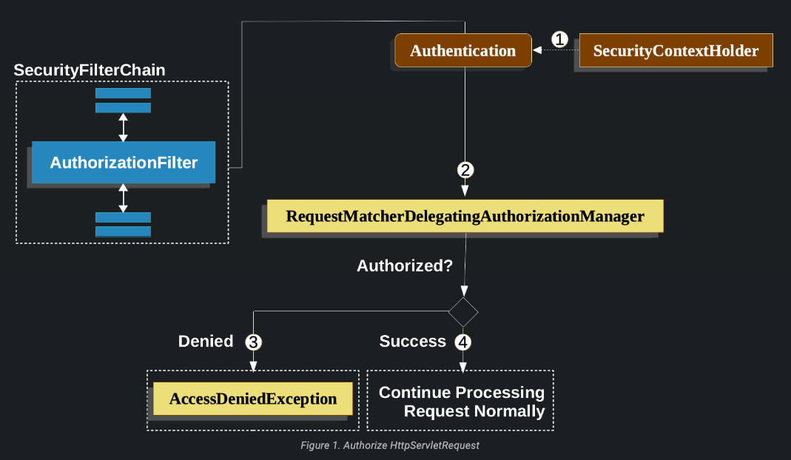

# Authorize HttpServletRequests

Spring Security'nin sunduğu özellikler ve yapılandırma seçenekleri sayesinde, request düzeyinde authorization
yapabilirsiniz. Örneğin, Spring Security ile "/admin" altındaki tüm sayfaların belirli bir yetkiyi gerektirdiğini, diğer
tüm sayfaların ise sadece authenticationsını gerektirdiğini belirtebilirsiniz.

Spring Security varsayılan olarak her request'in kimlik doğrulanmasını gerektirir. Bununla birlikte, herhangi bir
HttpSecurity instance'ini kullandığınızda, authorization kurallarınızı belirtmek gerekmektedir.

Bir HttpSecurity instance'iniz olduğunda, en azından şunları yapmalısınız:

```
http
    .authorizeHttpRequests((authorize) -> authorize
        .anyRequest().authenticated()
    )
```

Bu, Spring Security'ye uygulamanızdaki herhangi bir endpoint'in, security context'in en azından kimlik doğrulamış olması
gerektiğini belirtir. Çoğu durumda, authorization kurallarınız bundan daha complex olacaktır, bu nedenle lütfen
aşağıdaki kullanım durumlarını göz önünde bulundurun:

* AuthorizeRequests kullanan bir uygulamam var ve bunu AuthorizeHttpRequests uygulamasına geçirmek istiyorum
* AuthorizationFilter bileşenlerinin nasıl çalıştığını anlamak istiyorum
* Spring Security'de request'leri bir pattern'e dayalı olarak eşleştirmek istiyorsanız, regex kullanarak
  .regexMatchers() yöntemini kullanabilirsiniz. Bu yöntemle eşleştirilecek URL'ler için regex pattern'ini
  belirtebilirsiniz:

```
http.authorizeRequests()
    .regexMatchers("/admin/.*").hasRole("ADMIN")
    .regexMatchers("/public/.*").permitAll()
    .anyRequest().authenticated();
```

ukarıdaki örnekte, /admin/.* regex patterni, "/admin/" ile başlayan tüm URL'leri eşleştirir. .hasRole("ADMIN") yöntemi,
eşleşen URL'lerin "ADMIN" rolünü gerektirdiğini belirtir. Benzer şekilde, /public/.* regex patterni, "/public/" ile
başlayan tüm URL'leri eşleştirir ve .permitAll() yöntemi, eşleşen URL'lerin herkese açık olduğunu belirtir.

* Request'leri authorizationk için Spring Security'de authorizeRequests() yöntemini kullanabilirsiniz
* Spring Security'de bir isteği programlı olarak eşleştirmek için RequestMatcher arabirimini kullanabilirsiniz. Bu
  arabirim, istekleri belirli bir kurala veya özel bir duruma göre eşleştirmek için kullanılır. RequestMatcher
  arabirimini uygulayan bir sınıf oluşturun ve matches(HttpServletRequest request) yöntemini override edin
* Autherize request programmatically yapmak isteyebilir siniz
* Bir policy agent istek authorizationsini devretmek istiyorsanız, Spring Security'de bu işlevselliği uygulamak için
  özel bir AccessDecisionManager sınıfı oluşturabilirsiniz.

## Understanding How Request Authorization Components Work

Bu bölüm, Servlet tabanlı uygulamalarda istek düzeyinde authorization'in nasıl çalıştığını daha ayrıntılı olarak
açıklar. Servlet tabanlı uygulamalarda istek düzeyinde authorization nasıl çalışır konusunda daha ayrıntılı bilgiye
sahip olmak için, şu konulara odaklanabilirsiniz:

1 - Servlet Filtreleri: Servlet filtreleri, gelen istekleri işlemek ve yanıtları dönmeden önce değiştirmek için
kullanılır. authorization işlemlerini gerçekleştirmek için özelleştirilmiş bir servlet filtresi oluşturabilirsiniz. Bu
filtre, gelen istekleri yakalayabilir, authorization kontrollerini gerçekleştirebilir ve gerekirse erişimi
engelleyebilir.

2 - Servlet Interceptor: Servlet API'si, javax.servlet.Filter arayüzünün yanı sıra javax.servlet.ServletRequestListener
ve javax.servlet.http.HttpServlet gibi diğer sınıfları içerir. Bu sınıfları kullanarak, isteklerinizi dinleyebilir,
işleyebilir ve authorization kontrollerini gerçekleştirebilirsiniz.

3 - Servlet Güvenliği Ayarları: Servlet tabanlı uygulamalar, sunucu tarafından sağlanan güvenlik yapılandırmalarını
kullanabilir. Bu yapılandırmalar aracılığıyla, istekleri authorization için sunucu tarafında çeşitli güvenlik
mekanizmalarını yapılandırabilirsiniz. Örneğin, sunucu yönetim paneli veya yapılandırma dosyaları üzerinden URL tabanlı
authorization kuralları tanımlayabilirsiniz.



1 - İlk olarak AuthorizationFilter, SecurityContextHolder'dan bir Authentication alan bir Supplier oluşturur.

2 - İkinci olarak, Spring Security, Supplier<Authentication> ve HttpServletRequest'i AuthorizationManager'a aktarır.
AuthorizationManager, authorizeHttpRequests içindeki pattern'ler ile isteği eşleştirir ve ilgili kuralı çalıştırır.

3 - authorization reddedilirse, bir AuthorizationDeniedEvent yayınlanır ve bir AccessDeniedException oluşturulur. Bu
durumda, ExceptionTranslationFilter, AccessDeniedException'ı handle eder.

4 - Erişim verilirse bir AuthorizationGrantedEvent yayınlanır ve AuthorizationFilter, uygulamanın normal şekilde
işlemesine izin veren FilterChain ile devam eder.

### AuthorizationFilter Is Last By Default

AuthorizationFilter, varsayılan olarak Spring Security filter chain'inin sonuncusudur. Bu, Spring Security'nin kimlik
doğrulama filtreleri, saldırı korumaları ve diğer filtre entegrasyonlarının authorization gerektirmediği anlamına gelir.

Spring Security, güvenlikle ilgili birçok özelliği içeren bir filter chain sağlar. Bu filter chain, gelen istekleri
işlerken authentication, oturum yönetimi, CSRF koruması gibi çeşitli güvenlik önlemlerini uygular. Bunlar, güvenliği
artıran ve uygulamanın güvenliğini sağlayan önemli filtrelerdir. Eğer AuthorizationFilter'den önce kendi filtrelerinizi
eklerseniz, bu filtreler de authorization gerektirmez. Ancak, AuthorizationFilter'dan sonra filtre eklerseniz, bu
filtreler authorization gerektirir. Bu genellikle Spring MVC endpoint'lerini eklediğinizde önemli hale gelen bir
durumdur.

Spring MVC, bir web uygulamasında HTTP isteklerini işlemek ve yanıtlamak için kullanılan bir framework'tür. Spring
Security ile entegre ettiğinizde, Spring MVC endpoint'leri üzerinde yetkilendirme yapmanız gerekebilir. Çünkü
DispatcherServlet tarafından çalıştırıldığı için ve bu, AuthorizationFilter'den sonra gerçekleştiği için endpoint'
lerinizin izin verilmesi için authorizeHttpRequests içinde yer almaları gerekmektedir.

Spring MVC endpoint'leri, örneğin @RequestMapping, @GetMapping, @PostMapping gibi anotasyonlarla belirtilen metodlar
aracılığıyla tanımlanır. Bu endpoint'lerin her biri, gelen isteklere yanıt vermek için kullanılır. Bu noktalara erişimin
yetkilendirilip yetkilendirilmeyeceğini belirlemek, güvenlik gereksinimleriniz doğrultusunda yapmanız gereken bir
adımdır.

### All Dispatches Are Authorized

AuthorizationFilter her bir request'de değil, her bir yönlendirme üzerinde çalışır. Bu, REQUEST yönlendirmesinin yanı
sıra FORWARD, ERROR ve INCLUDE işlemlerinin de yetkilendirme gerektirdiği anlamına gelir.

Örneğin, Spring MVC, bir isteği Thymeleaf şablonunu işleyen bir view resolver'a FORWARD edebilir.

```
@Controller
public class MyController {
    @GetMapping("/endpoint")
    public String endpoint() {
        return "endpoint";
    }
}
```

Bu durumda, yetkilendirme iki kez gerçekleşir: birincisi "/endpoint" için yetkilendirme yapmak için ve ikincisi "
endpoint" şablonunu render etmek için Thymeleaf'e yönlendirme yaparken. Bu nedenle, tüm FORWARD gönderilerine izin
vermek isteyebilirsiniz.

Bu prensibin başka bir örneği, Spring Boot'un hataları nasıl işlediğidir. Eğer konteyner bir istisna yakalarsa:

```
@Controller
public class MyController {
    @GetMapping("/endpoint")
    public String endpoint() {
        throw new UnsupportedOperationException("unsupported");
    }
}
```

Spring Boot, bu exception'i ERROR yönlendirmesine yönlendirecektir. Bu durumda, yetkilendirme iki kez gerçekleşir:
birincisi "/endpoint" için yetkilendirme yapmak için ve ikincisi hata yönlendirmesi için yetkilendirme yapmak için. Bu
nedenle, tüm ERROR gönderilerine izin vermek isteyebilirsiniz.

### Authentication Lookup is Deferred

AuthorizationManager API'sinin bir Supplier<Authentication> kullandığını unutmayın. Bu durum, authorizeHttpRequests
kullanıldığında isteklerin her zaman izin verildiği veya her zaman reddedildiği durumlarda önem arz eder. Bu durumlarda,
Authentication sorgulanmadığı için istek daha hızlı gerçekleşir.

## Authorizing an Endpoint

Öncelik sırasına göre daha fazla kural ekleyerek Spring Security'yi farklı kurallara sahip olacak şekilde
yapılandırabilirsiniz. Bu /endpoint noktasına yalnızca USER yetkisine sahip son kullanıcılar tarafından erişilebilmesini
zorunlu kılmak istiyorsanız, şunları yapabilirsiniz:

```
@Bean
SecurityFilterChain web(HttpSecurity http) throws Exception {
	http
		.authorizeHttpRequests((authorize) -> authorize
		.requestMatchers("/endpoint").hasAuthority('USER')
		.anyRequest().authenticated()
	)
    // ...

	return http.build();
}
```

authorizeHttpRequests kurallarınızı tanımlarken, pattern ve rules çiftlerini kullanabilirsiniz. Her bir pattern, bir
HTTP isteği yolunu veya URL'sini temsil eder ve bu patternlere göre eşleşen istekler için belirli bir kural uygulanır.
AuthorizationFilter bu çiftleri listelenen sırayla işler ve isteğe yalnızca ilk eşleşen kuralı uygular. Bu durum, /**
patterninin /endpoint için de eşleşmesine rağmen yukarıdaki kuralların bir sorun teşkil etmediği anlamına gelir.
Yukarıdaki kuralları okumak için "eğer istek /endpoint ise, USER yetkisini gerektir; aksi takdirde, yalnızca kimlik
doğrulama gerektir" şeklinde okuyabilirsiniz.

Spring Security, çeşitli patternleri ve kuralları destekler; ayrıca kendi patternlerinizi ve kurallarınızı da
programatik olarak oluşturabilirsiniz.

Authorized edildikten sonra, Security'nin test desteğini kullanarak aşağıdaki şekilde test yapabilirsiniz:

```
@WithMockUser(authorities="USER")
@Test
void endpointWhenUserAuthorityThenAuthorized() {
    this.mvc.perform(get("/endpoint"))
        .andExpect(status().isOk());
}

@WithMockUser
@Test
void endpointWhenNotUserAuthorityThenForbidden() {
    this.mvc.perform(get("/endpoint"))
        .andExpect(status().isForbidden());
}

@Test
void anyWhenUnauthenticatedThenUnauthorized() {
    this.mvc.perform(get("/any"))
        .andExpect(status().isUnauthorized())
}
```

## Matching Requests

Yukarıda zaten istekleri eşleştirmenin iki yolunu gördünüz. İlk gördüğünüz, herhangi bir talebi karşılamak için en basit
olanıydı. İkinci seçenek, bir URI pattern'i ile eşleştirmektir. Spring Security, URI pattern'i eşleştirmesi için iki dil
destekler: Ant (yukarıda gördüğümüz gibi) ve Düzenli İfadeler (Regular Expressions).

### Matching Using Ant

Ant, Spring Security'nin istekleri eşleştirmek için kullandığı varsayılan dildir. Bu pattern'leri kullanarak tek bir
endpoint'i veya bir directory'i eşleştirebilir ve hatta daha sonra kullanmak üzere placeholders'ları yakalayabilirsiniz.
Ayrıca, belirli bir HTTP metod kümesini eşleştirmek için pattern'i daha da geliştirebilirsiniz.

Örneğin:

- "/api/users/{id}" pattern'i, "/api/users/" ile başlayan ve sonrasında Placeholder olarak kullanılacak bir "id"
  parametresini içeren URI'yi eşleştirir. Placeholder, ilgili değeri yakalamak ve kullanmak için kullanılabilir.
- "/api/admin/**" pattern'i, "/api/admin/" ile başlayan tüm URI'leri ve bu kök dizindeki tüm alt dizinleri eşleştirir.
- "/api/products" pattern'i, yalnızca "/api/products" URI'sini eşleştirir.

HTTP metodleriyle eşleştirmek için deseni daha da ayrıntılı hale getirebilirsiniz. Örneğin:

- "GET /api/users" pattern'i, yalnızca GET metodunu kullanarak "/api/users" URI'sini eşleştirir.
- "POST /api/products" deseni, yalnızca POST metodunu kullanarak "/api/products" URI'sini eşleştirir.

Varsayalım ki /endpoint endpoint'i eşleştirmek yerine, /resource dizini altındaki tüm endpoint'leri eşleştirmek
istiyorsunuz. Bu durumda aşağıdaki gibi bir yaklaşım izleyebilirsiniz:

```
http
    .authorizeHttpRequests((authorize) -> authorize
        .requestMatchers("/resource/**").hasAuthority("USER")
        .anyRequest().authenticated()
    )
```

Bu şekilde okuyabilirsiniz: "Eğer istek /resource veya alt dizinlerinden biriyse, USER yetkisini gerektir; aksi
takdirde, yalnızca authentication gerektir."

Aşağıda görüldüğü gibi, istekten yol değerlerini de çıkarabilirsiniz:

```
http
    .authorizeHttpRequests((authorize) -> authorize
        .requestMatchers("/resource/{name}").access(new WebExpressionAuthorizationManager("#name == authentication.name"))
        .anyRequest().authenticated()
    )
```

Yetkilendirildikten sonra, Security'nin test desteğini kullanarak aşağıdaki şekilde test edebilirsiniz:

```
@WithMockUser(authorities="USER")
@Test
void endpointWhenUserAuthorityThenAuthorized() {
    this.mvc.perform(get("/endpoint/jon"))
        .andExpect(status().isOk());
}

@WithMockUser
@Test
void endpointWhenNotUserAuthorityThenForbidden() {
    this.mvc.perform(get("/endpoint/jon"))
        .andExpect(status().isForbidden());
}

@Test
void anyWhenUnauthenticatedThenUnauthorized() {
    this.mvc.perform(get("/any"))
        .andExpect(status().isUnauthorized())
}
```

Spring Security varsayılan olarak yalnızca yolları eşleştirir. Eğer sorgu parametrelerini eşleştirmek isterseniz, özel
bir request matcher'a ihtiyacınız olacaktır.

### Matching Using Regular Expressions

Spring Security, istekleri bir regular expression karşı eşleştirmeyi destekler. Bu özellik, ** ile bir alt dizinde daha
katı eşleştirme kriterleri uygulamak istediğiniz durumlarda kullanışlı olabilir.

Örneğin, kullanıcı adını içeren bir yol düşünelim ve tüm kullanıcı adlarının alfasayısal karakterlerden oluşması
gerektiği kuralını uygulamak isteyelim. Bu durumda RegexRequestMatcher'ı kullanarak bu kurala uygun bir eşleştirme
yapabilirsiniz:

```
http
    .authorizeHttpRequests((authorize) -> authorize
        .requestMatchers(RegexRequestMatcher.regexMatcher("/resource/[A-Za-z0-9]+")).hasAuthority("USER")
        .anyRequest().denyAll()
    )
```

### Matching By Http Method

Kuralları HTTP yöntemiyle de eşleştirebilirsiniz. Bunun kullanışlı olduğu yerlerden biri, okuma veya yazma ayrıcalığı
verilmesi gibi, verilen izinlerle yetkilendirme yapmaktır.

Tüm GET'lerin okuma iznine ve tüm POST'ların yazma iznine sahip olmasını zorunlu kılmak için şöyle bir şey
yapabilirsiniz:

```
http
    .authorizeHttpRequests((authorize) -> authorize
        .requestMatchers(HttpMethod.GET).hasAuthority("read")
        .requestMatchers(HttpMethod.POST).hasAuthority("write")
        .anyRequest().denyAll()
    )
```

Bu yetkilendirme kuralları şu şekilde okunmalıdır: "eğer istek bir GET ise, o zaman okuma izni gerektir; aksi takdirde,
eğer istek bir POST ise, o zaman yazma izni gerekli; aksi takdirde, isteği reddet"

Tip : İsteği varsayılan olarak reddetmek, bir güvenlik uygulaması olarak sağlıklıdır, çünkü kurallar kümesini izin
listesine dönüştürür.

Authorized edildikten sonra, Security'nin test desteğini kullanarak aşağıdaki şekilde test edebilirsiniz:

```
@WithMockUser(authorities="read")
@Test
void getWhenReadAuthorityThenAuthorized() {
    this.mvc.perform(get("/any"))
        .andExpect(status().isOk());
}

@WithMockUser
@Test
void getWhenNoReadAuthorityThenForbidden() {
    this.mvc.perform(get("/any"))
        .andExpect(status().isForbidden());
}

@WithMockUser(authorities="write")
@Test
void postWhenWriteAuthorityThenAuthorized() {
    this.mvc.perform(post("/any").with(csrf()))
        .andExpect(status().isOk())
}

@WithMockUser(authorities="read")
@Test
void postWhenNoWriteAuthorityThenForbidden() {
    this.mvc.perform(get("/any").with(csrf()))
        .andExpect(status().isForbidden());
}
```

### Matching By Dispatcher Type

Daha önce belirtildiği gibi, Spring Security varsayılan olarak dispatcher type (tüm dağıtım programı) türlerini
yetkilendirir. Ve REQUEST yönlendirmesinde oluşturulan Security context sonraki yönlendirmelere aktarılmasına rağmen,
bazen küçük uyuşmazlıklar beklenmeyen bir AccessDeniedException'a neden olabilir.

Bunu ele almak için, Spring Security Java yapılandırmasını FORWARD ve ERROR gibi dispatcher type'lara göre izin verecek
şekilde yapılandırabilirsiniz, örneğin:

```
http
    .authorizeHttpRequests((authorize) -> authorize
        .dispatcherTypeMatchers(DispatcherType.FORWARD, DispatcherType.ERROR).permitAll()
        .requestMatchers("/endpoint").permitAll()
        .anyRequest().denyAll()
    )
```

### Using a Custom Matcher

Java yapılandırmasında, kendi RequestMatcher'ınızı oluşturabilir ve bunu DSL'e şu şekilde sağlayabilirsiniz:

```
RequestMatcher printview = (request) -> request.getParameter("print") != null;
http
    .authorizeHttpRequests((authorize) -> authorize
        .requestMatchers(printview).hasAuthority("print")
        .anyRequest().authenticated()
    )
```

RequestMatcher, functional bir interface'dir ve DSL'de bir lambda olarak sağlanabilir. Ancak, isteğe bağlı değerlerin
çıkarılmasını gerektiren durumlarda varsayılan bir methodu override etmeniz gerektiğinden, bu durumda concrete bir sınıf
kullanmanız gerekecektir.

Authorized edildikten sonra, Security'nin test desteğini kullanarak aşağıdaki şekilde test edebilirsiniz:

```
@WithMockUser(authorities="print")
@Test
void printWhenPrintAuthorityThenAuthorized() {
    this.mvc.perform(get("/any?print"))
        .andExpect(status().isOk());
}

@WithMockUser
@Test
void printWhenNoPrintAuthorityThenForbidden() {
    this.mvc.perform(get("/any?print"))
        .andExpect(status().isForbidden());
}
```

## Authorizing Requests

Bir istek eşleştiğinde, bunu önceden görülen permitAll, denyAll ve hasAuthority gibi çeşitli şekillerde
yetkilendirebilirsiniz.

Hızlı bir özet olarak, DSL'de yerleşik olarak bulunan yetkilendirme kuralları şunlardır:

- permitAll ifadesi, bir isteğin hiçbir yetkilendirmeye ihtiyaç duymadığını ve halka açık bir endpoint olduğunu
  belirtir. Bu durumda, yetkilendirmeyle ilgili işlemler yapılmaz ve Authentication bilgisi oturumdan alınmaz.
- denyAll ifadesi, bir isteğin hiçbir koşul altında izin verilmediğini belirtir. Bu durumda, yetkilendirmeyle ilgili
  işlemler yapılmaz ve Authentication bilgisi oturumdan alınmaz.
- hasAuthority - İstek, Authentication'ın verilen değerle eşleşen bir GrantedAuthority'ye sahip olmasını gerektirir
- hasRole ifadesi, hasAuthority ifadesinin bir kısaltmasıdır ve varsayılan olarak ROLE_ prefix'ini veya yapılandırılan
  varsayılan prefixi kullanır.
- hasAnyAuthority - İstek, Authentication'ın verilen değerlerden herhangi biriyle eşleşen bir GrantedAuthority'ye sahip
  olmasını gerektirir
- hasAnyRole ifadesi, hasAnyAuthority ifadesinin bir kısaltmasıdır ve varsayılan olarak ROLE_ prefix'ini veya
  yapılandırılan varsayılan prefixi kullanır.
- access ifadesi, Spring Security'de özel bir AuthorizationManager'ı kullanarak erişimi belirlemek için kullanılır.

Artık kalıpları, kuralları ve bunların nasıl eşleştirilebileceğini öğrendikten sonra, bu daha karmaşık örnekte neler
olduğunu anlayabilmelisiniz:

```
import static jakarta.servlet.DispatcherType.*;

import static org.springframework.security.authorization.AuthorizationManagers.allOf;
import static org.springframework.security.authorization.AuthorityAuthorizationManager.hasAuthority;
import static org.springframework.security.authorization.AuthorityAuthorizationManager.hasRole;

@Bean
SecurityFilterChain web(HttpSecurity http) throws Exception {
	http
		// ...
		.authorizeHttpRequests(authorize -> authorize                                  (1)
            .dispatcherTypeMatchers(FORWARD, ERROR).permitAll() (2)
			.requestMatchers("/static/**", "/signup", "/about").permitAll()         (3)
			.requestMatchers("/admin/**").hasRole("ADMIN")                             (4)
			.requestMatchers("/db/**").access(allOf(hasAuthority('db'), hasRole('ADMIN')))   (5)
			.anyRequest().denyAll()                                                (6)
		);

	return http.build();
}
```

1 - Belirtilen birden fazla yetkilendirme kuralı var. Her kural, ilan edildikleri sırayla dikkate alınır.

2 - Spring Security'de, FORWARD ve ERROR dispatch türleri, Spring MVC'nin görünümleri render etmesine ve Spring Boot'un
hataları işlemesine izin vermek için varsayılan olarak izin verilir.zzz

3 - Herhangi bir kullanıcının erişebileceği birkaç URL pattern'i belirttik. Özellikle, herhangi bir kullanıcı "
/static/" ile başlayan, "/signup" ile eşit olan veya "/about" ile eşit olan bir isteği erişebilir.

4 - "/admin/" ile başlayan herhangi bir URL, "ROLE_ADMIN" rolüne sahip kullanıcılarla sınırlandırılacaktır. hasRole
yöntemini çağırdığımız için "ROLE_" önekini belirtmemize gerek olmadığını fark edeceksiniz.

5 - "/db/" ile başlayan herhangi bir URL, kullanıcıya hem "db" izni verilmesini hem de "ROLE_ADMIN" olmasını gerektirir.
hasRole ifadesini kullandığımız için "ROLE_" önekini belirtmemize gerek olmadığını fark edeceksiniz.

6 - Halihazırda eşleştirilmemiş herhangi bir URL'ye erişim reddedilir. Yetkilendirme kurallarınızı yanlışlıkla
güncellemeyi unutmak istemiyorsanız bu iyi bir stratejidir.

## Expressing Authorization with SpEL

Bir AuthorizationManager yerine bir expression kullanmanın tavsiye edildiği durumlar olsa da, <intercept-url> veya JSP
Taglibs gibi bazı durumlarda expression'ın gerektiği durumlar vardır. Bu nedenle, bu bölümde örnekler bu alanlardan
odaklanacaktır.

Bunu göz önünde bulundurarak, Spring Security'nin Web Güvenliği Yetkilendirme SpEL API'sini biraz daha derinlemesine ele
alalım.

Spring Security, yetkilendirme alanlarını ve yöntemlerini bir dizi kök nesnede kapsüller. En genel kök nesne
SecurityExpressionRoot olarak adlandırılır ve WebSecurityExpressionRoot için temel oluşturur. Spring Security, bir
yetkilendirme ifadesini değerlendirmek için StandardEvaluationContext'i hazırlarken bu kök nesneyi sağlar.

### Using Authorization Expression Fields and Methods

Bunun sağladığı ilk şey, SpEL expression'larınız için geliştirilmiş bir dizi yetkilendirme alanı ve yöntemidir. Aşağıda,
en yaygın yöntemlere hızlı bir genel bakış yer almaktadır:

- permitAll - Request, çağrılmak için herhangi bir yetkilendirme gerektirmez; bu durumda, Authentication (Kimlik
  Doğrulama) hiçbir zaman session'dan alınmaz.
- DenyAll - Request hiçbir koşulda izin verilmez; bu durumda Authentication (Authentication) hiçbir zaman session'dan
  alınmaz.
- "hasAuthority" ifadesi, Spring Security'nin bir isteği, Authentication (Authentication) nesnesinin belirtilen değere
  sahip bir GrantedAuthority'ye sahip olması durumunda izin vermesini ifade eder.
- hasRole - hasAuthority için bir kısayol, ROLE_ prefix'i veya varsayılan prefix olarak yapılandırılmış değeri ekler.
- "hasAnyAuthority" ifadesi, Spring Security'nin bir isteği, Authentication nesnesinin belirtilen değerlerden herhangi
  birine sahip olması durumunda izin vermesini ifade eder. Bu ifade, yetkilendirme işleminde birden fazla yetkiye sahip
  olup olunmadığını kontrol etmek için kullanılır.
- "hasAnyRole" ifadesi, "hasAnyAuthority" ifadesinin ROLE_ veya yapılandırılan varsayılan ön ek ile kısaltmasıdır.
- "hasPermission" ifadesi, Spring Security tarafından sağlanan PermissionEvaluator arayüzü üzerinden nesne düzeyinde
  yetkilendirme yapmayı sağlar. Bu ifade, belirli bir nesne üzerinde yetkilendirme yaparken, bir PermissionEvaluator
  uygulamasını kullanır.

Ve işte en yaygın kullanılan alanlara kısa bir göz atış:

- authentication - Bu method çağrısı ile ilişkilendirilmiş Authentication örneği.
- principal - Bu method çağrısıyla ilişkili Authentication#getPrincipal

Artık pattern'leri, rules'ları ve bunların nasıl paired(eşleştirileceğini) öğrendikten sonra, bu daha karmaşık örnekte
neler olduğunu anlayabilmelisiniz (XML):

```
<http>
    <intercept-url pattern="/static/**" access="permitAll"/> (1)
    <intercept-url pattern="/admin/**" access="hasRole('ADMIN')"/> (2)
    <intercept-url pattern="/db/**" access="hasAuthority('db') and hasRole('ADMIN')"/> (3)
    <intercept-url pattern="/**" access="denyAll"/> (4)
</http>
```

1 - Herhangi bir kullanıcının erişebileceği bir URL pattern'i belirledik. Özellikle, URL "/static/" ile başlıyorsa
herhangi bir kullanıcı bir isteğe erişebilir.

2 - "/admin/" ile başlayan herhangi bir URL, "ROLE_ADMIN" rolüne sahip kullanıcılarla sınırlandırılacaktır. hasRole
yöntemini çağırdığımız için "ROLE_" önekini belirtmemize gerek olmadığını fark edeceksiniz.

3 - "/db/" ile başlayan herhangi bir URL, kullanıcıya hem "db" izni verilmesini hem de "ROLE_ADMIN" olmasını gerektirir.
hasRole ifadesini kullandığımız için "ROLE_" önekini belirtmemize gerek olmadığını fark edeceksiniz.

4 - Halihazırda eşleştirilmemiş herhangi bir URL'ye erişim reddedilir. Yetkilendirme kurallarınızı yanlışlıkla
güncellemeyi unutmak istemiyorsanız bu iyi bir stratejidir.

### Using Path Parameters

Ayrıca, Spring Security, path parametrelerini keşfetmek için bir mekanizma sağlar, böylece bunlar da SpEL ifadesinde
erişilebilir hale gelir.

Örneğin, SpEL ifadenizdeki bir path parametresine şu şekilde erişebilirsiniz (XML):

```
<http>
    <intercept-url pattern="/resource/{name}" access="#name == authentication.name"/>
    <intercept-url pattern="/**" access="authenticated"/>
</http>
```

Bu ifade, /resource/ öğesinden sonraki path değişkenine atıfta bulunur ve Authentication#getName'e eşit olmasını
gerektirir.

### Use an Authorization Database, Policy Agent, or Other Service

Spring Security'yi yetkilendirme için ayrı bir hizmet kullanacak şekilde yapılandırmak istiyorsanız, kendi
AuthorizationManager'ınızı oluşturabilir ve bunu anyRequest ile eşleştirebilirsiniz.

İlk olarak, AuthorizationManager'ınız şöyle görünebilir:

```
@Component
public final class OpenPolicyAgentAuthorizationManager implements AuthorizationManager<RequestAuthorizationContext> {
    @Override
    public AuthorizationDecision check(Supplier<Authentication> authentication, RequestAuthorizationContext context) {
        // make request to Open Policy Agent
    }
}
```

Ardından, Spring Security'ye aşağıdaki şekilde bağlayabilirsiniz:

```
@Bean
SecurityFilterChain web(HttpSecurity http, AuthorizationManager<RequestAuthorizationContext> authz) throws Exception {
	http
		// ...
		.authorizeHttpRequests((authorize) -> authorize
            .anyRequest().access(authz)
		);

	return http.build();
}
```

### Favor permitAll over ignoring

Statik kaynaklarınız olduğunda, filter chain'i bu değerleri yok sayacak şekilde yapılandırmak cazip gelebilir. Daha
güvenli bir yaklaşım, permitAll'u şu şekilde kullanmalarına izin vermektir:

```
http
    .authorizeHttpRequests((authorize) -> authorize
        .requestMatchers("/css/**").permitAll()
        .anyRequest().authenticated()
    )
```

Daha güvenlidir çünkü statik kaynaklarla bile secure headers'lar yazmak önemlidir, istek göz ardı edilirse Spring
Security bunu yapamaz.

Geçmişte, bu durum her istekte Spring Security tarafından oturuma başvurulduğunda performans açısından bir tradeoff(
takas) getirirdi. Bununla birlikte, Spring Security 6'dan itibaren, authorization rule gerektirmedikçe oturum artık
pinglenmemektedir. Performans etkisi artık ele alındığından, Spring Security tüm istekler için en azından permitAll
kullanılmasını önerir.

## Migrating from authorizeRequests

AuthorizationFilter, FilterSecurityInterceptor'ın yerine geçer. Geriye dönük uyumluluğu korumak için,
FilterSecurityInterceptor varsayılan olarak kalır. Bu bölümde AuthorizationFilter'ın nasıl çalıştığı ve varsayılan
yapılandırmanın nasıl geçersiz kılınacağı anlatılmaktadır.

AuthorizationFilter, HttpServletRequests için yetkilendirme sağlar. Güvenlik Filtrelerinden biri olarak
FilterChainProxy'ye eklenir.

Bir SecurityFilterChain bildirirken varsayılanı override edebilirsiniz. authorizeRequests yerine authorizeHttpRequests
kullanarak bunu yapabilirsiniz. Örnek olarak:

```
@Bean
SecurityFilterChain web(HttpSecurity http) throws AuthenticationException {
    http
        .authorizeHttpRequests((authorize) -> authorize
            .anyRequest().authenticated();
        )
        // ...

    return http.build();
}
```

Bu, yetkilendirme İsteklerini çeşitli şekillerde geliştirir:

1 - Bu, metadata sources, config attributes, decision managers (karar yöneticileri) ve voters (oylayıcıları) yerine
basitleştirilmiş AuthorizationManager API'sini kullanır. Bu, yeniden kullanımı ve özelleştirmeyi kolaylaştırır.

2 - Bu, Authentication aramasını geciktirir. Her istek için Authentication'ın aranması gereken yerine, Authenticationnın
yalnızca bir yetkilendirme kararı Authentication gerektirdiğinde aranacağı isteklerde aranır.

3 - Bean tabanlı yapılandır desteği

AuthorizeRequests yerine AuthorizeHttpRequests kullanıldığında, FilterSecurityInterceptor yerine AuthorizationFilter
kullanılır.

### Migrating Expressions

Mümkün olduğunda, SpEL yerine type-safe authorization manager kullanmanız önerilir. Java yapılandırması için, eski
SpEL'in taşınmasına yardımcı olmak üzere WebExpressionAuthorizationManager mevcuttur.

WebExpressionAuthorizationManager'ı kullanmak için, taşımaya çalıştığınız ifadeyle bir tane oluşturabilirsiniz, örneğin:

```
.requestMatchers("/test/**").access(new WebExpressionAuthorizationManager("hasRole('ADMIN') && hasRole('USER')"))
```

İfadenizde şu şekilde bir bean'den bahsediyorsanız: @webSecurity.check(authentication, request), bunun yerine bean'i
doğrudan çağırmanız önerilir, bu aşağıdaki gibi görünecektir:

```
.requestMatchers("/test/**").access((authentication, context) ->
    new AuthorizationDecision(webSecurity.check(authentication.get(), context.getRequest())))
```

Karmaşık talimatlar, Bean referansları ve diğer expression'ları içeriyorsa, bunlara AuthorizationManager uygulamak ve
.access(AuthorizationManager) şeklinde çağırarak onlara başvurmanız önerilir.

Bunu yapamıyorsanız, bir bean resolver ile yapılandırılmış bir DefaultHttpSecurityExpressionHandler'ı yapılandırabilir
ve bunu WebExpressionAuthorizationManager#setExpressionHandler metoduyla sağlayabilirsiniz.

## Security Matchers

RequestMatcher interface'i, bir isteğin belirli bir kuralla eşleşip eşleşmediğini belirlemek için kullanılır. Belirli
bir HttpSecurity'nin belirli bir isteğe uygulanması gerekip gerekmediğini belirlemek için securityMatchers kullanıyoruz.
Aynı şekilde, belirli bir isteğe uygulamamız gereken yetkilendirme kurallarını belirlemek için requestMatchers'ı
kullanabiliriz. Aşağıdaki örneğe bakın:

```
@Configuration
@EnableWebSecurity
public class SecurityConfig {

	@Bean
	public SecurityFilterChain securityFilterChain(HttpSecurity http) throws Exception {
		http
			.securityMatcher("/api/**") (1)
			.authorizeHttpRequests(authorize -> authorize
				.requestMatchers("/user/**").hasRole("USER") (2)
				.requestMatchers("/admin/**").hasRole("ADMIN") (3)
				.anyRequest().authenticated() (4)
			)
			.formLogin(withDefaults());
		return http.build();
	}
}
```

1 - HttpSecurity'yi yalnızca /api/ ile başlayan URL'lere uygulanacak şekilde yapılandırın

2 - USER rolüne sahip kullanıcıların /user/ ile başlayan URL'lere erişmesine izin ver

3 - ADMIN rolüne sahip kullanıcıların /admin/ ile başlayan URL'lere erişmesine izin ver

4 - Yukarıdaki kurallara uymayan diğer tüm istekler, Authentication gerektirecektir.

securityMatcher(s) ve requestMatcher(s) yöntemleri, uygulamanız için hangi RequestMatcher uygulamasının en uygun
olduğunu belirler: Eğer Spring MVC classpath'te ise, MvcRequestMatcher kullanılır, aksi takdirde AntPathRequestMatcher
kullanılır.

Belirli bir RequestMatcher kullanmak istiyorsanız, securityMatcher ve/veya requestMatcher yöntemlerine bir
implementasyon geçirmeniz yeterlidir:

```
import static org.springframework.security.web.util.matcher.AntPathRequestMatcher.antMatcher; (1)
import static org.springframework.security.web.util.matcher.RegexRequestMatcher.regexMatcher;

@Configuration
@EnableWebSecurity
public class SecurityConfig {

	@Bean
	public SecurityFilterChain securityFilterChain(HttpSecurity http) throws Exception {
		http
			.securityMatcher(antMatcher("/api/**"))                              (2)
			.authorizeHttpRequests(authorize -> authorize
				.requestMatchers(antMatcher("/user/**")).hasRole("USER")         (3)
				.requestMatchers(regexMatcher("/admin/.*")).hasRole("ADMIN")     (4)
				.requestMatchers(new MyCustomRequestMatcher()).hasRole("SUPERVISOR")     (5)
				.anyRequest().authenticated()
			)
			.formLogin(withDefaults());
		return http.build();
	}
}

public class MyCustomRequestMatcher implements RequestMatcher {

    @Override
    public boolean matches(HttpServletRequest request) {
        // ...
    }
}
```

1 - AntPathRequestMatcher ve RegexRequestMatcher'dan static factory methods içe aktararak RequestMatcher örnekleri
oluşturabilirsiniz.

2 - AntPathRequestMatcher kullanarak HttpSecurity'yi yalnızca /api/ ile başlayan URL'lere uygulanacak şekilde
yapılandırın

3 - AntPathRequestMatcher kullanarak USER rolüne sahip kullanıcıların /user/ ile başlayan URL'lere erişmesine izin verin

4 - RegexRequestMatcher kullanarak ADMIN rolüne sahip kullanıcılara /admin/ ile başlayan URL'lere erişim izni verin

5 - Özel bir RequestMatcher kullanarak, SUPERVISOR rolüne sahip kullanıcılara MyCustomRequestMatcher ile eşleşen
URL'lere erişim izni verin