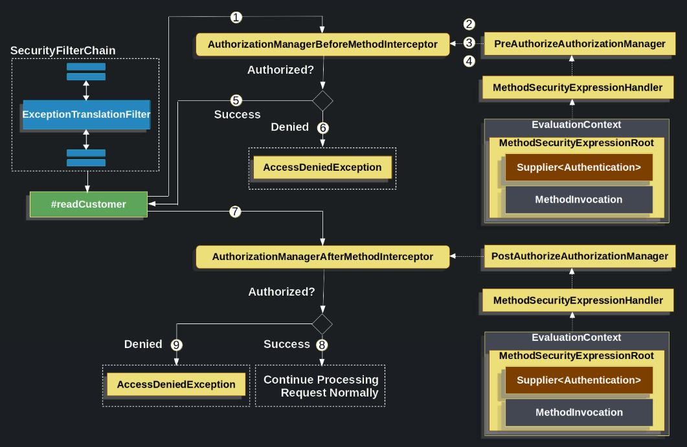
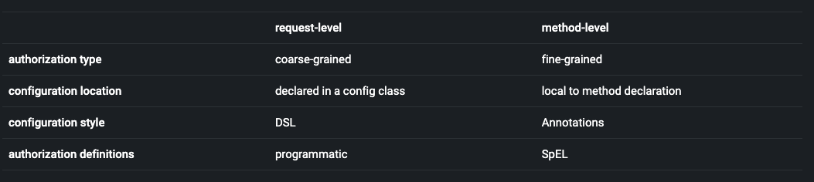

# Method Security

Request düzeyinde modelleme yetkisine ek olarak, Spring Security ayrıca method düzeyinde modellemeyi de destekler.

Herhangi bir @Configuration sınıfına @EnableMethodSecurity ile annotation ekleyerek veya herhangi bir XML yapılandırma
dosyasına <method-security> ekleyerek bunu uygulamanızda etkinleştirebilirsiniz, örneğin:

```
@EnableMethodSecurity
```

Daha sonra, herhangi bir Spring tarafından yönetilen sınıfı veya methodu hemen @PreAuthorize, @PostAuthorize, @PreFilter
ve @PostFilter ile işaretleyerek method invocation'ları yetkilendirebilirsiniz

Not : Spring Boot Starter Security, varsayılan olarak method-level authorization'ı etkinleştirmez.

Method Security birçok farklı kullanım senaryosunu desteklemektedir. Bunlar arasında AspectJ desteği, custom annotations
ve birkaç yapılandırma noktası bulunmaktadır. Aşağıda bahsedilen kullanım senaryolarını öğrenmeyi düşünebilirsiniz:

- @EnableGlobalMethodSecurity öğesinden geçiş
- Method Security'nin nasıl çalıştığını ve onu kullanma nedenlerini anlama
- Request-Level ve method düzeyinde authorization'ı karşılaştırma
- Methodları @PreAuthoriza ve @PostAuthoriza ile authorization
- @PreFilter ve @PostFilter ile filtreleme methodları
- JSR-250 annotation'ları ile method Authorization'ı
- AspectJ expresion'ları ile method authorization'ı
- AspectJ byte-code weaving ile entegrasyon yapmak
- SpEL expression handling'i özelliştirme
- Custom Authorization sistemleri ile entegrasyon

## How Method Security Works

Spring Security'nin method authorization desteği, aşağıdaki durumlar için kullanışlıdır:

- Method parametreleri ve return value'ları, authorization kararına katkıda bulunması gereken durumlarda, ince detaylara
  sahip authorization mantığını çıkarmak için kullanışlıdır. Örneğin, bir Methodun çağrılmasını etkileyen belirli bir
  parametreye veya Methodun dönüş değerine dayalı olarak authorization yapmanız gerekebilir. Spring Security'nin Method
  authorization desteği, bu tür karmaşık authorization senaryolarında kullanılabilir ve daha ince ayarlanabilir
  authorization mantığı oluşturmanıza olanak tanır.
- Service Layer'da güvenliği zorlama
- Annotation-Based tabanlı yapılandırmayı HttpSecurity tabanlı yapılandırmaya göre biçimsel olarak tercih etme

Spring AOP'nin sunduğu yeteneklerle methodları etkili bir şekilde güvence altına alabilir, özelleştirilebilir
authorization mantığınızı uygulayabilir ve Spring Security'nin varsayılan davranışlarını değiştirebilirsiniz.

Daha önce bahsedildiği gibi, bir Spring XML yapılandırma dosyasında bir @Configuration sınıfına
veya `<sec:method-security/>` öğesine @EnableMethodSecurity ekleyerek başlarsınız.

Note : Bu açıklama ve XML öğesi, sırasıyla @EnableGlobalMethodSecurity ve `<sec:global-method-security/>` yerine geçer.
Aşağıdaki iyileştirmeleri sunarlar:

1 - Metadata sources, config attirubtes, decision managers ve voters'lar yerine basitleştirilmiş AuthorizationManager
API'sini kullanır. Bu, yeniden kullanımı ve özelleştirmeyi basitleştirir.

2- Method Authorization, direkt bean tabanlı yapılandırmayı tercih eder ve özelleştirme yapmak için
GlobalMethodSecurityConfiguration sınıfını extend etmeyi gerektirmez. Spring Security'nin method authorization
özelliklerini kullanarak, doğrudan bean tabanlı yapılandırma yapabilirsiniz. Bean tabanlı yapılandırma, daha esnek ve
okunabilir bir şekilde yapılandırma yapmanıza olanak tanır ve özelleştirme ihtiyaçlarınızı kolayca karşılar. Bu
yaklaşım, authorization mantığınızı daha iyi ayarlamanızı ve uygulamanızı daha yönetilebilir hale getirmenizi sağlar.

3 - Method Authorization, native Spring AOP kullanılarak oluşturulmuştur. Bu sayede, soyutlamaları kaldırır ve Spring
AOP yapı taşlarını kullanarak özelleştirme yapmanıza olanak tanır.

4 - Karmaşık durumları önlemek için çelişen anotasyonları kontrol eder ve belirsizlik oluşturan bir güvenlik
yapılandırmasını engeller.

5 - JSR-250 ile uyumludur

6 - Varsayılan olarak @PreAuthorize, @PostAuthorize, @PreFilter ve @PostFilter'ı etkinleştirir

@EnableGlobalMethodSecurity veya `<global-method-security/>` kullanıyorsanız, bunlar artık kullanımdan kaldırılmıştır ve
geçiş yapmanız önerilir.

method authorizationsi, method öncesi (before) ve method sonrası (after) authorization kombinasyonudur.

```
@Service
public class MyCustomerService {
    @PreAuthorize("hasAuthority('permission:read')")
    @PostAuthorize("returnObject.owner == authentication.name")
    public Customer readCustomer(String id) { ... }
}
```

Belirli bir MyCustomerService#readCustomer çağrısı, Method Security etkinleştirildiğinde şöyle görünebilir:



1 - Spring AOP, readCustomer metodu için proxy methodini çağırır. Proxy'nin diğer advisor'ları arasında, @PreAuthorize
pointcut ile eşleşen AuthorizationManagerBeforeMethodInterceptor'ı çağırır.

2 - Interceptor, PreAuthorizeAuthorizationManager#check'i çağırır

3 - Authorization Manager, anotasyondaki SpEL expression'ını çözümlemek için bir MethodSecurityExpressionHandler
kullanır ve bir Supplier<Authentication> ve MethodInvocation içeren MethodSecurityExpressionRoot'dan oluşan bir
EvaluationContext oluşturur.

4 - Interceptor, bu context'i kullanarak expression'ı değerlendirir. Özellikle, Supplier'dan Authentication'ı okur ve
authorities collection'ından permission:read iznine sahip olup olmadığını kontrol eder.

5 - Değerlendirme başarılı olursa, Spring AOP method invocation'a devam eder.

6 - Eğer öyle değilse, interceptor bir AuthorizationDeniedEvent yayınlar ve ExceptionTranslationFilter tarafından
yakalanır ve yanıt olarak bir 403 durum kodu döndürülen bir AccessDeniedException fırlatır.

7 - Method tamamlandıktan sonra, Spring AOP, @PostAuthorize point cut'ına uyan bir
AuthorizationManagerAfterMethodInterceptor'ı çağırır ve yukarıda anlatıldığı gibi aynı şekilde çalışır, ancak
PostAuthorizeAuthorizationManager kullanır.

8 - Değerlendirme başarılı olursa (bu durumda, dönüş değeri oturum açan kullanıcıya aittir), işleme normal şekilde devam
eder

9 - Değilse, interceptor bir AuthorizationDeniedEvent yayınlar ve bir AccessDeniedException fırlatır; bu,
ExceptionTranslationFilter tarafından yakalanır ve yanıta bir 403 durum kodu döndürülür.

Note : Eğer method bir HTTP isteği bağlamında çağrılmıyorsa, genellikle AccessDeniedException'ı kendiniz yönetmeniz
gerekecektir.

### Multiple Annotations Are Computed In Series

Yukarıda gösterildiği gibi, bir method invocation birden fazla Method Security annotation'ı içeriyorsa, her biri
sırasıyla işlenir. Bu, onları toplu olarak birlikte "ve" olarak düşünebileceğiniz anlamına gelir. Başka bir deyişle, bir
çağrının authorized edilmesi için tüm açıklama kontrollerinin authorization işlemini geçmesi gerekmektedir.

### Repeated Annotations Are Not Supported

Ancak, aynı method üzerinde aynı annotation'ı tekrarlamak desteklenmez. Örneğin, aynı method üzerinde @PreAuthorize
annotasyonunu iki kez kullanamazsınız.

Bunun yerine, SpEL'in boolean desteğini veya ayrı bir bean delegasyonu desteğini kullanın.

### Each Annotation Has Its Own Pointcut

Her anotasyonun kendi pointcut örneği vardır ve bu pointcut, method ve onu içeren sınıftan başlayarak tüm nesne
hiyerarşisinde ilgili anotasyonu veya meta-annotation karşılıklarını arar.

### Each Annotation Has Its Own Method Interceptor

Her açıklama kendi özel method interceptor'ına sahiptir. Bu, işleri daha birleştirilebilir hale getirmek içindir.
Örneğin, gerektiğinde Spring Security varsayılanlarını devre dışı bırakabilir ve sadece @PostAuthorize method
interceptor'ını yayınlayabilirsiniz.

Method interceptor'ları aşağıdaki gibidir:

- @PreAuthorize için, Spring Security AuthenticationManagerBeforeMethodInterceptor#preAuthorize methodini kullanır ve bu
  method de PreAuthorizeAuthorizationManager'ı kullanır.
- @PostAuthorize için, Spring Security AuthenticationManagerAfterMethodInterceptor#postAuthorize methodini kullanır ve
  bu method de PostAuthorizeAuthorizationManager'ı kullanır.
- @PreFilter için Spring Security, PreFilterAuthorizationMethodInterceptor kullanır
- @PostFilter için Spring Security, PostFilterAuthorizationMethodInterceptor kullanır
- @Secured için Spring Security, AuthenticationManagerBeforeMethodInterceptor#secured kullanır, bu da
  SecuredAuthorizationManager kullanır
- JSR-250 anotasyonları için Spring Security, AuthenticationManagerBeforeMethodInterceptor#jsr250'yi kullanır ve bu da
  Jsr250AuthorizationManager'ı kullanır.

Genel olarak, @EnableMethodSecurity kullanarak Spring Security'yi eklediğinizde, aşağıdaki liste, yayınlanan
interceptorların temsilcisi olarak kabul edilebilir:

1 - PreAuthorize: Bu interceptor, bir metodun çağrılabilmesi için authorization kontrollerini yapar. Methodun çalışması
için belirli bir yetkiye veya roller kombinasyonuna sahip olmanız gerekebilir. Örneğin,
@PreAuthorize("hasRole('ROLE_ADMIN')") ifadesi, ilgili metodu sadece "ROLE_ADMIN" yetkisine sahip kullanıcıların
çağırabilmesini sağlar.

2 - PostAuthorize: Bu interceptor, metodun çalışmasından sonra sonuç üzerinde authorization kontrollerini yapar.
@PostAuthorize("returnObject.owner == authentication.name") ifadesi, metodun çalışmasının ardından dönen sonucun
sahibinin, mevcut kimlik doğrulama bilgilerine (authentication) sahip olan kullanıcı ile eşleşmesini sağlar.

3 - PreFilter: Bu interceptor, bir koleksiyonun veya dizinin elemanlarını filtrelemek için authorization kontrolleri
sağlar. Örneğin, @PreFilter("filterObject.owner == authentication.name") ifadesi, koleksiyon veya dizi elemanlarının
sahiplerinin, mevcut kimlik doğrulama bilgilerine sahip olan kullanıcı ile eşleşmesini sağlar.

4 - PostFilter: Bu interceptor, bir koleksiyonun veya dizinin elemanlarını filtrelemek için authorization kontrolleri
sağlar ve filtreleme işleminden sonra geri dönen sonuçları tekrar denetler. Örneğin,
@PostFilter("filterObject.owner == authentication.name") ifadesi, koleksiyon veya dizi elemanlarının sahiplerinin,
mevcut kimlik doğrulama bilgilerine sahip olan kullanıcı ile eşleşmesini sağlar ve sonuç listesini tekrar denetler.

```
@Bean
@Role(BeanDefinition.ROLE_INFRASTRUCTURE)
static Advisor preAuthorizeMethodInterceptor() {
    return AuthorizationManagerBeforeMethodInterceptor.preAuthorize();
}

@Bean
@Role(BeanDefinition.ROLE_INFRASTRUCTURE)
static Advisor postAuthorizeMethodInterceptor() {
    return AuthorizationManagerAfterMethodInterceptor.postAuthorize();
}

@Bean
@Role(BeanDefinition.ROLE_INFRASTRUCTURE)
static Advisor preFilterMethodInterceptor() {
    return AuthorizationManagerBeforeMethodInterceptor.preFilter();
}

@Bean
@Role(BeanDefinition.ROLE_INFRASTRUCTURE)
static Advisor postFilterMethodInterceptor() {
    return AuthorizationManagerAfterMethodInterceptor.postFilter();
}
```

### Favor Granting Authorities Over Complicated SpEL Expressions

Oldukça sık olarak, aşağıdaki gibi complex bir SpEL expression'ı kullanmak cazip gelebilir:

```
@PreAuthorize("hasAuthority('permission:read') || hasRole('ADMIN')")
```

Ancak, ROLE_ADMIN'a sahip olanlara permission:read izni verebilirsiniz. Bunun için bir RoleHierarchy kullanarak
aşağıdaki gibi yapabilirsiniz:

```
@Bean
static RoleHierarchy roleHierarchy() {
    return new RoleHierarchyImpl("ROLE_ADMIN > permission:read");
}
```

ve ardından bunu bir MethodSecurityExpressionHandler instance'inda set edin. Bu, bunun gibi daha basit bir @PreAuthorize
ifadesine sahip olmanızı sağlar:

```
@PreAuthorize("hasAuthority('permission:read')")
```

Veya mümkünse, application specific authorization mantığını oturum açma sırasında granted authorities'lere uyarlayın.

## Comparing Request-level vs Method-level Authorization

Method-Level authorization'ı ne zaman request-level authorization'a tercih etmelisiniz?

Method-Level authorization ile request-level authorization arasında tercih yaparken aşağıdaki güçlü yönlerin listesini
göz önünde bulundurabilirsiniz:

Method-Level authorization lehine olan durumlar:

1 - Daha ayrıntılı kontrol: Method-Level authorization, kullanıcılara daha ince detaylarda authorization sağlar. Her
methodun veya işlevin kullanıcı izinlerine göre ayrı ayrı kontrol edilmesi, kullanıcıların sadece belirli işlemleri
yapabilmesini sağlar.

2 - Daha fazla esneklik: Method-Level authorization, farklı kullanıcı rollerine veya izin seviyelerine göre
özelleştirilmiş authorization kuralları oluşturmanıza olanak tanır. Bu şekilde, farklı kullanıcı gruplarına
özelleştirilmiş authorization'lar sunabilir ve uygulamanızın güvenliğini ve uyumluluğunu artırabilirsiniz.

3 - Daha iyi hata yönetimi: Method-Level authorization, yetkisiz erişim girişimlerini erken aşamada engeller ve
hataların daha öngörülebilir şekilde ele alınmasını sağlar. Yanlış bir şekilde yetkilendirilmemiş kullanıcılar, hata
mesajları yerine yetkilendirme reddi hatalarıyla karşılaşır, bu da güvenlik açıklarını azaltır.

Request-Level yetkilendirme lehine olan durumlar:

1 - Daha basit yapı: Request-Level Authorization, kullanıcıların belirli API endpoint'lerine veya rotalara erişimini
kolaylıkla kontrol etmenizi sağlar. Kullanıcı izinleri, istek yönlendiricisinde veya middleware katmanında belirtilir ve
izin kontrolleri daha genel bir şekilde gerçekleştirilir.

2 - Daha az karmaşıklık: Request-Level Authorization, daha genel bir yetkilendirme düzeni sağlar ve method düzeyinde
ayrıntılı yetkilendirmelerin gereksiz olduğu durumlarda tercih edilebilir. Eğer kullanıcıların tüm methodları veya
işlevleri kullanmasına izin vermek istiyorsanız, Request-Level Authorization daha kolay bir seçenek olabilir.

3 - Daha fazla uygulama bağımsızlığı: Request-Level Authorization, uygulamanın belirli bir işlevselliğe veya methoda
bağımlı olmasını gerektirmez. API'lerin veya rotaların erişimini kontrol eden genel bir yetkilendirme mekanizması
kullanılarak farklı uygulamaların erişim izinleri merkezi bir şekilde yönetilebilir.



Temel bir tercih noktası, yetkilendirme kurallarınızın nerede olmasını istediğinizdir. Method-Level Authorization
kullanıyorsanız, yetkilendirme kuralları doğrudan kodunuzun içinde yer alır. Öte yandan, Request-Level Authorization
kullanıyorsanız, yetkilendirme kurallarını daha genel bir yetkilendirme mekanizması veya ortamda yönetirsiniz.

Note : Annotation tabanlı Method Security kullanıyorsanız, unannotated methodlar güvence altına alınmaz. Buna karşı
korunmak için HttpSecurity örneğinizde genel bir yetkilendirme kuralı belirtmek önemlidir.

## Authorizing with Annotations

Spring Security'nin method-level security desteğini etkinleştirmesinin birincil yolu, methodlere, sınıflara ve
interface'lere ekleyebileceğiniz annotation'lardır

### Authorizing Method Invocation with @PreAuthorize

Method Security etkinken, bir methoda @PreAuthorize anotasyonuna şu şekilde anotasyon ekleyebilirsiniz:

```
@Component
public class BankService {
	@PreAuthorize("hasRole('ADMIN')")
	public Account readAccount(Long id) {
        // ... is only invoked if the `Authentication` has the `ROLE_ADMIN` authority
	}
}
```

Bu, methodun yalnızca sağlanan expression hasRole('ADMIN') geçerse çağrılabileceğini belirtmek içindir.

Daha sonra, authorization rules'u şu şekilde uyguladığını doğrulamak için sınıfı test edebilirsiniz:

```
@Autowired
BankService bankService;

@WithMockUser(roles="ADMIN")
@Test
void readAccountWithAdminRoleThenInvokes() {
    Account account = this.bankService.readAccount("12345678");
    // ... assertions
}

@WithMockUser(roles="WRONG")
@Test
void readAccountWithWrongRoleThenAccessDenied() {
    assertThatExceptionOfType(AccessDeniedException.class).isThrownBy(
        () -> this.bankService.readAccount("12345678"));
}
```

Tip : @PreAuthorize da bir meta-annotasyon olabilir, sınıf veya interface düzeyinde tanımlanabilir ve SpEL Yetkilendirme
expression'ları kullanabilir.

@PreAuthorize, gerekli yetkileri belirtmek için oldukça yardımcıdır, ancak aynı zamanda method parametrelerini içeren
daha karmaşık expression'ların değerlendirilmesi için de kullanılabilir. Yukarıdaki iki örnek parça, kullanıcının
yalnızca kendi siparişlerini talep edebileceğini sağlamak için username parametresini Authentication#getName methodiyle
karşılaştırıyor.

Yukarıdaki method, request path'de ki kullanıcı adının oturum açmış kullanıcının adıyla eşleşmesi durumunda yalnızca
çağrılacaktır. Eşleşmezse, Spring Security bir AccessDeniedException fırlatacak ve bir 403 durum koduyla yanıt
verecektir.

### Authorization Method Results with @PostAuthorize

Method Güvenliği etkinken, bir methoda @PostAuthorize anotasyonu ile şu şekilde açıklama ekleyebilirsiniz:

```
@Component
public class BankService {
	@PostAuthorize("returnObject.owner == authentication.name")
	public Account readAccount(Long id) {
        // ... is only returned if the `Account` belongs to the logged in user
	}
}
```

Bu expression, methodun yalnızca sağlanan ifade returnObject.owner == authentication.name doğru olduğunda değeri
döndürebileceğini belirtir. returnObject, döndürülecek olan Account nesnesini temsil eder.

Ardından, authorization rule'un uyguladığını doğrulamak için sınıfı test edebilirsiniz:

```
@Autowired
BankService bankService;

@WithMockUser(username="owner")
@Test
void readAccountWhenOwnedThenReturns() {
    Account account = this.bankService.readAccount("12345678");
    // ... assertions
}

@WithMockUser(username="wrong")
@Test
void readAccountWhenNotOwnedThenAccessDenied() {
    assertThatExceptionOfType(AccessDeniedException.class).isThrownBy(
        () -> this.bankService.readAccount("12345678"));
}
```

@PostAuthorize da bir meta-annotasyon olabilir, sınıf veya interface düzeyinde tanımlanabilir ve SpEL Authorization
expression'ları kullanabilir.

@PostAuthorize, Özellikle Insecure Direct Object Reference saldırılarına karşı korunmada yardımcıdır. Aslında, aşağıdaki
gibi bir meta-annotasyon olarak tanımlanabilir.

```
@Target({ ElementType.METHOD, ElementType.TYPE })
@Retention(RetentionPolicy.RUNTIME)
@PostAuthorize("returnObject.owner == authentication.name")
public @interface RequireOwnership {}
```

Bunun yerine service'e aşağıdaki şekilde anotasyon eklemenize olanak tanır:

```
@Component
public class BankService {
	@RequireOwnership
	public Account readAccount(Long id) {
        // ... is only returned if the `Account` belongs to the logged in user
	}
}
```

Yukarıdaki method, Account nesnesinin owner özelliği oturum açmış kullanıcının adıyla eşleşiyorsa yalnızca Account
nesnesini döndürecektir. Eşleşmezse, Spring Security bir AccessDeniedException fırlatacak ve 403 durum koduyla yanıt
verecektir.

### Filtering Method Parameters with @PreFilter

Method Güvenliği etkinken, bir methode @PreFilter anotasyonu ile şu şekilde anotasyon ekleyebilirsiniz:

```
@Component
public class BankService {
	@PreFilter("filterObject.owner == authentication.name")
	public Collection<Account> updateAccounts(Account... accounts) {
        // ... `accounts` will only contain the accounts owned by the logged-in user
        return updated;
	}
}
```

Bu expression, filterObject.owner == authentication.name expression'ının başarısız olduğu durumlarda accounts içindeki
her bir account değerini filtrelemek için kullanılır. filterObject, accounts içindeki her bir account'ı temsil eder ve
her bir account'ı test etmek için kullanılır.

Ardından, authorization rule'un uyguladığını doğrulamak için sınıfı aşağıdaki şekilde test edebilirsiniz:

```
@Autowired
BankService bankService;

@WithMockUser(username="owner")
@Test
void updateAccountsWhenOwnedThenReturns() {
    Account ownedBy = ...
    Account notOwnedBy = ...
    Collection<Account> updated = this.bankService.updateAccounts(ownedBy, notOwnedBy);
    assertThat(updated).containsOnly(ownedBy);
}
```

@PreFilter de bir meta-annotasyon olabilir, sınıf veya interface düzeyinde tanımlanabilir ve SpEL Yetkilendirme
expression'ları kullanabilir.

@PreFilter array'leri, collection'ları, maps ve stream'leri destekler (stream açık olduğu sürece).

Örneğin, yukarıdaki updateAccounts bildirimi, aşağıdaki diğer dördü ile aynı şekilde çalışacaktır:

```
@PreFilter("filterObject.owner == authentication.name")
public Collection<Account> updateAccounts(Account[] accounts)

@PreFilter("filterObject.owner == authentication.name")
public Collection<Account> updateAccounts(Collection<Account> accounts)

@PreFilter("filterObject.value.owner == authentication.name")
public Collection<Account> updateAccounts(Map<String, Account> accounts)

@PreFilter("filterObject.owner == authentication.name")
public Collection<Account> updateAccounts(Stream<Account> accounts)
```

Yukarıdaki methodda, Account instance'larının sadece owner özelliği oturum açmış kullanıcının adıyla eşleşenleri
bulunacaktır.

### Filtering Method Results with @PostFilter

Method Security etkin olduğunda, bir methodi @PostFilter annotasyonuyla aşağıdaki gibi işaretleyebilirsiniz.

```
@Component
public class BankService {
	@PostFilter("filterObject.owner == authentication.name")
	public Collection<Account> readAccounts(String... ids) {
        // ... the return value will be filtered to only contain the accounts owned by the logged-in user
        return accounts;
	}
}
```

Bu ifade, filterObject.owner == authentication.name ifadesinin başarısız olduğu durumlarda dönüş değerinden herhangi bir
değeri filtrelemek için kullanılır. filterObject, accounts içindeki her bir account'ı temsil eder ve her bir account'ı
test etmek için kullanılır.

Daha sonra, yetkilendirme kuralını uyguladığını doğrulamak için sınıfı şu şekilde test edebilirsiniz:

```
@Autowired
BankService bankService;

@WithMockUser(username="owner")
@Test
void readAccountsWhenOwnedThenReturns() {
    Collection<Account> accounts = this.bankService.updateAccounts("owner", "not-owner");
    assertThat(accounts).hasSize(1);
    assertThat(accounts.get(0).getOwner()).isEqualTo("owner");
}
```

@PostFilter ayrıca bir meta-anotasyon olabilir, sınıf veya interface düzeyinde tanımlanabilir ve SpEL Yetkilendirme
expression'larını kullanabilir.

@PostFilter array'leri, collection'ları, maps ve stream'leri destekler (stream açık olduğu sürece).

Örneğin, yukarıdaki readAccounts bildirimi, aşağıdaki diğer üçüyle aynı şekilde çalışacaktır:

```
@PostFilter("filterObject.owner == authentication.name")
public Account[] readAccounts(String... ids)

@PostFilter("filterObject.value.owner == authentication.name")
public Map<String, Account> readAccounts(String... ids)

@PostFilter("filterObject.owner == authentication.name")
public Stream<Account> readAccounts(String... ids)
```

Yukarıdaki methodun sonucu, sahibiyle oturum açmış kullanıcının adı eşleşen Account örneklerini döndürecektir.

InMemory yapılan filtreleme işlemi açıkçası maliyetli olabilir, bu nedenle verileri veri katmanında filtrelemenin daha
iyi olup olmadığını düşünmek önemlidir.

### Authorizing Method Invocation with @Secured

@Secured, çağrıların yetkilendirilmesi için eski bir seçenektir. @PreAuthorize ise onun yerine kullanılması önerilen ve
recommended bir seçenektir.

@Secured anotasyonunu kullanmak için, önce Method Güvenliği bildiriminizi şu şekilde etkinleştirecek şekilde
değiştirmelisiniz:

```
@EnableMethodSecurity(securedEnabled = true)
```

Bu, Spring Security'nin @Secured ile işaretlenmiş methodları, sınıfları ve interface'leri yetkilendiren ilgili method
interceptor'ını publish etmesine neden olacaktır.

### Authorizing Method Invocation with JSR-250 Annotations

Eğer JSR-250 annotasyonlarını kullanmak isterseniz, Spring Security bunu da desteklemektedir. Ancak, @PreAuthorize
annotasyonu daha ifade gücüne sahip olduğu için önerilmektedir.

JSR-250 anotasyonlarını kullanmak için, önce Method Güvenliği bildiriminizi aşağıdaki gibi etkinleştirecek şekilde
değiştirmelisiniz:

```
@EnableMethodSecurity(jsr250Enabled = true)
```

Bu, Spring Security'nin @RolesAllowed, @PermitAll ve @DenyAll ile annotated edilmiş methodları, sınıfları ve
interface'leri yetkilendiren ilgili method önleyiciyi publish edilmesine neden olur.

### Declaring Annotations at the Class or Interface Level

Spring Security'de Method Security annotasyonlarını sınıf ve interface düzeyinde kullanmak da desteklenmektedir.

Eğer Method Security annotasyonu sınıf düzeyinde kullanılıyorsa:

```
@Controller
@PreAuthorize("hasAuthority('ROLE_USER')")
public class MyController {
    @GetMapping("/endpoint")
    public String endpoint() { ... }
}
```

daha sonra tüm methodlar sınıf düzeyindeki davranışı devralır.

Veya, hem sınıf hem de method düzeyinde aşağıdaki gibi bildirilirse:

```
@Controller
@PreAuthorize("hasAuthority('ROLE_USER')")
public class MyController {
    @GetMapping("/endpoint")
    @PreAuthorize("hasAuthority('ROLE_ADMIN')")
    public String endpoint() { ... }
}
```

Sınıf düzeyinde tanımlanan Method Security annotasyonları, method düzeyindeki annotasyonlar tarafından override
edilebilir

Interface'ler için de aynı durum geçerlidir, ancak bir sınıfın farklı interface'lerden gelen aynı annotasyonu miras
aldığı durumda başlatma işlemi başarısız olur. Bunun nedeni, Spring Security'nin hangi annotasyonu kullanmak
istediğinizi belirleme yolunun olmamasıdır.

Bu gibi durumlarda, concrete methoda ek anotasyon ekleyerek belirsizliği giderebilirsiniz.

### Using Meta Annotations

Method Güvenliği, meta annotation'ları destekler. Bu, uygulamaya özel kullanım durumlarınıza göre herhangi bir anotation
alabileceğiniz ve okunabilirliği iyileştirebileceğiniz anlamına gelir.

Örneğin, @PreAuthorize("hasRole('ADMIN')") işlevini @IsAdmin'e şu şekilde basitleştirebilirsiniz:

```
@Target({ ElementType.METHOD, ElementType.TYPE })
@Retention(RetentionPolicy.RUNTIME)
@PreAuthorize("hasRole('ADMIN')")
public @interface IsAdmin {}
```

Sonuç olarak, güvence altına alınmış methodlarınızı da aşağıdaki gibi yapabilirsiniz:

```
@Component
public class BankService {
	@IsAdmin
	public Account readAccount(Long id) {
        // ... is only returned if the `Account` belongs to the logged in user
	}
}
```

Bu, daha okunabilir method tanımlarıyla sonuçlanır.

### Enabling Certain Annotations

@EnableMethodSecurity özelliğinin önceden yapılandırmasını kapatıp kendi yapılandırmanızı kullanabilirsiniz. Bunun
nedenini, AuthorizationManager veya Pointcut gibi özel yapılandırmaları özelleştirmek istemeniz veya yalnızca belirli
bir annotasyonu, örneğin @PostAuthorize'i etkinleştirmek istemeniz olabilir.

Bunu aşağıda ki şekilde yapabilirsiniz:

```
@Configuration
@EnableMethodSecurity(prePostEnabled = false)
class MethodSecurityConfig {
	@Bean
	@Role(BeanDefinition.ROLE_INFRASTRUCTURE)
	Advisor postAuthorize() {
		return AuthorizationManagerBeforeMethodInterceptor.postAuthorize();
	}
}
```

Yukarıdaki örnek, öncelikle Method Security'nin önceden yapılandırmalarını devre dışı bırakarak ve ardından
@PostAuthorize interceptor'ünü publish ederek bunu başarır.

## Authorizing with <intercept-methods>

Spring Security'nin annotasyon tabanlı desteğini kullanmak, method güvenliği için tercih edilen bir yaklaşımdır. Bununla
birlikte, XML kullanarak da bean yetkilendirme kurallarını bildirebilirsiniz.

Bunun yerine XML yapılandırmanızda bildirmeniz gerekiyorsa, şu şekilde `<intercept-methods>` kullanabilirsiniz (XML):

```
<bean class="org.mycompany.MyController">
    <intercept-methods>
        <protect method="get*" access="hasAuthority('read')"/>
        <protect method="*" access="hasAuthority('write')"/>
    </intercept-methods>
</bean>
```

Bu yaklaşım yalnızca methodu prefix veya isim eşleştirme şeklinde destekler. Eğer ihtiyaçlarınız bundan daha karmaşık
ise, bunun yerine annotasyon desteğini kullanmanız önerilir.

## Authorizing Methods Programmatically

Daha önce de gördüğünüz gibi, Method Security SpEL expression'ları kullanarak karmaşık yetkilendirme kurallarını
belirtmenin birkaç farklı yolu vardır.

SpEL (Spring Expression Language) yerine Java tabanlı bir mantık kullanarak daha fazla test edilebilirlik ve flow
kontrolü sağlamak için birkaç farklı yol vardır.

### Using a Custom Bean in SpEL

Bir methodu programlı olarak yetkilendirmenin ilk yolu iki adımlı bir süreçtir.

Öncelikle, aşağıdaki gibi MethodSecurityExpressionOperations instance'i alan bir methoda sahip bir bean tanımlayın.

```
@Component("authz")
public class AuthorizationLogic {
    public boolean decide(MethodSecurityExpressionOperations operations) {
        // ... authorization logic
    }
}
```

Ardından, aşağıdaki şekilde annotasyonlarda bu bean'e referans verin:

```
@Controller
public class MyController {
    @PreAuthorize("@authz.decide(#root)")
    @GetMapping("/endpoint")
    public String endpoint() {
        // ...
    }
}
```

Spring Security, her method çağrısı için belirtilen methodu o beanda çağıracaktır. Bu, belirtilen bean ve methodun, her
methodun yetkilendirme işlemi sırasında Spring Security tarafından otomatik olarak çağrılacağı anlamına gelir.

Bu yaklaşımın güzel yanı, tüm yetkilendirme mantığınızın bağımsız olarak bir sınıfta olmasıdır. Bu sınıfı bağımsız bir
şekilde birim testi yapabilir ve doğruluğunu doğrulayabilirsiniz.

### Using a Custom Authorization Manager

Bir methodu programatic olarak authorize etmenin ikinci yolu, iki özel AuthorizationManager oluşturmaktır.

İlk olarak, aşağıdaki gibi bir authorization manager örneği tanımlayabilirsiniz:

```
@Component
public class MyAuthorizationManager implements AuthorizationManager<MethodInvocation> {
    public AuthorizationDecision check(Supplier<Authentication> authentication, MethodInvocation invocation) {
        // ... authorization logic
    }
}
```

Daha sonra, ilgili AuthorizationManager'ın çalışmasını istediğiniz noktaya karşılık gelen bir pointcut ile method
interceptor'ünü yayımlamanız gerekmektedir. Örneğin, @PreAuthorize ve @PostAuthorize gibi annotasyonların çalışma
mantığını değiştirmek için aşağıdaki gibi bir yaklaşımı kullanabilirsiniz:

```
@Configuration
@EnableMethodSecurity(prePostEnabled = false)
class MethodSecurityConfig {
    @Bean
	@Role(BeanDefinition.ROLE_INFRASTRUCTURE)
	Advisor postAuthorize(MyAuthorizationManager manager) {
		return AuthorizationManagerBeforeMethodInterceptor.preAuthorize(manager);
	}

	@Bean
	@Role(BeanDefinition.ROLE_INFRASTRUCTURE)
	Advisor postAuthorize(MyAuthorizationManager manager) {
		return AuthorizationManagerAfterMethodInterceptor.postAuthorize(manager);
	}
}
```

Spring Security, AuthorizationInterceptorsOrder sınıfında tanımlanan sıralama sabitlerini kullanarak interceptor'ünüzü
Spring Security method interceptor'lerinin arasına yerleştirebilmenizi sağlar.

### Customizing Expression Handling

Üçüncü olarak, her SpEL expression'ının nasıl işleneceğini özelleştirebilirsiniz. Bunun için özel bir
MethodSecurityExpressionHandler sağlayabilirsiniz. Bunun için aşağıdaki gibi bir örnek kullanabilirsiniz:

```
@Bean
static MethodSecurityExpressionHandler methodSecurityExpressionHandler(RoleHierarchy roleHierarchy) {
	DefaultMethodSecurityExpressionHandler handler = new DefaultMethodSecurityExpressionHandler();
	handler.setRoleHierarchy(roleHierarchy);
	return handler;
}
```

Tip : Bu ifade, Spring Security'nin method güvenliği yapılandırma sınıflarını başlatmadan önce
MethodSecurityExpressionHandler'ın yayınlanmasını ve kullanılabilir hale getirilmesini sağlamak amacıyla kullanılan bir
tekniktir. Statik bir method kullanılarak MethodSecurityExpressionHandler'ı önceden yayınlamak, Spring'in doğru sıralama
ile bu bean'ı oluşturmasını ve diğer method güvenliği yapılandırma işlemlerini gerçekleştirmesini sağlar.

Varsayılanların ötesinde kendi özel yetkilendirme expression'larınızı eklemek için
DefaultMessageSecurityExpressionHandler alt sınıfını da kullanabilirsiniz.

## Authorizing with AspectJ

### Matching Methods with Custom Pointcuts

Spring Security, Spring AOP üzerine inşa edildiği için, request-level authorization ile benzer şekilde, anotasyonlarla
ilgili olmayan desenler belirleyebilirsiniz. Bu, method-level authorization kurallarını merkezi bir şekilde yönetme
potansiyeline sahiptir ve avantaj sağlayabilir.

Örneğin, kendi Advisor'ınızı yayınlayabilir veya AOP expression'larını service katmanınız için aşağıdaki gibi
yetkilendirme kurallarıyla eşleştirmek için `<protect-pointcut>` kullanabilirsiniz:

```
import static org.springframework.security.authorization.AuthorityAuthorizationManager.hasRole;

@Bean
@Role(BeanDefinition.ROLE_INFRASTRUCTURE)
static Advisor protectServicePointcut() {
    JdkRegexpMethodPointcut pattern = new JdkRegexpMethodPointcut();
    pattern.setPattern("execution(* com.mycompany.*Service.*(..))");
    return new AuthorizationManagerBeforeMethodInterceptor(pattern, hasRole("USER"));
}
```

XML :

```
<sec:method-security>
    <protect-pointcut expression="execution(* com.mycompany.*Service.*(..))" access="hasRole('USER')"/>
</sec:method-security>
```

### Integrate with AspectJ Byte-weaving

Performans bazen AspectJ'yi kullanarak Spring Security advice'larını bean'lerinizin byte koduna yerleştirerek
artırılabilir.

AspectJ'i kurduktan sonra, AspectJ kullandığınızı belirtmek için @EnableMethodSecurity anotasyonunda
veya `<method-security>` öğesinde basitçe belirtebilirsiniz.

```
@EnableMethodSecurity(mode=AdviceMode.ASPECTJ)
```

Sonuç olarak, Spring Security, AspectJ advice'larını AspectJ advice'ları olarak yayınlayacak ve uygun şekilde woven(
dokuma) işlemi gerçekleştirecektir. Bu sayede, Spring Security'nin güvenlik tavsiyeleri, AspectJ tarafından
yönlendirilecek ve byte koduna dokunacak şekilde entegre edilecektir.

## Expressing Authorization with SpEL

SpEL kullanan birçok örnek gördünüz, o yüzden şimdi API'yi biraz daha derinlemesine ele alalım.

Spring Security, yetkilendirme alanlarını ve yöntemlerini bir dizi kök nesne içerisine kapsüller. En genel kök nesne
SecurityExpressionRoot olarak adlandırılır ve MethodSecurityExpressionRoot için temel oluşturur. Spring Security, bir
yetkilendirme ifadesini değerlendirmeye hazırlanırken bu kök nesneyi MethodSecurityEvaluationContext'e sağlar.

### Using Authorization Expression Fields and Methods

Bunun sağladığı ilk şey, SpEL expression'larınız için geliştirilmiş bir dizi yetkilendirme alanı ve yöntemidir. Aşağıda,
en yaygın yöntemlere hızlı bir genel bakış yer almaktadır:

- "permitAll", bir methodun çağrılması için herhangi bir yetkilendirmeye ihtiyaç duyulmadığı anlamına gelir; bu durumda,
  kimlik doğrulama hiçbir zaman session'dan alınmaz.
- "denyAll", herhangi bir koşul altında yöntemin izin verilmediği anlamına gelir; bu durumda, kimlik doğrulama hiçbir
  zaman session'dan alınmaz.
- "hasAuthority", Spring Security ile yapılandırılan bir yetkilendirme kurallarında kullanılan bir ifadedir. Bu ifade,
  belirli bir yöntemin, Authentication nesnesinin belirtilen değere sahip bir yetkiye (GrantedAuthority) sahip olmasını
  gerektirir.
- "hasRole", "hasAuthority" ifadesine kıyasla kısaltılmış bir versiyondur ve varsayılan olarak ROLE_ veya yapılandırılan
  varsayılan prefix ile başlar. "hasRole", Spring Security'de kullanılan bir yetkilendirme ifadesidir. Bu ifade,
  Authentication nesnesinin belirtilen rol veya yetkiye sahip olmasını gerektirir. "hasAuthority" ile benzer bir işlevi
  vardır, ancak "hasRole" prefix eklemesi ile daha kısa bir şekilde kullanılabilir.
- "hasAnyAuthority", Authentication nesnesinin belirtilen değerlerden herhangi birine sahip bir GrantedAuthority'ye
  sahip olmasını gerektiren bir yetkilendirme ifadesidir. Spring Security'de, kullanıcılara verilen yetkileri temsil
  etmek için GrantedAuthority kullanılır. Bu yetkiler, genellikle roller veya belirli işlemlere veya kaynaklara erişim
  izinleri gibi tanımlanır. "hasAnyAuthority" ifadesi, Authentication nesnesinin belirtilen değerlerden herhangi birine
  sahip olup olmadığını kontrol etmek için kullanılır.
- "hasAnyRole", "hasAnyAuthority" için bir kısaltmadır ve varsayılan olarak ROLE_ veya yapılandırılan başka bir prefix
  ile kullanılır. Bu ifade, Authentication nesnesinin belirtilen rollerden herhangi birine sahip olup olmadığını kontrol
  etmek için kullanılır.Spring Security'de, kullanıcılara rol atanır ve bu roller, GrantedAuthority olarak temsil
  edilir. Roller, kullanıcının sahip olduğu yetkileri gruplandırarak belirli işlemler veya kaynaklara erişim izinlerini
  tanımlamak için kullanılır. "hasAnyRole" ifadesi, Authentication nesnesinin belirtilen rollerden herhangi birine sahip
  olup olmadığını kontrol eder.
- "hasPermission", PermissionEvaluator instance'ına bağlanan bir yöntemdir ve object-level authorization yapmak için
  kullanılır. Spring Security'de, object-level authorization için PermissionEvaluator kullanılır. PermissionEvaluator,
  özel bir yetkilendirme mantığı uygulayan ve belirli bir nesne üzerinde izin kontrolleri gerçekleştiren bir
  arabirimdir. Genellikle, özel bir yetkilendirme mantığının uygulandığı özel bir sınıf veya bileşen olarak tanımlanır.

İşte en yaygın kullanılan bazı alanlara kısa bir bakış:

1 - authentication: Authentication nesnesini temsil eder ve mevcut kimlik doğrulama durumunu sağlar. Bu nesne üzerinden
kullanıcının rollerine, yetkilendirme bilgilerine ve kimlik doğrulama detaylarına erişebilirsiniz.

2 - principal: Principal, kimlik doğrulama işlemi sırasında kullanıcıyı temsil eden nesnedir. Genellikle bir kullanıcı
adı veya kullanıcı kimliği gibi bilgileri içerir. Örneğin, principal.name ifadesi, mevcut kullanıcının adını
döndürecektir.

Artık pattern'leri, rules'ları ve bunların nasıl eşleştirilebileceğini öğrendikten sonra, bu daha karmaşık örnekte neler
olduğunu anlayabilmelisiniz:

```
@Component
public class MyService {
    @PreAuthorize("denyAll") (1)
    MyResource myDeprecatedMethod(...);

    @PreAuthorize("hasRole('ADMIN')") (2)
    MyResource writeResource(...)

    @PreAuthorize("hasAuthority('db') and hasRole('ADMIN')") (3)
    MyResource deleteResource(...)

    @PreAuthorize("principal.claims['aud'] == 'my-audience'") (4)
    MyResource readResource(...);

	@PreAuthorize("@authz.check(authentication, #root)") (5)
    MyResource shareResource(...);
}
```

1 - Bu method herhangi bir nedenle kimse tarafından başlatılamaz.

2 - Bu method yalnızca ROLE_ADMIN authority'si verilen Authentication'lar tarafından çağrılabilir.

3 - Bu method yalnızca db ve ROLE_ADMIN yetkilileri tarafından verilen Authentication tarafından çağrılabilir.

4 - Bu method, "aud" talebinin "my-audience" değerine eşit olan Principals tarafından çağrılabilir.

5 - Bu method yalnızca, bean authz'in kontrol yöntemi true dönerse çağrılabilir.

### Using Method Parameters

Spring Security, SpEL expression'ında kullanılmak üzere method parametrelerini keşfetme mekanizması da sağlar.

Spring Security, parametre isimlerini keşfetmek için DefaultSecurityParameterNameDiscoverer kullanır. Varsayılan olarak,
bir method için aşağıdaki seçenekler denenir:

1 - Eğer Spring Security'nin @P (Parameter) anotasyonu yönteme tek bir argüman olarak uygulanmışsa, değeri kullanılır.
Aşağıdaki örnek, @P işaretinin nasıl kullanıldığını göstermektedir:

```
import org.springframework.security.access.method.P;

...

@PreAuthorize("hasPermission(#c, 'write')")
public void updateContact(@P("c") Contact contact);
```

Bu expression'ın amacı, mevcut Authentication'ın yalnızca bu Contact instance'i için yazma iznine sahip olmasını
gerektirmektir.

Bu, arkadaki işleyiş AnnotationParameterNameDiscoverer kullanılarak gerçekleştirilir ve bu, herhangi bir belirtilen
işaretlemenin value attribute'unu desteklemek için özelleştirebileceğiniz anlamına gelir.

- Eğer Spring Data'nın @Param anotation'i methodun en az bir parametresine uygulanmışsa, value kullanılır. Aşağıdaki
  örnek, @Param anotasyonunun nasıl kullanıldığını göstermektedir:

```
import org.springframework.data.repository.query.Param;

...

@PreAuthorize("#n == authentication.name")
Contact findContactByName(@Param("n") String name);
```

Bu expression'ın amacı, çağrının yetkilendirilmesi için name'in Authentication#getName'e eşit olmasını gerektirmektir.
Yani, çağrıyı gerçekleştiren kullanıcının adının (name) Authentication#getName ile aynı olması gerekmektedir.

Bu işlem, AnnotationParameterNameDiscoverer kullanılarak gerçekleştirilir ve özel belirtilen bir anotasyonun value
attribute'unu desteklemek için özelleştirilebilir.

- Kodunuzu -parameters argümanıyla derlerseniz, standart JDK reflection API'si kullanılarak parametre isimleri bulunur.
  Bu, hem sınıflar hem de interface'ler üzerinde çalışır.

- Son olarak, kodunuzu debug symbol'ler ile derlerseniz, parametre isimleri debug symbol'leri kullanılarak
  bulunur. Bu yöntem interface'ler için çalışmaz, çünkü interface'ler parametre isimleri hakkında debug bilgisine sahip
  değillerdir. interface'ler için ya açıklama ya da -parameters yaklaşımı kullanılmalıdır. Bu yaklaşımlar,
  interface'lerdeki parametre isimlerine SpEL ifadeleri üzerinden erişmenizi sağlar.

## Migrating from @EnableGlobalMethodSecurity

@EnableGlobalMethodSecurity kullanıyorsanız, @EnableMethodSecurity'ye geçiş yapmalısınız.

### Replace global method security with method security

@EnableGlobalMethodSecurity ve `<global-method-security>` @EnableMethodSecurity ve `<method-security>` ile
değiştirilmiştir ve artık önerilmemektedir. Yeni anotasyon ve XML öğesi, varsayılan olarak Spring'in pre-post
anotasyonlarını etkinleştirir ve AuthorizationManager'ı içeride kullanır. Bu şekilde, method güvenliği konfigürasyonunu
daha tutarlı ve basit hale getirir.

Bu, aşağıdaki iki örneğin işlevsel olarak eşdeğer olduğu anlamına gelir:

```
@EnableGlobalMethodSecurity(prePostEnabled = true)
```

ve:

```
@EnableMethodSecurity
```

Eğer uygulamanız pre-post anotasyonlarını kullanmıyorsa ve istenmeyen davranışların etkinleştirilmesini önlemek
istiyorsanız, bunları kapatmanız önemlidir.

Örneğin, aşağıdaki gibi bir örnek:

```
@EnableGlobalMethodSecurity(securedEnabled = true)
```

olarak değiştirilmelidir.

```
@EnableMethodSecurity(securedEnabled = true, prePostEnabled = false)
```

### Use a Custom @Bean instead of subclassing DefaultMethodSecurityExpressionHandler

Performans optimizasyonu olarak, MethodSecurityExpressionHandler'a Authentication yerine Supplier<Authentication> alan
bir yeni yöntem tanıtıldı.

Bu, Spring Security'nin Authentication'un aramasını geciktirmesine olanak tanır ve @EnableMethodSecurity yerine
@EnableGlobalMethodSecurity kullanmanız durumunda otomatik olarak kullanılır.

Ancak, diyelim ki kodunuz DefaultMethodSecurityExpressionHandler'ı extend ederek
createSecurityExpressionRoot(Authentication, MethodInvocation) yöntemini override ediyor ve özel bir
SecurityExpressionRoot örneği döndürüyorsunuz. Bu artık çalışmayacak çünkü @EnableMethodSecurity tarafından ayarlanan
düzen createEvaluationContext(Supplier<Authentication>, MethodInvocation) yöntemini çağırır.

Neyse ki, genellikle bu kadar özelleştirme seviyesine ihtiyaç duyulmaz. Bunun yerine, ihtiyaç duyduğunuz yetkilendirme
yöntemlerine sahip özel bir bean oluşturabilirsiniz.

Örneğin, @PostAuthorize("hasAuthority('ADMIN')") ifadesinin özel bir değerlendirmesini yapmak istediğinizi varsayalım.
Aşağıdaki gibi özel bir @Bean oluşturabilirsiniz:

```
class MyAuthorizer {
	boolean isAdmin(MethodSecurityExpressionOperations root) {
		boolean decision = root.hasAuthority("ADMIN");
		// custom work ...
        return decision;
	}
}
```

ve ardından ek açıklamada buna şu şekilde bakın:

```
@PreAuthorize("@authz.isAdmin(#root)")
```

- I’d still prefer to subclass DefaultMethodSecurityExpressionHandler

Eğer DefaultMethodSecurityExpressionHandler sınıfını devam ettirmeniz gerekiyorsa, hala yapabilirsiniz. Bunun yerine,
createEvaluationContext(Supplier<Authentication>, MethodInvocation) methodunu aşağıdaki gibi override edebilirsiniz:

```
@Component
class MyExpressionHandler extends DefaultMethodSecurityExpressionHandler {
    @Override
    public EvaluationContext createEvaluationContext(Supplier<Authentication> authentication, MethodInvocation mi) {
		StandardEvaluationContext context = (StandardEvaluationContext) super.createEvaluationContext(authentication, mi);
        MethodSecurityExpressionOperations delegate = (MethodSecurityExpressionOperations) context.getRootObject().getValue();
        MySecurityExpressionRoot root = new MySecurityExpressionRoot(delegate);
        context.setRootObject(root);
        return context;
    }
}
```