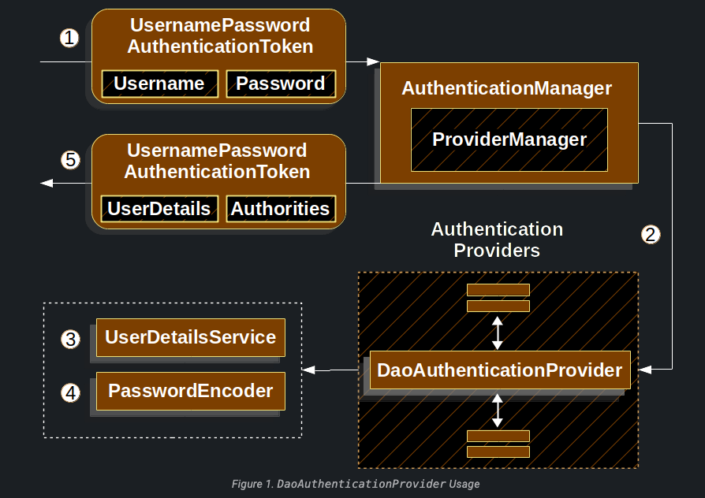

# Storage Mechanism

Kullanıcı adı ve şifre okuma için desteklenen her bir mekanizma, desteklenen depolama mekanizmalarından herhangi birini 
kullanabilir.  Spring Security, çeşitli kimlik bilgisi okuma mekanizmalarını destekler, örneğin HTTP temel kimlik 
doğrulama, form tabanlı kimlik doğrulama, OAuth, JWT ve daha fazlası. Her bir kimlik doğrulama mekanizması, 
kullanıcı adı ve şifre gibi kimlik bilgilerini okumak için farklı yöntemler kullanabilir.

* SimpleStorage with **_In-Memory Authentication_**
* Relational Database with **_JDBC Authentication_**
* Custom data stores with **_UserDetailsService_**
* LDAP storage with **_LDAP Authentication_**

## In-Memory Authentication

Spring Security'nin InMemoryUserDetailsManager'ı, bellekte depolanan kullanıcı adı/şifre tabanlı kimlik doğrulama 
desteği sağlamak için UserDetailsService'i uygular. InMemoryUserDetailsManager, UserDetailsManager interface'ini 
uygulayarak UserDetails'in yönetimini sağlar. UserDetails tabanlı kimlik doğrulama, Spring Security tarafından, 
kimlik doğrulama için bir kullanıcı adı ve parolayı kabul edecek şekilde yapılandırıldığında kullanılır.

Aşağıdaki örnekte kullanılmak üzere Spring CLI'ini kullanarak bir password üretiyorum;

* terminalde **spring encodepassword password** dediğimizde password generate ediliyor

```
@Bean
public UserDetailsService users() {
	UserDetails user = User.builder()
		.username("user")
		.password("{bcrypt}$2a$10$GRLdNijSQMUvl/au9ofL.eDwmoohzzS7.rmNSJZ.0FxO/BTk76klW")
		.roles("USER")
		.build();
	UserDetails admin = User.builder()
		.username("admin")
		.password("{bcrypt}$2a$10$GRLdNijSQMUvl/au9ofL.eDwmoohzzS7.rmNSJZ.0FxO/BTk76klW")
		.roles("USER", "ADMIN")
		.build();
	return new InMemoryUserDetailsManager(user, admin);
}
```
Yukarıda ki örneğin şifreleri güvenli bir şekilde depoladığını ancak kullanıcıların başlangıç deneyiminde bazı 
eksiklikler olduğunu göstemektedir. Şifrelerin güvenli bir şekilde depolanması, genellikle şifreleri düz metin olarak 
saklamamak ve kriptografik yöntemlerle korumak anlamına gelir.

```
@Configuration
public class DefaultSecurityConfig {
    @Bean
    public UserDetailsService users() {
        User.UserBuilder users = User.withDefaultPasswordEncoder();
        UserDetails user = users
                .username("user")
                .password("password")
                .roles("USER")
                .build();
        return new InMemoryUserDetailsManager(user);
    }
}
```
Yukarıda ki örnekte User.withDefaultPasswordEncoder, kullanıcının şifresini bir koddan varsayılan bir şifreleyici 
kullanarak koruyan bir yardımcı yöntemdir. Bu yöntem, bir kullanıcının şifresini düz metin olarak depolamak yerine, 
şifreyi otomatik olarak bir şifreleyiciye geçirir ve güvenli bir formatta saklar.Ancak, kaynak kodun decompile 
yoluyla şifrenin elde edilmesine karşı koruma sağlamaz. Bu durum, güvenlik açısından dikkate alınması gereken bir 
noktadır. Özellikle güvenli bir uygulama geliştirme hedeflendiğinde, şifreleri decompile edilme riskine karşı korumak 
için daha güçlü güvenlik önlemleri düşünülmelidir. Production'da kullanılmaz. withDefaultPasswordEncoder deprecate
edilmiştir. Yerine @Bean seklinde BCryptPasswordEncoder kullanılmalıdır

## JDBC Authentication

Spring Security'nin JdbcDaoImpl sınıfı, JDBC kullanarak alınan kullanıcı adı ve şifre tabanlı kimlik doğrulama desteği 
sağlamak için UserDetailsService interface'ini uygular. UserDetailsService, Spring Security'nin kimlik doğrulama 
sürecinde kullanılan bir arabirimdir. JdbcDaoImpl sınıfı, bu arabirimi uygulayarak, JDBC aracılığıyla kullanıcı adı ve 
şifre bilgilerini alarak kimlik doğrulama sağlar. 

JdbcUserDetailsManager sınıfı, JdbcDaoImpl sınıfından extend edilmişti, bu da onun JDBC ile kullanıcı ayrıntılarının 
saklanmasını ve yönetimini sağlayan yeteneklere sahip olduğunu gösterir. Bu sınıf, kullanıcı ayrıntılarının eklenmesi, 
güncellenmesi, silinmesi, sorgulanması gibi işlemleri gerçekleştirmek için JDBC'yi kullanır.

UserDetails-based authentication, Spring Security'nin kullanıcı kimlik doğrulama sürecinde kullanılan bir yöntemdir. 
Bu yöntemde, kimlik doğrulama için kullanıcı adı ve şifre çifti kabul edilir. Spring Security, bu kullanıcı adı ve 
şifreyi alarak UserDetails nesnesini oluşturur.

- Default Schema

JDBC tabanlı kimlik doğrulama kullanıldığında, kullanıcıların kimlik bilgileri veritabanında depolanır ve
Spring Security bu bilgilere erişmek için SQL sorgularını kullanır. Spring Security, kullanıcı adı/şifre tabanlı
kimlik doğrulama için bazı varsayılan sorguları sağlar. Spring Security'nin varsayılan sorguları, genellikle
UserDetailsService ile birleştirilerek veya UserDetailsManager üzerinden yapılandırılarak kullanılır. Bu sorgular,
JDBC üzerinden veritabanına erişerek kimlik doğrulama işlemlerini gerçekleştirir.

- User Schema

JdbcDaoImpl, UserDetails tabanlı kimlik doğrulaması için kullanılan bir sınıftır ve JDBC tabanlı kimlik doğrulama 
işlemlerini gerçekleştirir. Bu işlemler için JdbcDaoImpl, kullanıcının kimlik bilgilerini doğrulamak ve kullanıcının 
yetkilerini yüklemek için belirli tablolara ihtiyaç duyar.

Classpath, bir Java projesinin çalışma zamanında kullanılan kaynak dosyalarını ve sınıfları içeren bir yol dizinidir. 
Varsayılan şema dosyası, projenin classpath'ine dahil edilir ve adıyla erişilebilir hale getirilir. Genellikle, 
varsayılan şema dosyasının adı "schema.sql" veya "database.sql" gibi bir şeydir. Bu dosya, kullanıcı bilgilerini 
depolamak için gereken tabloları oluşturmak için gerekli SQL ifadelerini içerir.

External Libraries içerisinde: org/springframework/security/core/userdetails/jdbc/users.ddl isimli DefaultUserSchema'sı
bulunur

- Group Schema

Eğer uygulamanız group'ları kullanıyorsa group schema'yı sağlamanız gerekmektedir. Aşağıdaki örnek;
```
create table groups (
	id bigint generated by default as identity(start with 0) primary key,
	group_name varchar_ignorecase(50) not null
);

create table group_authorities (
	group_id bigint not null,
	authority varchar(50) not null,
	constraint fk_group_authorities_group foreign key(group_id) references groups(id)
);

create table group_members (
	id bigint generated by default as identity(start with 0) primary key,
	username varchar(50) not null,
	group_id bigint not null,
	constraint fk_group_members_group foreign key(group_id) references groups(id)
);
```

- Setting up a MySQL Database
Docker uzerinden mysql container'i create ediyorum. Test adında bir DB yaratıyorum ve icerisine asagidaki MYSQL
sorgusunu calistiyorum
```
create table users
(
    username varchar(50)  not null primary key,
    password varchar(500) not null,
    enabled  boolean      not null
);
create table authorities
(
    username  varchar(50) not null,
    authority varchar(50) not null,
    constraint fk_authorities_users foreign key (username) references users (username)
);
create unique index ix_auth_username on authorities (username, authority);
```
- Setting up a DataSource
JdbcUserDetailsManager'i yapılandırmadan önce bir DataSource oluşturmalıyız.
```
@Bean
    public DataSource dataSource() {
        DriverManagerDataSource dataSource = new DriverManagerDataSource();
        dataSource.setDriverClassName("com.mysql.cj.jdbc.Driver");
        dataSource.setUrl("jdbc:mysql://localhost:3306/test");
        dataSource.setUsername("root");
        dataSource.setPassword("verysecretpass");
        return dataSource;
    }
```

- JdbcUserDetailsManager Bean.Spring CLI ile sifre generate ediyoruz.
```
@Bean
    UserDetailsManager users(DataSource dataSource) {
        UserDetails user = User.builder()
                .username("user")
                .password("{bcrypt}$2a$10$GRLdNijSQMUvl/au9ofL.eDwmoohzzS7.rmNSJZ.0FxO/BTk76klW")
                .roles("USER")
                .build();
        UserDetails admin = User.builder()
                .username("admin")
                .password("{bcrypt}$2a$10$GRLdNijSQMUvl/au9ofL.eDwmoohzzS7.rmNSJZ.0FxO/BTk76klW")
                .roles("ADMIN")
                .build();
        JdbcUserDetailsManager users = new JdbcUserDetailsManager(dataSource);
        users.createUser(user);
        users.createUser(admin);
        return users;
    }
```
Yukarıda ki Bean yardımıyla DB'ye user ve admin object'leri otomatik olarak insert ediliyor

## UserDetails
UserDetails, UserDetailsService tarafından döndürülür. DaoAuthenticationProvider, UserDetails'ı doğrular ve ardından 
yapılandırılmış UserDetailsService tarafından döndürülen UserDetails'ı içeren bir principal'e sahip olan bir 
Authentication nesnesini döndürür. Bu ifade, kullanıcı ayrıntılarının UserDetails nesnesi olarak temsil edildiği ve bu 
ayrıntıların UserDetailsService tarafından sağlandığından bahsetmektedir. UserDetails, bir kullanıcının kimlik 
bilgilerini (kullanıcı adı, şifre, roller vb.) içeren bir interface'i temsil eder. UserDetailsService, kullanıcı 
ayrıntılarını sağlamak için kullanılan bir arayüzdür. Bu arayüzü uygulayan sınıflar, kullanıcı verilerini bir 
veritabanından, bir API'den veya başka bir kaynaktan alabilir. UserDetailsService, genellikle kimlik doğrulama 
işlemi sırasında kullanıcının ayrıntılarını almak için kullanılır. DaoAuthenticationProvider, UserDetails'ı doğrulamak 
ve kimlik doğrulama işlemi için bir Authentication nesnesi oluşturmakla sorumludur. Bu işlem genellikle kullanıcının 
sağladığı kimlik bilgilerini (kullanıcı adı ve şifre gibi) kullanarak UserDetails nesnesinin doğrulanmasını içerir.

Sonuç olarak, DaoAuthenticationProvider, UserDetails'ı doğrular ve ardından bu doğrulanmış kullanıcı ayrıntılarını 
içeren bir Authentication nesnesi oluşturur. Bu Authentication nesnesi, kullanıcının kimlik doğrulama sürecini 
geçtiğini ve yetkilendirme ve diğer güvenlik kontrolleri için kullanılabileceğini temsil eder.

## UserDetailsService
UserDetailsService, DaoAuthenticationProvider tarafından kullanılır ve bir kullanıcı adı, şifre ve diğer öznitelikleri 
almak için kullanılır. Bir kullanıcı adı ve şifre ile kimlik doğrulama yapmak için kullanılır.

UserDetailsService, genellikle kimlik doğrulama işlemi sırasında kullanıcının kimlik bilgilerini almak için kullanılır. 
İstemciden gelen kimlik bilgileri, kullanıcı adı ve şifre gibi, UserDetailsService aracılığıyla alınır.

Spring Security, UserDetailsService için in-memory ve JDBC tabanlı implementasyonlar sağlar.
* In-Memory UserDetailsService: Bu implementasyon, kullanıcı ayrıntılarını bellekte bir veri yapısında 
(genellikle bir Map) saklar. Örneğin, kullanıcı adları, şifreler ve roller gibi bilgileri içeren bir Map 
kullanılabilir. Bu yöntem basit uygulamalar için uygundur, ancak büyük kullanıcı tabanları veya güncellemeler 
gerektiren senaryolarda kullanışsız olabilir.
* JDBC UserDetailsService: Bu implementasyon, kullanıcı ayrıntılarını bir JDBC veritabanından alır. 
JDBC UserDetailsService, genellikle kullanıcı bilgilerinin bir veritabanında saklandığı ve kimlik doğrulama işlemi 
sırasında bu veritabanının kullanıldığı durumlarda tercih edilir. Veritabanında kullanıcı tablosu ve gerekli sütunlar 
(kullanıcı adı, şifre, roller vb.) bulunmalıdır. Bu şekilde, kullanıcı kimlik bilgileri güvenli bir şekilde 
saklanabilir ve veritabanı kullanıcı yönetimi sağlanabilir.

Özelleştirilmiş kimlik doğrulama yapmak için, özel bir UserDetailsService uygulamasını bir bean olarak açığa 
çıkarabilirsiniz. Aşağıdaki örnek, CustomUserDetailsService sınıfının UserDetailsService arayüzünü uyguladığını 
varsayarak kimlik doğrulamayı özelleştiriyor.

Örneğin;
UserDetailsService arayüzünü uygulayan CustomUserDetailsService adında bir sınıf oluşturun. Bu sınıf, kimlik doğrulama 
süreci sırasında kullanıcıya özgü verileri yüklemekten sorumlu olacak.

```
public class CustomUserDetailsService implements UserDetailsService {
    // Implement the loadUserByUsername method to load user-specific data based on the provided username
    @Override
    public UserDetails loadUserByUsername(String username) throws UsernameNotFoundException {
        // Custom logic to load user details from a data source
        // Return an instance of UserDetails that represents the user
    }
}
```
Bu sınıfı Spring container'ina bir bean olarak ekleyin. Bunun için, @Service, @Component veya @Bean gibi bir Spring 
bileşeni anotasyonunu kullanabilirsiniz. Spring Security konfigürasyonunda, bu özelleştirilmiş UserDetailsService'ı 
kullanarak kimlik doğrulama işlemini yapılandırabilirsiniz.

```
@Configuration
@EnableWebSecurity
public class SecurityConfig extends WebSecurityConfigurerAdapter {

    @Autowired
    private CustomUserDetailsService userDetailsService;

    @Override
    protected void configure(AuthenticationManagerBuilder auth) throws Exception {
        auth.userDetailsService(userDetailsService);
    }
    
    // ...
}
```

## PasswordEncoder

Elbette! Spring Security'nin servlet desteği, PasswordEncoder ile entegre olarak şifreleri güvenli bir şekilde 
depolamayı içerir. PasswordEncoder, şifreleri kodlamak ve doğrulamakla sorumludur. Spring Security tarafından 
kullanılan PasswordEncoder uygulamasını özelleştirmek için, bir PasswordEncoder bean'ini açığa çıkarmanız 
gerekmektedir. Bu şekilde, Spring Security, belirtilen PasswordEncoder bean'ini kullanarak şifreleri kodlama ve 
doğrulama işlemlerini gerçekleştirecektir. Bu, şifrelerin güvenli bir şekilde depolanmasını sağlamak için kullanılan 
algoritmayı ve yapılandırmaları belirlemenize olanak tanır. Özelleştirilmiş bir PasswordEncoder bean'ini açığa çıkarmak
için aşağıdaki gibi bir yapılandırma yapabilirsiniz:

```
@Configuration
public class SecurityConfig {

    @Bean
    public PasswordEncoder passwordEncoder() {
        // Return your custom PasswordEncoder implementation
        // Example: return new BCryptPasswordEncoder();
    }

    // Other security configuration...
}
```
Bu örnekte, passwordEncoder() adında bir PasswordEncoder bean'i tanımlanmıştır. Kendi özel PasswordEncoder 
uygulamanızı döndürmelisiniz. Örneğin, BCryptPasswordEncoder kullanarak şifreleri kodlamak için 
new BCryptPasswordEncoder() ifadesini döndürebilirsiniz. Böylece, özelleştirilmiş PasswordEncoder uygulamanızı 
Spring Security ile entegre edebilir ve şifreleri güvenli bir şekilde depolayabilirsiniz.

## DaoAuthenticationProvider

DaoAuthenticationProvider bir AuthenticationProvider implementasyonudur ve bir UserDetailsService ve PasswordEncoder 
kullanarak bir kullanıcı adı ve şifresini doğrulamak için kullanılır. DaoAuthenticationProvider'ın temel işlevi, 
kullanıcının sağladığı kimlik bilgilerini (kullanıcı adı ve şifre) kullanarak bir doğrulama işlemi gerçekleştirmektir. 
Bu işlem sırasında, UserDetailsService kullanıcı ayrıntılarını alır ve doğru kullanıcı bulunduğunda PasswordEncoder 
kullanıcı tarafından sağlanan şifreyi doğrular. Bu şekilde, DaoAuthenticationProvider kullanarak bir kullanıcının 
kimlik doğrulamasını gerçekleştirebilirsiniz. Bu, veritabanından kullanıcı bilgilerini almak ve doğru şifreleme 
algoritmasını kullanarak şifreleri doğrulamak için yaygın olarak kullanılan bir yöntemdir.



1 - "Reading the Username & Password" bölümündeki authentication Filter'i, isteğin içerisinden kullanıcı adını ve şifreyi 
çıkarmak ve bir UsernamePasswordAuthenticationToken nesnesi oluşturmakla görevlidir. Bu token, kullanıcının kimlik 
bilgilerini temsil eder ve sonra AuthenticationManager'a iletilir.

2 - AuthenticationManager, Spring Security tarafından sağlanan bir arayüzdür ve kimlik doğrulama işlemlerini yönetir. 
ProviderManager, AuthenticationManager arayüzünü uygulayan bir örnektir. AuthenticationManager, gelen kimlik doğrulama 
isteğini alır ve doğrulama işlemini gerçekleştirmek için ilgili kimlik doğrulayıcıları (AuthenticationProvider) 
kullanır. ProviderManager, kimlik doğrulama işlemini yöneten ve AuthenticationManager arayüzünü uygulayan bir sınıftır. 
DaoAuthenticationProvider türünde bir AuthenticationProvider kullanarak yapılandırılan ProviderManager, kimlik 
doğrulama işlemini gerçekleştirmek için bu özel AuthenticationProvider'ı kullanır.

3 - DaoAuthenticationProvider UserDetailsService'den UserDetails'i arar

4 - DaoAuthenticationProvider, önceki adımda döndürülen UserDetails üzerindeki parolayı doğrulamak için 
PasswordEncoder'ı kullanır.

5 - Kimlik doğrulama başarılı olduğunda, döndürülen Authentication nesnesi UsernamePasswordAuthenticationToken 
türündedir ve principal (anahtar) olarak, yapılandırılmış UserDetailsService tarafından döndürülen UserDetails 
nesnesini içerir. Sonuç olarak, döndürülen UsernamePasswordAuthenticationToken, kimlik doğrulama Filtresi tarafından 
SecurityContextHolder üzerine ayarlanır.

## LDAP Authentication
LDAP (Lightweight Directory Access Protocol), Türkçe açılımıyla Hafif Dizin Erişim Protokolü, kullanıcı bilgilerini 
merkezi bir veritabanında saklamak ve kimlik doğrulama hizmeti olarak kullanmak için organizasyonlar tarafından 
sıklıkla kullanılan bir protokoldür. Ayrıca uygulama kullanıcılarının rol bilgilerini depolamak için de kullanılabilir.

Spring Security, kullanıcıların kimlik doğrulama işlemlerini gerçekleştirmek için farklı yöntemler sunar. 
Bunlardan biri, kullanıcı adı ve parola ile LDAP tabanlı kimlik doğrulamadır. LDAP tabanlı kimlik doğrulama, 
kullanıcının veritabanında saklanan kullanıcı adı ve parolasını bir LDAP sunucusuna göndererek doğrulama işlemini 
gerçekleştirir. Öte yandan, kullanıcı adı ve parola ile kimlik doğrulaması yapılmasına rağmen, bind kimlik 
doğrulamasında LDAP sunucusu parolayı döndürmediği için, uygulama parolanın doğrulamasını gerçekleştiremediğinden 
UserDetailsService kullanılmaz

LDAP sunucusunun nasıl yapılandırılabileceği konusunda farklı senaryolar bulunmaktadır. Bu nedenle, Spring Security'nin 
LDAP sağlayıcısı tamamen yapılandırılabilir. Spring Security, kimlik doğrulama ve rol alımı için ayrı strateji 
arayüzleri kullanır ve geniş bir yelpazedeki durumları yönetmek için yapılandırılabilen varsayılan uygulamalar sunar.

- Setting up an Embedded LDAP Server
Yapmanız gereken ilk şey, yapılandırmanızı yönlendireceğiniz bir LDAP Sunucunuz olduğundan emin olmaktır. Basitlik 
açısından, genellikle yerleşik bir LDAP Sunucusu ile başlamak en iyisidir. Spring Security aşağıdakilerden birini 
kullanmayı destekler:

1 - Embedded UnboundID Server

2 - Embedded ApacheDS Server

users.ldif adlı bir dosya, classpath bir kaynak olarak kullanılır ve bu dosya üzerinde tanımlanan "user" ve "admin" 
kullanıcıları, her ikisinin de "password" olarak ayarlanmış şifreleriyle birlikte LDAP sunucusunda oluşturulur.

```
dn: ou=groups,dc=springframework,dc=org
objectclass: top
objectclass: organizationalUnit
ou: groups

dn: ou=people,dc=springframework,dc=org
objectclass: top
objectclass: organizationalUnit
ou: people

dn: uid=admin,ou=people,dc=springframework,dc=org
objectclass: top
objectclass: person
objectclass: organizationalPerson
objectclass: inetOrgPerson
cn: Rod Johnson
sn: Johnson
uid: admin
userPassword: password

dn: uid=user,ou=people,dc=springframework,dc=org
objectclass: top
objectclass: person
objectclass: organizationalPerson
objectclass: inetOrgPerson
cn: Dianne Emu
sn: Emu
uid: user
userPassword: password

dn: cn=user,ou=groups,dc=springframework,dc=org
objectclass: top
objectclass: groupOfNames
cn: user
uniqueMember: uid=admin,ou=people,dc=springframework,dc=org
uniqueMember: uid=user,ou=people,dc=springframework,dc=org

dn: cn=admin,ou=groups,dc=springframework,dc=org
objectclass: top
objectclass: groupOfNames
cn: admin
uniqueMember: uid=admin,ou=people,dc=springframework,dc=org
```

- Embedded UnboundID Server
UnboundID kullanılacaksa aşağıda ki dependency'ler eklenmelidir.
```
<dependency>
	<groupId>com.unboundid</groupId>
	<artifactId>unboundid-ldapsdk</artifactId>
	<version>6.0.8</version>
	<scope>runtime</scope>
</dependency>
```
Ardından Gömülü LDAP Sunucusunu bir EmbeddedLdapServerContextSourceFactoryBean kullanarak yapılandırabilirsiniz. 
Bu, Spring Security'ye bir in-memory LDAP sunucusu başlatma talimatı verecektir:
```
@Bean
public EmbeddedLdapServerContextSourceFactoryBean contextSourceFactoryBean() {
	return EmbeddedLdapServerContextSourceFactoryBean.fromEmbeddedLdapServer();
}
```
Alternatif olarak, Yerleşik LDAP Sunucusunu manuel olarak da yapılandırabilirsiniz. Bu yaklaşımı seçerseniz Gömülü LDAP 
Sunucusunun yaşam döngüsünü yönetmekten siz sorumlu olursunuz.
```
@Bean
UnboundIdContainer ldapContainer() {
	return new UnboundIdContainer("dc=springframework,dc=org",
				"classpath:users.ldif");
}
```

- Embedded ApacheDS Server
Eğer ApacheDS kullanılmak isteniyorsa aşağıdaki dependency'ler eklenmelidir
```
<dependency>
	<groupId>org.apache.directory.server</groupId>
	<artifactId>apacheds-core</artifactId>
	<version>1.5.5</version>
	<scope>runtime</scope>
</dependency>
<dependency>
	<groupId>org.apache.directory.server</groupId>
	<artifactId>apacheds-server-jndi</artifactId>
	<version>1.5.5</version>
	<scope>runtime</scope>
</dependency>
```
Daha sonra embedded LDAP sunucusunu yapılandırabilirsiniz
```
@Bean
ApacheDSContainer ldapContainer() {
	return new ApacheDSContainer("dc=springframework,dc=org",
				"classpath:users.ldif");
}
```

- LDAP ContextSource
Yapılandırmanızı yönlendirmek için bir LDAP Sunucunuz olduğunda, Spring Security'yi kullanıcıların kimliğini 
doğrulamak için kullanılması gereken bir LDAP sunucusuna işaret edecek şekilde yapılandırmanız gerekir.

Bunu yapmak için bir LDAP ContextSource oluşturun (JDBC DataSource'a eşdeğerdir).

LDAP ContextSource, LDAP sunucusuna bağlantı kurmak ve kimlik doğrulama işlemlerini gerçekleştirmek için gereken 
bağlantı bilgilerini sağlar. Dolayısıyla, EmbeddedLdapServerContextSourceFactoryBean yapılandırıldıysa, Spring Security 
otomatik olarak LDAP sunucusuna bağlanmak için gerekli olan ContextSource nesnesini oluşturur ve konfigürasyonunuzu bu 
bağlamda kullanır. Bu şekilde, Spring Security, LDAP sunucusuna işaret eden bir ContextSource kullanarak 
kimlik doğrulama ve yetkilendirme işlemlerini gerçekleştirir.
```
@Bean
public EmbeddedLdapServerContextSourceFactoryBean contextSourceFactoryBean() {
	EmbeddedLdapServerContextSourceFactoryBean contextSourceFactoryBean =
			EmbeddedLdapServerContextSourceFactoryBean.fromEmbeddedLdapServer();
	contextSourceFactoryBean.setPort(0);
	return contextSourceFactoryBean;
}
```
Alternatif olarak, sağlanan LDAP sunucusuna bağlanmak için LDAP ContextSource'u açıkça yapılandırabilirsiniz:
```
ContextSource contextSource(UnboundIdContainer container) {
	return new DefaultSpringSecurityContextSource("ldap://localhost:53389/dc=springframework,dc=org");
}
```

- Authentication
LDAP bind kimlik doğrulamasında, istemci kullanıcı adı ve parolayı LDAP sunucusuna sağlar ve sunucu bu bilgileri 
doğrular. Ancak, sunucu parolanın kendisini veya karmasını döndürmez. Bu nedenle, Spring Security kullanıcının 
parolasını doğrulayamaz çünkü parola bilgisi uygulama tarafına iletilmez. Bu durumda, Spring Security LDAP desteği, 
bind kimlik doğrulaması üzerinde odaklanarak kullanıcı kimlik doğrulama sürecini gerçekleştirir. Kullanıcının 
sağladığı kullanıcı adı ve parolayı LDAP sunucusuna göndererek doğrulama işlemini gerçekleştirir, ancak parola 
bilgisini doğrudan okuyamaz veya doğrulayamaz. Bu nedenle, Spring Security LDAP desteğiyle kullanıcı kimlik doğrulaması 
gerçekleştirirken UserDetailsService'i kullanmaz.

Bu nedenle LDAP desteği LdapAuthenticator interface'i üzerinden uygulanmaktadır. LdapAuthenticator interface'i, 
gerektiğinde kullanıcı attribute'lerini almakla da sorumludur. LDAP sunucusunda saklanan kullanıcı atrribute'lerin 
her biri için izinler ayrı ayrı ayarlanabilir. Kimlik doğrulama türüne bağlı olarak, belirli bir kimlik doğrulama 
yöntemi kullanıldığında erişilebilecek attribute'ler değişebilir. Örneğin, kullanıcı olarak bağlanıyorsa, attributeleri 
kullanıcının kendi izinleriyle okumak gerekebilir.

Spring Security, iki LdapAuthenticator uygulaması sağlar:

1 - User Bind Authentication

2 - Using Password Authentication

- 1 -  Using Bind Authentication

Bind kimlik doğrulaması, LDAP sunucusuna bağlanarak kullanıcı adı ve parolanın doğrulanmasını içeren bir mekanizmadır. 
Kullanıcı, LDAP sunucusuna bağlanırken kullanıcı adını ve parolayı sağlar. Sunucu, bu sağlanan kimlik bilgilerini 
kullanarak kullanıcının kimlik doğrulamasını gerçekleştirir.

Bind kimlik doğrulamasında, kullanıcının kimlik bilgileri (kullanıcı adı ve parola) LDAP sunucusuna gönderilir ve 
sunucu tarafından doğrulanır. Bind Authentication kullanmanın avantajı, kullanıcının secrets (the password) istemcilere 
ifşa edilmesinin gerekmemesidir, bu da onları sızıntıdan korumaya yardımcı olur.

```
@Bean
AuthenticationManager authenticationManager(BaseLdapPathContextSource contextSource) {
	LdapBindAuthenticationManagerFactory factory = new LdapBindAuthenticationManagerFactory(contextSource);
	factory.setUserDnPatterns("uid={0},ou=people");
	return factory.createAuthenticationManager();
}
```
Yukarıda ki örnek kullanıcı giriş adını sağlanan desende yerine koyarak kullanıcı için DN'yi elde eder ve ardından 
kullanıcıyı o DN ile ve giriş parolasıyla bağlamaya çalışır.

Örneğin, bir kullanıcının giriş adı "john" ise ve sağlanan desen "cn={0},ou=users,dc=mydomain,dc=com" ise, örnekteki 
işlem, "{0}" yerine "john" yazarak "cn=john,ou=users,dc=mydomain,dc=com" gibi bir DN oluşturur ve ardından bu DN ve 
kullanıcının giriş parolasını kullanarak LDAP sunucusuna bağlanmaya çalışır.

Tüm kullanıcıların dizinde tek bir node altında depolandığı durumlarda yukarıdaki işlemin uygun olduğu ifade edilir. 
Bazı durumlarda, LDAP dizininde tüm kullanıcıların tek bir düğüm (örneğin, "ou=users") altında depolandığı bir yapı 
kullanılabilir. Bu durumda, yukarıdaki örnekte belirtilen desen ve işlem kullanıcıların DN'lerini doğru şekilde 
oluşturmak için yeterli olacaktır.

Bunun yerine, kullanıcıyı bulmak için bir LDAP arama filtresi yapılandırmak isterseniz, aşağıdaki örneği 
kullanabilirsiniz

```
@Bean
AuthenticationManager authenticationManager(BaseLdapPathContextSource contextSource) {
	LdapBindAuthenticationManagerFactory factory = new LdapBindAuthenticationManagerFactory(contextSource);
	factory.setUserSearchFilter("(uid={0})");
	factory.setUserSearchBase("ou=people");
	return factory.createAuthenticationManager();
}
```

Daha önce gösterilen ContextSource tanımıyla kullanılırsa, bu, filtre olarak (uid={0}) kullanarak ou=people,
dc=springframework,dc=org DN'si altında bir arama gerçekleştirir. 

Yine, filtre adındaki parametrenin yerine kullanıcı oturum açma adı değiştirilir, böylece kullanıcı adına eşit uid 
attribute'una sahip bir giriş arar. Bir kullanıcı arama tabanı sağlanmazsa, arama root'dan gerçekleştirilir.

- 2 - Using Password Authentication

Parola karşılaştırması, kullanıcı tarafından sağlanan parolanın repository'de saklanan parola ile karşılaştırılması 
işlemidir.

kullanıcının parolasını doğrulamak için iki farklı yöntem bulunmaktadır

1 - Parola attirubute'unun değerini alarak locally olarak kontrol etme: Bu yöntemde, LDAP sunucusundan kullanıcının 
parola attirubute'unun değeri alınır ve locally olarak kontrol edilir. Karşılaştırma işlemi locally gerçekleştirildiği 
için, parola değeri sunucudan alınmaz. Bu yöntem, parolanın doğruluğunu doğrulamak için kullanılabilir.

2 - LDAP "compare" methodu kullanarak parolayı karşılaştırma: Bu yöntemde, sağlanan parola sunucuya gönderilir ve 
sunucuda karşılaştırma işlemi gerçekleştirilir. Gerçek parola değeri asla alınmaz. Bu yöntemde, sunucuda parolanın 
doğru bir şekilde rastgele bir salt hashed yapıldığı durumlarda LDAP "compare" methodu gerçekleştirilemez.

```
@Bean
AuthenticationManager authenticationManager(BaseLdapPathContextSource contextSource) {
	LdapPasswordComparisonAuthenticationManagerFactory factory = new LdapPasswordComparisonAuthenticationManagerFactory(
			contextSource, NoOpPasswordEncoder.getInstance());
	factory.setUserDnPatterns("uid={0},ou=people");
	return factory.createAuthenticationManager();
}
```

Aşağıdaki örnek, bazı özelleştirmelerle birlikte daha gelişmiş bir yapılandırmayı göstermektedir:

```
@Bean
AuthenticationManager authenticationManager(BaseLdapPathContextSource contextSource) {
	LdapPasswordComparisonAuthenticationManagerFactory factory = new LdapPasswordComparisonAuthenticationManagerFactory(
			contextSource, new BCryptPasswordEncoder());
	factory.setUserDnPatterns("uid={0},ou=people");
	factory.setPasswordAttribute("pwd");
	return factory.createAuthenticationManager();
}
```

- LdapAuthoritiesPopulator

Spring Security'nin LdapAuthoritiesPopulator'ı, kullanıcı için hangi yetkilerin döndürüldüğünü belirlemek için 
kullanılır.

```
@Bean
LdapAuthoritiesPopulator authorities(BaseLdapPathContextSource contextSource) {
	String groupSearchBase = "";
	DefaultLdapAuthoritiesPopulator authorities =
		new DefaultLdapAuthoritiesPopulator(contextSource, groupSearchBase);
	authorities.setGroupSearchFilter("member={0}");
	return authorities;
}

@Bean
AuthenticationManager authenticationManager(BaseLdapPathContextSource contextSource, LdapAuthoritiesPopulator authorities) {
	LdapBindAuthenticationManagerFactory factory = new LdapBindAuthenticationManagerFactory(contextSource);
	factory.setUserDnPatterns("uid={0},ou=people");
	factory.setLdapAuthoritiesPopulator(authorities);
	return factory.createAuthenticationManager();
}
```

- Active Directory

Active Directory, Microsoft'un geliştirdiği bir dizin hizmetidir ve LDAP protokolünü destekler. Ancak, bazı özel 
yeteneklere ve özelliklere sahip olduğu için, standart LdapAuthenticationProvider'ın tipik kullanım deseniyle tam 
olarak uyumlu olmayabilir.

Active Directory'nin kendi non-standard (standart dışı) kimlik doğrulama seçenekleri vardır. Bu seçenekler, 
Active Directory'nin sunduğu özel yeteneklere ve yapılandırmalara dayanır. Bu nedenle, normalde kullanılan standart 
LdapAuthenticationProvider ile bu özel yetenekleri desteklemek veya kullanmak zor olabilir.

Tipik olarak kimlik doğrulama, bir LDAP ayırt edici adı kullanmak yerine etki alanı kullanıcı adı 
(kullanıcı@etki alanı biçiminde) kullanılarak gerçekleştirilir. Bunu kolaylaştırmak için Spring Security, tipik bir 
Active Directory kurulumu için özelleştirilmiş bir kimlik doğrulama sağlayıcısına sahiptir.

ActiveDirectoryLdapAuthenticationProvider'ı yapılandırmak oldukça basittir. Yalnızca etki alanı adını ve sunucunun 
adresini sağlayan bir LDAP URL'sini sağlamanız gerekir

```
@Bean
ActiveDirectoryLdapAuthenticationProvider authenticationProvider() {
	return new ActiveDirectoryLdapAuthenticationProvider("example.com", "ldap://company.example.com/");
}
```