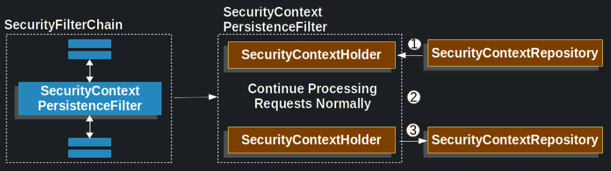
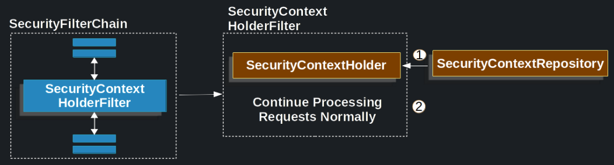

# Persisting Authentication

Bir kullanıcının korumalı bir kaynağa erişim isteğinde bulunduğunda ilk kez kimlik bilgileri istendiğini belirtmektedir 
Kimlik bilgilerinin istenmesi için en yaygın yöntemlerden biri, kullanıcıyı giriş sayfasına yönlendirmektir. 
Kimlik doğrulaması yapılmamış bir kullanıcının korumalı bir kaynağa erişim isteği için özetlenmiş bir HTTP 
exchange'i şu şekilde olabilir.

Example 1. Unauthenticated User Requests Protected Resource:
```
GET / HTTP/1.1
Host: example.com
Cookie: SESSION=91470ce0-3f3c-455b-b7ad-079b02290f7b

Copied!
HTTP/1.1 302 Found
Location: /login
```

User, username ve password'u submit eder

Username and Password Submitted
```
POST /login HTTP/1.1
Host: example.com
Cookie: SESSION=91470ce0-3f3c-455b-b7ad-079b02290f7b

username=user&password=password&_csrf=35942e65-a172-4cd4-a1d4-d16a51147b3e
```
Kullanıcının kimlik doğrulaması yapıldıktan sonra, session fixation attacks'ları önlemek için kullanıcının yeni bir 
oturum kimliğiyle ilişkilendirildiğini belirtmektedir.

Session fixation saldırısı, bir saldırganın hedef kullanıcının oturum kimliğini ele geçirerek saldırganın belirlediği 
oturumu kullanmasını sağlamayı amaçlar. Bunu engellemek için, kullanıcının kimlik doğrulaması yapıldıktan sonra, 
yeni bir oturum kimliği (session id) ile ilişkilendirilir. Bu, saldırganın önceden elde ettiği oturum kimliğiyle 
oturum açmasını engeller ve güvenliği artırır.

Authenticated User is Associated to New Session:
```
HTTP/1.1 302 Found
Location: /
Set-Cookie: SESSION=4c66e474-3f5a-43ed-8e48-cc1d8cb1d1c8; Path=/; HttpOnly; SameSite=Lax
```

Bir kullanıcı kimlik doğrulandıktan sonra, sunucu tarafında oturum oluşturulur ve session cookie kullanıcıya gönderilir 
Session Cookies genellikle tarayıcının belleğinde veya diskte saklanır ve sonraki isteklerde sunucuya gönderilir.

Authenticated Session Provided as Credentials:
```
GET / HTTP/1.1
Host: example.com
Cookie: SESSION=4c66e474-3f5a-43ed-8e48-cc1d8cb1d1c8
```

# SecurityContextRepository

Spring Security'de kullanıcının gelecekteki request'lere ilişkilendirilmesinin SecurityContextRepository aracılığıyla 
yapıldığını belirtelim.SecurityContextRepository'nin varsayılan implementasyonu DelegatingSecurityContextRepository'dir 
ve aşağıdakilere yönlendirme yapar:
- HttpSessionSecurityContextRepository
- RequestAttributeSecurityContextRepository

### HttpSessionSecurityContextRepository

HttpSessionSecurityContextRepository, Spring Security tarafından kullanılan bir sınıftır ve SecurityContext HttpSession 
ile ilişkilendirir. HttpSessionSecurityContextRepository, SecurityContext nesnesini HttpSession'a kaydetmek için 
Java'nın standart HttpSession mekanizmasını kullanır. Bu sayede, kullanıcının kimlik doğrulama durumunu oturum 
süresince koruyabilir ve ilgili her istekte SecurityContext'i elde edebilirsiniz.

Kullanıcılar HttpSessionSecurityContextRepository'nin yerine başka bir SecurityContextRepository uygulaması 
kullanabilirler. HttpSessionSecurityContextRepository, Spring Security tarafından varsayılan olarak kullanılan bir 
implementasyondur, ancak kullanıcılar kendi gereksinimlerine göre farklı bir davranış sergilemek veya kullanıcıları 
sonraki isteklerle başka bir şekilde ilişkilendirmek istediklerinde bu davranışı değiştirebilirler.

### NullSecurityContextRepository

NullSecurityContextRepository, HttpSession ile SecurityContext'i ilişkilendirmek istemediğiniz durumlarda 
kullanabileceğiniz bir SecurityContextRepository uygulamasıdır. Bu uygulama, hiçbir işlem yapmadan boş bir 
SecurityContext döndürür ve kaydetme işlemi gerçekleştirmez.

NullSecurityContextRepository, loadContext yöntemini çağırıldığında her zaman boş bir SecurityContext döndürür. 
saveContext yöntemi hiçbir işlem yapmaz ve SecurityContext'i kaydetmez. containsContext yöntemi her zaman false 
döndürür, yani bir SecurityContext'in varlığını kontrol ettiğinde her zaman bulunmadığı sonucunu verir.

Bu şekilde, NullSecurityContextRepository kullanarak, örneğin OAuth ile kimlik doğrulama yaptığınızda, HttpSession 
kullanmak yerine SecurityContext'i tamamen atlayabilir ve geçici olarak saklamayabilirsiniz. Bu senaryoda, her istekte 
kimlik doğrulama işlemini yeniden gerçekleştirmek ve kimlik doğrulama durumunu uygun şekilde yönetmek sorumluluğu size 
ait olacaktır.

### RequestAttributeSecurityContextRepository

RequestAttributeSecurityContextRepository, Spring Security tarafından sağlanan bir SecurityContextRepository 
uygulamasıdır. Bu uygulama, SecurityContext'i güvenli bir şekilde bir request attribute olarak saklar. Böylece, 
SecurityContext'in çeşitli yönlendirmeler (dispatch types) nedeniyle temizlenebileceği durumlarda bile tek bir istek 
için kullanılabilir hale gelir. Spring Security, bir istek sırasında bir veya daha fazla yönlendirme işlemi 
gerçekleştirebilir. Bu yönlendirmeler, örneğin iç sayfalara yönlendirme veya kaynak istekleri gibi işlemleri 
içerebilir. Yönlendirme işlemleri, bir isteğin farklı bileşenler veya filtreler tarafından işlenmesini sağlar. Bazı 
durumlarda, yönlendirme işlemi SecurityContext'i temizleyebilir. Örneğin, iç sayfalara yapılan yönlendirmeler 
genellikle yeni bir istek olarak kabul edilir ve bu istekle birlikte önceki SecurityContext bilgisi kaybolabilir. 
RequestAttributeSecurityContextRepository, bu durumu ele almak için kullanılır. Bu uygulama, SecurityContext'i bir 
request attribute olarak saklar, böylece farklı yönlendirmeler sırasında da SecurityContext'in korunmasını sağlar. 
Bu sayede, SecurityContext'in tek bir istek için kullanılabilir olmasını garanti eder.

Örneğin, bir istemci bir istek gönderir, kimlik doğrulaması gerçekleştirilir ve ardından bir hata oluşur. Bir servlet 
konteyneri, gelen istekleri yönetmek ve ilgili servlet veya filtreleri çalıştırmak için kullanılır. Hata durumunda, 
servlet konteyneri, hata işleme mekanizmalarını devreye alır ve hata yönlendirmesini gerçekleştirir. Servlet 
konteynerinin bu şekilde davranması, hata durumunda güvenlik açısından ek önlemler alınmasını ve güvenlik durumunun 
yeniden değerlendirilmesini sağlar. Böylece, hataların güvenlik açıklarına yol açmasının önüne geçilebilir ve 
kullanıcıların güvenliği korunabilir. Bu durumda, hata yönlendirmesi sırasında, mevcut SecurityContext geçerliliğini 
yitirir ve herhangi bir kimlik doğrulama durumu veya yetkilendirme bilgisi kullanılamaz hale gelir. Hata yönlendirmesi 
işlemi, daha çok hata yönetimi ve kullanıcıya hata durumu hakkında bilgilendirme sağlamaya odaklanır. Eğer 
SecurityContext, hata sayfasına geçirilmedi veya saklanmadıysa, hata sayfası SecurityContext'e erişemez ve bu nedenle 
yetkilendirme veya kullanıcı bilgilerini doğrudan kullanamaz.

Use RequestAttributeSecurityContextRepository:
```
public SecurityFilterChain filterChain(HttpSecurity http) {
	http
		// ...
		.securityContext((securityContext) -> securityContext
			.securityContextRepository(new RequestAttributeSecurityContextRepository())
		);
	return http.build();
}
```

### DelegatingSecurityContextRepository

DelegatingSecurityContextRepository, bir SecurityContext'i birden fazla SecurityContextRepository delegesine kaydeden 
ve belirtilen bir sıraya göre herhangi bir delegeden alınabilmesini sağlayan bir uygulamadır.

Spring Security tarafından sağlanan DelegatingSecurityContextRepository, genellikle birden fazla 
SecurityContextRepository'nin kullanılmasını gerektiren senaryolarda kullanılır. Örneğin, farklı depolama 
mekanizmaları veya farklı oturum yönetimi stratejileri kullanılan bir uygulamada, SecurityContext'in farklı yerlere 
kaydedilmesi ve geri alınması gerekebilir.

```
public class DelegatingSecurityContextRepository implements SecurityContextRepository {
    private List<SecurityContextRepository> delegates;

    public DelegatingSecurityContextRepository(List<SecurityContextRepository> delegates) {
        this.delegates = delegates;
    }

    @Override
    public SecurityContext loadContext(HttpRequestResponseHolder requestResponseHolder) {
        for (SecurityContextRepository delegate : delegates) {
            SecurityContext context = delegate.loadContext(requestResponseHolder);
            if (context != null) {
                return context;
            }
        }
        return createEmptyContext();
    }

    @Override
    public void saveContext(SecurityContext context, HttpRequestResponseHolder requestResponseHolder) {
        for (SecurityContextRepository delegate : delegates) {
            delegate.saveContext(context, requestResponseHolder);
        }
    }

    @Override
    public boolean containsContext(HttpRequestResponseHolder requestResponseHolder) {
        for (SecurityContextRepository delegate : delegates) {
            if (delegate.containsContext(requestResponseHolder)) {
                return true;
            }
        }
        return false;
    }

    // Getter and setter for delegates
}
```
Yukarıdaki kodda görüldüğü gibi, DelegatingSecurityContextRepository, SecurityContext'i birden fazla 
SecurityContextRepository delegesine kaydeder ve geri alır. loadContext yöntemi çağırıldığında, belirtilen sıraya göre 
her bir delegeden SecurityContext yüklenir ve ilk geçerli SecurityContext döndürülür. Eğer geçerli bir SecurityContext 
yoksa, boş bir SecurityContext oluşturulur.

saveContext yöntemi, SecurityContext'i tüm delegelere kaydeder.

containsContext yöntemi, belirtilen sıraya göre delegelerden herhangi birinin SecurityContext içerip içermediğini 
kontrol eder ve varsa true, yoksa false döndürür.

Aşağıdaki örnek, hem RequestAttributeSecurityContextRepository hem de HttpSessionSecurityContextRepository'nin aynı 
anda kullanılmasını sağlayan en kullanışlı düzenlemeyi göstermektedir.

Configure DelegatingSecurityContextRepository:
```
@Bean
public SecurityFilterChain filterChain(HttpSecurity http) throws Exception {
	http
		// ...
		.securityContext((securityContext) -> securityContext
			.securityContextRepository(new DelegatingSecurityContextRepository(
				new RequestAttributeSecurityContextRepository(),
				new HttpSessionSecurityContextRepository()
			))
		);
	return http.build();
}
```

# SecurityContextPersistenceFilter

Spring Security tarafından sağlanan SecurityContextPersistenceFilter, istemci tarafından yapılan ardışık istekler 
arasında SecurityContext'in korunmasını ve taşınmasını sağlamak için kullanılır. Her istek için, 
SecurityContextPersistenceFilter, SecurityContext'i güvenli bir şekilde saklayan ve gerektiğinde geri alabilen bir 
SecurityContextRepository ile etkileşime girer.

SecurityContextPersistenceFilter, bir HTTP isteğini ele aldığında aşağıdaki işlemleri gerçekleştirir:

1 - İstek başlangıcında, SecurityContextPersistenceFilter, SecurityContext'i SecurityContextRepository'den yüklemek 
için SecurityContextRepository'nin loadContext yöntemini çağırır. Bu, geçerli bir SecurityContext olup olmadığını 
kontrol etmek ve varsa ilgili isteğin SecurityContext'ini elde etmek için kullanılır.

2 - İstekin gerçek işleme adımında, SecurityContext işlem sırasında kullanılır. Örneğin, yetkilendirme kontrolleri 
yapmak veya kullanıcı kimlik bilgilerine erişmek için kullanılabilir.

3 - İstekin tamamlanmasından önce, SecurityContextPersistenceFilter, güncellenmiş SecurityContext'i 
SecurityContextRepository'ye geri kaydetmek için SecurityContextRepository'nin saveContext yöntemini çağırır. Bu, 
güncellenmiş SecurityContext'in sonraki isteklerde kullanılabilir hale getirilmesini sağlar.



1 - SecurityContextPersistenceFilter, uygulamanın geri kalanını çalıştırmadan önce SecurityContextRepository'den 
SecurityContext'i yükler ve SecurityContextHolder'a ayarlar.

2 - Daha sonra uygulama çalıştırılır

3 - Sonunda, SecurityContext değiştiğinde, SecurityContextPersistenceRepository kullanılarak SecurityContext
kaydedilir. SecurityContextPersistenceFilter, SecurityContext'in güncellenmesi ve kaydedilmesi işlemlerini otomatik 
olarak yönetir. Bu nedenle, güncellenmiş bir SecurityContext'i SecurityContextHolder üzerinden ayarladığınızda, 
SecurityContextPersistenceFilter, bu güncellenmiş SecurityContext'i SecurityContextRepository'ye kaydedecektir.

Ancak, bazı durumlarda, yanıtın (response) bir kısmı veya tamamı, SecurityContextPersistenceFilter yöntemi 
tamamlanmadan önce client'a iletilir ve yazılır. Bu durumda, SecurityContext'in kaydedilmesi işlemi tamamlanmadan önce
response'un client'a gönderildiği anlamına gelir. Örneğin, client'a redirect gönderildiğinde, response hemen client'a 
geri yazılır. Bu durumda, adım 3'te bir HttpSession oluşturmak mümkün olmayacaktır çünkü session id zaten yazılmış olan 
response'a dahil edilemez. Başka bir durum ise, bir istemcinin başarılı bir şekilde kimlik doğrulaması yaptığı durumda, 
yanıtın (response) tamamlanması SecurityContextPersistenceFilter tamamlanmadan gerçekleşirse ve istemci 
SecurityContextPersistenceFilter tamamlanmadan ikinci bir istek yaparsa, yanlış kimlik doğrulaması ikinci istekte 
bulunabilir. Bu durumda, SecurityContextPersistenceFilter yöntemi tamamlanmadan önce yanıt (response) tamamlanmış ve 
client'a gönderilmiştir. Eğer istemci, SecurityContextPersistenceFilter tamamlanmadan ikinci bir istek yaparsa, 
bu istek için yanlış bir kimlik doğrulaması mevcut olabilir. Örneğin, istemci ilk isteğini gönderir ve başarılı bir 
şekilde kimlik doğrular. Ancak, SecurityContextPersistenceFilter henüz tamamlanmadığından yanıt (response) tamamlanır 
ve istemciye gönderilir. İstemci, ikinci bir istekte bulunurken, hala geçerli olmayan bir kimlik doğrulamasıyla bu 
isteği gerçekleştirebilir. Bu durumda, güvenlik açısından sorunlar ortaya çıkabilir. Yanlış kimlik doğrulaması, 
yetkisiz erişime veya yetkilendirme hatalarına neden olabilir. Bu tür durumları en aza indirmek için, 
SecurityContextPersistenceFilter methodu tamamlanmadan önce mümkün olduğunca erken bir aşamada yanıtın (response) 
taahhüt edilmesi ve müşteriye gönderilmesi önemlidir. Böylece, istemci, ikinci bir istekte bulunmadan önce güncel ve 
doğru bir kimlik doğrulamasına sahip olabilir. Ayrıca, istemcinin ikinci bir istek yapması öncesinde 
SecurityContextPersistenceFilter'in tamamlanması için uygun bir mekanizma sağlamak da önemlidir. 
Bu, güncellenmiş SecurityContext'in kaydedilmesi ve sonraki isteklerde doğru kimlik doğrulamasının sağlanması için 
gereklidir.

Bu sorunları önlemek için, SecurityContextPersistenceFilter, HttpServletRequest ve HttpServletResponse'i sarar ve 
SecurityContext'in değişip değişmediğini tespit eder ve eğer değişmişse yanıtın (response) taahhüt edilmeden hemen önce 
SecurityContext'i kaydeder.

# SecurityContextHolderFilter

SecurityContextHolderFilter, SecurityContextRepository kullanarak istekler arasında SecurityContext'i yüklemekten ve 
güncellemekten sorumludur. Bu sayede, kullanıcı kimlik bilgileri doğru şekilde saklanır ve her istekte güncellenir.



1 - Uygulamanın geri kalanını çalıştırmadan önce SecurityContextHolderFilter, SecurityContext'i 
SecurityContextRepository'den yükler ve SecurityContextHolder'a ayarlar.

2 - Daha sonra uygulama çalışır

SecurityContextPersistenceFilter'dan farklı olarak, SecurityContextHolderFilter yalnızca SecurityContext'i yükler, 
SecurityContext'i kaydetmez. Bu, SecurityContextHolderFilter kullanılırken SecurityContext'in açıkça kaydedilmesi 
gerektiği anlamına gelir.

SecurityContext'in açıkça kaydedilmesi:
```
public SecurityFilterChain filterChain(HttpSecurity http) {
	http
		// ...
		.securityContext((securityContext) -> securityContext
			.requireExplicitSave(true)
		);
	return http.build();
}
```
Özetle, bir SecurityContext'in istekler arasında korunması gerekiyorsa, bu SecurityContext'in SecurityContextHolder'a 
ayarlanmasının yanı sıra SecurityContextRepository'ye kaydedilmesi de gereklidir. Bu şekilde, güncel SecurityContext'in 
korunması ve tutarlı bir şekilde kullanılması sağlanır.

SecurityContextHolder'ı SecurityContextPersistenceFilter ile Ayarlama:
```
SecurityContextHolder.setContext(securityContext);
```
SecurityContextHolderFilter ile SecurityContextHolder Ayarı:
```
SecurityContextHolder.setContext(securityContext);
securityContextRepository.saveContext(securityContext, httpServletRequest, httpServletResponse);
```