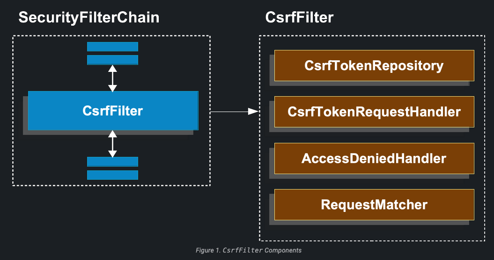
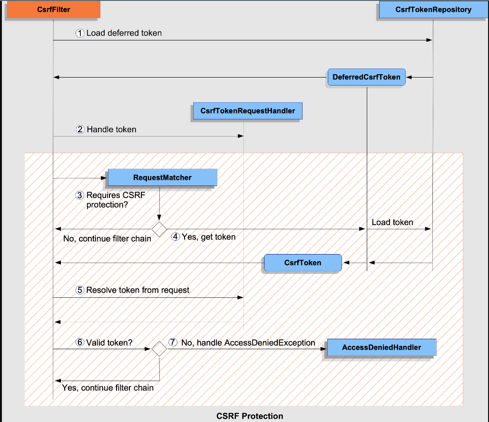

# Cross Site Request Forgery (CSRF)

Son kullanıcıların giriş yapabildiği bir uygulamada, Cross Site Request Forgery (CSRF) saldırılarına karşı nasıl
korunacağınızı düşünmek önemlidir.

CSRF saldırıları, yetkili bir kullanıcının bilgisi olmadan, kötü niyetli bir saldırganın kullanıcının oturum açmış
olduğu web uygulamasına istekler göndermesiyle gerçekleşir. Bu istekler, kullanıcının istemeden kötü niyetli eylemleri
gerçekleştirmesine neden olabilir.

Spring Security varsayılan olarak POST isteği gibi unsafe HTTP methodları için CSRF saldırılarına karşı koruma sağlar,
bu nedenle ek bir kod gerekmeksizin otomatik olarak koruma sağlanır. Varsayılan yapılandırmayı aşağıdaki gibi açıkça
belirtebilirsiniz:

Configure CSRF Protection:

```
@Configuration
@EnableWebSecurity
public class SecurityConfig {

	@Bean
	public SecurityFilterChain securityFilterChain(HttpSecurity http) throws Exception {
		http
			// ...
			.csrf(Customizer.withDefaults());
		return http.build();
	}
}
```

## Understanding CSRF Protection's Components

CSRF koruması, CsrfFilter içinde oluşan birkaç bileşen tarafından sağlanır:



CSRF protection iki bölüme ayrılmıştır:

1 - CsrfTokenRequestHandler'a yetki vererek CsrfToken'ı uygulama için kullanılabilir hale getirin.

2 - İsteğin CSRF korumasına ihtiyaç olup olmadığını belirlemek, belirli bir CSRF token'ini yüklemek ve doğrulamak, ve
AccessDeniedException ile başa çıkmak için aşağıdaki adımları izleyebilirsiniz:



1 - İlk olarak, DeferredCsrfToken yüklenir. DeferredCsrfToken, CsrfTokenRepository'ye bir referans tutar, böylece
depolanmış CsrfToken daha sonra yüklenebilir (adım 4'te). DeferredCsrfToken, CsrfToken'un asenkron olarak yüklenmesini
sağlamak için kullanılan bir öğedir. CsrfToken, sunucu tarafında depolanır ve belirli bir süre geçerlidir. Client
tarafındaki bir istekte CSRF koruması gerektiğinde, DeferredCsrfToken yüklenir ve sunucu tarafındaki
CsrfTokenRepository'den depolanmış CsrfToken alınır. Bu, client'in bir form gönderdiğinde veya bir AJAX isteği yaparken
CsrfToken ile birlikte sunucuya isteği göndermesini sağlar. Sunucu, gelen isteği aldığında, CsrfToken'ın geçerliliğini
doğrular ve işlemi devam ettirir.

2 - İkinci olarak, DeferredCsrfToken'dan oluşturulan bir Supplier<CsrfToken>, CsrfTokenRequestHandler'a verilir.
CsrfTokenRequestHandler, CsrfToken'un uygulamanın geri kalanına kullanılabilir hale getirilmesi için bir
request attribute doldurma işlemini üstlenir. CsrfTokenRequestHandler, CsrfToken'u sağlamak için request attribute'a
değer atar. Bu, uygulamanın diğer kısımlarında CsrfToken'a erişimin mümkün olmasını sağlar. Örneğin, bu request
attribute, bir formu oluştururken veya bir AJAX isteği yaparken CsrfToken'ı almak için kullanılabilir.
Supplier<CsrfToken>, CsrfTokenRequestHandler tarafından sağlanan bir işlevdir. Bu işlev, CsrfToken'ın dinamik olarak
sağlanabilmesini sağlar. Supplier, talep edildiğinde veya gerektiğinde CsrfToken'ı üretir. Bu şekilde,
CsrfTokenRequestHandler, CsrfToken'un request attribute'a yerleştirilmesini ve uygulamanın geri kalanında erişilebilir
hale getirilmesini sağlar.

3 - Sonraki adımda, ana CSRF koruma işlemi başlar ve mevcut isteğin CSRF koruması gerektirip gerektirmediği kontrol
edilir. Eğer gerekli değilse, filtre zinciri devam eder ve işleme son verilir. Spring Security, CSRF korumasının
etkinleştirilmesi için varsayılan olarak HTTP POST, PUT, DELETE gibi unsafe methodların isteklerini CSRF korumasına
tabi tutar. Bu tür istekler, kullanıcının kimlik doğrulaması sonrasında yetkilendirilmiş bir şekilde yapılan
isteklerdir. Ancak bazı isteklerin CSRF korumasına ihtiyaç duymaması mümkündür, örneğin GET istekleri.

4 - Eğer CSRF koruması gerekiyorsa, son olarak DeferredCsrfToken'dan depolanmış CsrfToken yüklenir.

5 - Devam ederek, client tarafından sağlanan gerçek CSRF tokeni varsa, CsrfTokenRequestHandler kullanılarak çözülür.
CsrfTokenRequestHandler, client tarafından sağlanan CSRF tokeninin çözülmesini sağlayan bir bileşendir. client
tarafından gelen request'de, CSRF tokeni genellikle bir formda veya bir HTTP başlığında yer alır.

6 - Gerçek CSRF tokeni, depolanmış CsrfToken ile karşılaştırılır. Eğer geçerli ise, filtre zinciri devam eder ve
işlem sonlandırılır. Karşılaştırma işlemi, sunucunun istemciden gelen CSRF tokenini depolanmış CsrfToken ile
eşleştirmesini sağlar. Bu eşleştirme, güvenlik doğrulamasının gerçekleştirilmesini sağlar.

7 - Eğer gerçek CSRF tokeni geçersiz ise (veya eksikse), bir AccessDeniedException (Erişim Reddedildi İstisnası)
AccessDeniedHandler'a iletilir ve işlem sonlandırılır.

## Migrating to Spring Security 6

Spring Security 5'ten 6'ya geçiş yaparken, uygulamanızı etkileyebilecek birkaç değişiklik vardır. Aşağıda, CSRF
korumasının Spring Security 6'da değişen yönlerine genel bir bakış yer almaktadır:

- Spring Security 6'da, CsrfToken'un yüklenmesi varsayılan olarak ertelenir ve her request'de session'ın yüklenmesini
  gerektirmediği için performansı artırmaya yöneliktir.
- Spring Security 6'da, CsrfToken varsayılan olarak her request'de random'lık içerir ve CSRF tokeninin BREACH
  saldırısına karşı korunmasını sağlar.

Tip : Spring Security 6'daki değişiklikler, single page application'lar için ek yapılandırma gerektirir

## Persisting the CsrfToken

CsrfToken, bir CsrfTokenRepository kullanılarak depolanır. CsrfTokenRepository, CSRF tokenini depolama ve alıp
güncelleme işlemlerini sağlayan bir interface'dir. Bu interface, CsrfToken'un nasıl yönetileceğini tanımlar ve
uygulamanın CSRF korumasının düzgün çalışmasını sağlar.

Varsayılan olarak, Spring Security'de CsrfToken'ların session'da depolanması için HttpSessionCsrfTokenRepository
kullanılır. Ayrıca, CsrfToken'ların bir cookies'de depolanması için CookieCsrfTokenRepository sağlanır. Kendi
uygulamanıza göre istediğiniz yere token'ları depolamak için kendi implementasyonunuzu belirtebilirsiniz.

### Using the HttpSessionCsrfTokenRepository

Varsayılan olarak, Spring Security beklenen CSRF tokenini HttpSessionCsrfTokenRepository kullanarak HttpSession'da
saklar, bu nedenle ek kod gerekmez. HttpSessionCsrfTokenRepository, token'i X-CSRF-TOKEN adlı bir HTTP request header'
ından veya varsayılan olarak _csrf istek parametresinden okur.

Aşağıdaki yapılandırmayı kullanarak varsayılan yapılandırmayı açıkça belirleyebilirsiniz:

Configure HttpSessionCsrfTokenRepository:

```
@Configuration
@EnableWebSecurity
public class SecurityConfig {

	@Bean
	public SecurityFilterChain securityFilterChain(HttpSecurity http) throws Exception {
		http
			// ...
			.csrf((csrf) -> csrf
				.csrfTokenRepository(new HttpSessionCsrfTokenRepository())
			);
		return http.build();
	}
}
```

### Using the CookieCsrfTokenRepository

JavaScript tabanlı bir uygulamayı desteklemek için CsrfToken'u bir cookies'de depolamak için CookieCsrfTokenRepository
kullanabilirsiniz. CookieCsrfTokenRepository, CSRF tokenini bir cookies olarak depolayan bir implementasyondur. Bu
yöntem, özellikle SPA (Single Page Application) gibi JavaScript tabanlı uygulamalar için yaygın olarak kullanılır.
Çalışma şekli şu şekildedir: Sunucu tarafında, bir CSRF tokeni oluşturulur ve bir cookies olarak istemciye iletilir.
JavaScript tabanlı uygulama, bu cookies'i tutar ve her istekte bu cookies'i sunucuya geri gönderir. Sunucu, gelen CSRF
tokeniyle saklanan CSRF tokeni arasında bir karşılaştırma yaparak isteğin doğruluğunu kontrol eder.

Aşağıdaki yapılandırmayı kullanarak CookieCsrfTokenRepository'yi yapılandırabilirsiniz:

Configure CookieCsrfTokenRepository:

```
@Configuration
@EnableWebSecurity
public class SecurityConfig {

	@Bean
	public SecurityFilterChain securityFilterChain(HttpSecurity http) throws Exception {
		http
			// ...
			.csrf((csrf) -> csrf
				.csrfTokenRepository(CookieCsrfTokenRepository.withHttpOnlyFalse())
			);
		return http.build();
	}
}
```

Örnekte HttpOnly değeri açıkça false olarak ayarlanmıştır. Bu, JavaScript framework'leri (örneğin Angular) tarafından
okunabilmesi için gereklidir. Eğer doğrudan JavaScript ile cookies'i okuma ihtiyacınız yoksa, güvenliği artırmak için
HttpOnly'yi (new CookieCsrfTokenRepository() kullanarak) atlamayı öneririz.

### Customizing the CsrfTokenRepository

Bu arada özel bir CsrfTokenRepository uygulamak istediğiniz durumlar olabilir. CsrfTokenRepository interface'ini
uyguladıktan sonra, Spring Security'yi aşağıdaki yapılandırmayla kullanacak şekilde yapılandırabilirsiniz:

Configure Custom CsrfTokenRepository:

```
@Configuration
@EnableWebSecurity
public class SecurityConfig {

	@Bean
	public SecurityFilterChain securityFilterChain(HttpSecurity http) throws Exception {
		http
			// ...
			.csrf((csrf) -> csrf
				.csrfTokenRepository(new CustomCsrfTokenRepository())
			);
		return http.build();
	}
}
```

## Handling The CsrfToken

CsrfToken, bir uygulamanın kullanımına CsrfTokenRequestHandler aracılığıyla sunulur. Bu component, CsrfToken'u HTTP
header'larından veya request parametrelerinden çözmekten sorumludur. CsrfTokenRequestHandler, istemci tarafından
sağlanan CsrfToken'ı alır ve uygulamanın diğer bileşenlerine iletilebilir hale getirir. Bu sayede, uygulama CSRF
tokenine kolayca erişebilir ve doğrulama işlemlerini gerçekleştirebilir.

### Using the XorCsrfTokenRequestAttributeHandler (BREACH)

XorCsrfTokenRequestAttributeHandler, CsrfToken'ı _csrf olarak adlandırılan bir HttpServletRequest attribute'u olarak
kullanılabilir hale getirir ve ayrıca BREACH saldırılarına karşı koruma sağlar.

Note : CsrfToken, CsrfToken.class.getName() adı kullanılarak bir request attribute'u olarak da kullanılabilir hale
getirilir. Bu isim yapılandırılabilir değildir, ancak _csrf adı
XorCsrfTokenRequestAttributeHandler#setCsrfRequestAttributeName methodu kullanılarak değiştirilebilir.

Bu implementasyon, CsrfToken değerini request'deki bir request header'ından veya bir request parametresinden çözer.
Varsayılan olarak, request header'ından (X-CSRF-TOKEN veya X-XSRF-TOKEN) veya istek parametresinden (_csrf) token değeri
alınır.

Note : BREACH koruması, CSRF token değerine randomness eklenerek sağlanır, böylece döndürülen CsrfToken her istekte
değişir. Token daha sonra bir header value veya istek parametresi olarak çözümlendiğinde, orijinal tokena erişmek için
çözümlenir ve bu orijinal token, saklanan CsrfToken ile karşılaştırılır.

Spring Security, CSRF tokenini varsayılan olarak bir BREACH saldırısından korur, bu nedenle ek kod gerekmez.
Aşağıdaki yapılandırmayı kullanarak varsayılan yapılandırmayı açıkça belirleyebilirsiniz:

Configure BREACH protection:

```
@Configuration
@EnableWebSecurity
public class SecurityConfig {

	@Bean
	public SecurityFilterChain securityFilterChain(HttpSecurity http) throws Exception {
		http
			// ...
			.csrf((csrf) -> csrf
				.csrfTokenRequestHandler(new XorCsrfTokenRequestAttributeHandler())
			);
		return http.build();
	}
}
```

### Using the CsrfTokenRequestAttributeHandler

CsrfTokenRequestAttributeHandler, CsrfToken'ı _csrf adlı bir HttpServletRequest attibute'u olarak kullanılabilir hale
getirir. CsrfToken, CsrfToken.class.getName() adı kullanılarak bir request attribute'u olarak da kullanılabilir hale
getirilir. Bu isim yapılandırılabilir değildir, ancak _csrf adı
CsrfTokenRequestAttributeHandler#setCsrfRequestAttributeName yöntemi kullanılarak değiştirilebilir.

Bu implementasyonda, token değeri request header'dan veya istek parametresinden çözülerek elde edilir. Varsayılan
olarak, token değeri bir request header'dan (X-CSRF-TOKEN veya X-XSRF-TOKEN) veya bir istek parametresinden (_csrf)
alınır.

CsrfTokenRequestAttributeHandler'nın temel kullanımı, CsrfToken'un BREACH korumasından çıkmasıdır. Bu, aşağıdaki
yapılandırma ile yapılandırılabilir:

Opt-out of BREACH protection:

```
@Configuration
@EnableWebSecurity
public class SecurityConfig {

	@Bean
	public SecurityFilterChain securityFilterChain(HttpSecurity http) throws Exception {
		http
			// ...
			.csrf((csrf) -> csrf
				.csrfTokenRequestHandler(new CsrfTokenRequestAttributeHandler())
			);
		return http.build();
	}
}
```

### Customizing the CsrfTokenRequestHandler

Token'ları işleme ve çözme stratejisini özelleştirmek için CsrfTokenRequestHandler interface'ini uygulayabilirsiniz.

Tip : CsrfTokenRequestHandler interface'i, request handling sürecini özelleştirmek için lambda ifadesi kullanılarak
uygulanabilen bir @FunctionalInterface'dir. İsteğe dayalı olarak nasıl token'ların çözüleceğini özelleştirmek için tam
interface uygulanmalıdır. Özelleştirilmiş token çözme stratejisi uygulamak için delegasyonu kullanan bir örnek için "
Single-Page Uygulama için CSRF Yapılandırması"nı inceleyebilirsiniz.

CsrfTokenRequestHandler interface'ini implemente ettikten sonra, Spring Security'yi aşağıdaki yapılandırmayla kullanacak
şekilde yapılandırabilirsiniz:

Configure Custom CsrfTokenRequestHandler:

```
@Configuration
@EnableWebSecurity
public class SecurityConfig {

	@Bean
	public SecurityFilterChain securityFilterChain(HttpSecurity http) throws Exception {
		http
			// ...
			.csrf((csrf) -> csrf
				.csrfTokenRequestHandler(new CustomCsrfTokenRequestHandler())
			);
		return http.build();
	}
}
```

## Deferred Loading of the CsrfToken

Varsayılan olarak, Spring Security, CsrfToken'ın yüklenmesini gerekene kadar erteler.

Note : CsrfToken, bir POST gibi unsafe bir HTTP methoduyla yapılan her istekte gereklidir. Ayrıca, token'ın yanıtla
birlikte sunulduğu her istekte, örneğin CSRF token'ını içeren bir <form> etiketi olan bir web sayfasında, token
gereklidir. Unsafe HTTP methodları, sunucuya değişiklik yapma amacıyla bir isteği ileten methodlardır. Bu tür istekler,
genellikle veri gönderme, kaydetme veya güncelleme gibi işlemler gerçekleştirmek için kullanılır. CsrfToken, bu tür
isteklerin güvenli olmasını sağlamak için kullanılır. Sunucu, isteğin yanıtında doğru CSRF token'ını kontrol ederek
isteğin güvenilir olduğunu doğrular.

Spring Security varsayılan olarak CsrfToken'ı HttpSession'da da saklar. Bu nedenle, ertelenmiş CSRF token'lar, her
istekte session'ın yüklenmesini gerektirmediği için performansı artırabilir.

Deferred(ertelenmiş) token'larından vazgeçmek ve CsrfToken'ın her istekte yüklenmesini sağlamak isterseniz, aşağıdaki
yapılandırmayı kullanabilirsiniz:

Opt-out of Deferred CSRF Tokens:

```
@Configuration
@EnableWebSecurity
public class SecurityConfig {

	@Bean
	public SecurityFilterChain securityFilterChain(HttpSecurity http) throws Exception {
		XorCsrfTokenRequestAttributeHandler requestHandler = new XorCsrfTokenRequestAttributeHandler();
		// set the name of the attribute the CsrfToken will be populated on
		requestHandler.setCsrfRequestAttributeName(null);
		http
			// ...
			.csrf((csrf) -> csrf
				.csrfTokenRequestHandler(requestHandler)
			);
		return http.build();
	}
}
```

csrfRequestAttributeName öğesini null olarak ayarlayarak, hangi attibute adının kullanılacağını belirlemek için önce
CsrfToken yüklenmelidir. Bu, CsrfToken'ın her istekte yüklenmesine neden olur.

## Integrating with CSRF Protection

CSRF saldırılarına karşı koruma sağlamak için senkronizasyon token patterni kullanılır. Bu pattern'de, gerçek CSRF
token'ı HTTP isteği içine eklememiz gerekmektedir. Bu, tarayıcı tarafından otomatik olarak HTTP isteğine eklenmeyen bir
bölümde (bir form parametresi, bir HTTP header'i veya diğer bir bölüm) yer almalıdır.

Aşağıdaki bölümlerde, bir frontend veya client uygulamasının CSRF korumalı bir backend uygulamasıyla entegre olabileceği
çeşitli yollar açıklanmaktadır:

- HTML Forms
- JAvaScript Applications
- Mobile Applications

### HTML Forms

Bir HTML formu göndermek için, CSRF token'inin forma gizli bir girdi olarak dahil edilmesi gerekir. Örneğin, işlenen
HTML şöyle görünebilir:

CSRF Token in HTML Form (HTML):

```
<input type="hidden"
	name="_csrf"
	value="4bfd1575-3ad1-4d21-96c7-4ef2d9f86721"/>
```

Aşağıdaki görünüm teknolojileri, POST gibi unsafe bir HTTP methodu içeren bir formda gerçek CSRF token'ını otomatik
olarak ekler:

- Thymeleaf

Spring Framework ile sıkça kullanılan bir görünüm teknolojisidir. Thymeleaf, <form> etiketine th:
action veya th:object attribute'lerini kullanarak otomatik olarak CSRF token'ını ekler. Örneğin:

```
<form action="/submit" method="post">
    <!-- Diğer form alanları -->
    <input type="hidden" th:name="${_csrf.parameterName}" th:value="${_csrf.token}">
    <button type="submit">Submit</button>
</form>

```

- Spring’s form tag library

Spring'in form tag library'si, Spring MVC tabanlı uygulamalarda CSRF token'ını otomatik olarak eklemek için
kullanılabilir. Bu kütüphane, JSP veya Thymeleaf gibi görünüm teknolojileriyle kullanılabilir.

- RequestDataValueProcessor ile entegre olan diğer tüm görüntüleme teknolojileri (CsrfRequestDataValueProcessor
  aracılığıyla)

- Token'i csrfInput tag'ı aracılığıyla kendiniz de dahil edebilirsiniz.

Eğer yukarıda bahsedilen seçenekler kullanılabilir değilse, CsrfToken'ın _csrf adında bir HttpServletRequest attribute'u
olarak sunulduğunu kullanabilirsiniz

CSRF Token in HTML Form with Request Attribute (XML):

```
<c:url var="logoutUrl" value="/logout"/>
<form action="${logoutUrl}"
	method="post">
<input type="submit"
	value="Log out" />
<input type="hidden"
	name="${_csrf.parameterName}"
	value="${_csrf.token}"/>
</form>
```

### JavaScript Applications

JavaScript uygulamaları genellikle JSON kullanır ve HTML yerine JSON kullanılıyorsa, CSRF token'ını bir HTTP request
header'ında bir request parametresi yerine gönderebilirsiniz.

Aşağıda JavaScript ile JSON kullanarak CSRF token'ını bir HTTP isteği başlığında nasıl gönderebileceğinizi gösteren bir
örnek verilmiştir:

```
var xhr = new XMLHttpRequest();
xhr.open("POST", "/submit", true);
xhr.setRequestHeader("Content-Type", "application/json");
xhr.setRequestHeader("X-CSRF-TOKEN", csrfToken); // csrfToken değişkeni CSRF token değerini temsil eder
xhr.onreadystatechange = function() {
  if (xhr.readyState === 4 && xhr.status === 200) {
    // İstek tamamlandığında gerçekleştirilecek işlemler
  }
};
var data = JSON.stringify({ /* JSON veri nesnesi */ });
xhr.send(data);
```

Spring Security, beklenen CSRF token'ını bir cookie'ye kaydetmek için yapılandırabilirsiniz. Beklenen token'ı bir
cookies'e kaydettiğinizde, Angular gibi JavaScript framework'leri otomatik olarak gerçek CSRF token'ını bir HTTP request
header olarak ekleyebilir.

Tip : Spring Security'nin CSRF korumasını Single Page Application (SPA) ile entegre ederken BREACH koruması ve
ertelenmiş(deferred) tokenlar için özel hususlar bulunmaktadır.

Aşağıdaki bölümlerde farklı JavaScript uygulamaları türleri hakkında bilgi edinebilirsiniz:

- Single-Page Applications

Tek sayfalık bir uygulamayı (SPA) Spring Security'nin CSRF korumasıyla entegre etmek için özel hususlar vardır.

Spring Security, varsayılan olarak CsrfToken için BREACH koruması sağlar. Beklenen CSRF token'ını bir cookies'de
depoladığınızda, JavaScript uygulamaları yalnızca plain token değerine erişebilir ve kodlanmış değere erişemez.
Gerçek token değerini çözmek için özelleştirilmiş bir request handler sağlanması gerekecektir.

Ek olarak, CSRF token'ını depolayan cookie, authentication success ve logout durumunda temizlenecektir. Spring Security,
varsayılan olarak yeni bir CSRF token'ının yüklenmesini erteleyerek çalışır ve fresh bir cookie döndürmek için ek
işlemler gerekmektedir.

Note : Authentication Success ve logout durumunda token yenilemek gerekmektedir çünkü CsrfAuthenticationStrategy ve
CsrfLogoutHandler önceki token'ı temizleyecektir. Client uygulaması, taze bir token almadan POST gibi unsafe
bir HTTP isteği gerçekleştiremeyecektir.

Single-Page bir uygulamayı Spring Security ile kolayca entegre etmek için aşağıdaki yapılandırma kullanılabilir:

Configure CSRF for Single-Page Application:

```
@Configuration
@EnableWebSecurity
public class SecurityConfig {

	@Bean
	public SecurityFilterChain securityFilterChain(HttpSecurity http) throws Exception {
		http
			// ...
			.csrf((csrf) -> csrf
				.csrfTokenRepository(CookieCsrfTokenRepository.withHttpOnlyFalse()) (1)
				.csrfTokenRequestHandler(new SpaCsrfTokenRequestHandler())  (2)
			)
			.addFilterAfter(new CsrfCookieFilter(), BasicAuthenticationFilter.class);   (3)
		return http.build();
	}
}

final class SpaCsrfTokenRequestHandler extends CsrfTokenRequestAttributeHandler {
	private final CsrfTokenRequestHandler delegate = new XorCsrfTokenRequestAttributeHandler();

	@Override
	public void handle(HttpServletRequest request, HttpServletResponse response, Supplier<CsrfToken> csrfToken) {
		/*
		 * Always use XorCsrfTokenRequestAttributeHandler to provide BREACH protection of
		 * the CsrfToken when it is rendered in the response body.
		 */
		this.delegate.handle(request, response, csrfToken);
	}

	@Override
	public String resolveCsrfTokenValue(HttpServletRequest request, CsrfToken csrfToken) {
		/*
		 * If the request contains a request header, use CsrfTokenRequestAttributeHandler
		 * to resolve the CsrfToken. This applies when a single-page application includes
		 * the header value automatically, which was obtained via a cookie containing the
		 * raw CsrfToken.
		 */
		if (StringUtils.hasText(request.getHeader(csrfToken.getHeaderName()))) {
			return super.resolveCsrfTokenValue(request, csrfToken);
		}
		/*
		 * In all other cases (e.g. if the request contains a request parameter), use
		 * XorCsrfTokenRequestAttributeHandler to resolve the CsrfToken. This applies
		 * when a server-side rendered form includes the _csrf request parameter as a
		 * hidden input.
		 */
		return this.delegate.resolveCsrfTokenValue(request, csrfToken);
	}
}

final class CsrfCookieFilter extends OncePerRequestFilter {

	@Override
	protected void doFilterInternal(HttpServletRequest request, HttpServletResponse response, FilterChain filterChain)
			throws ServletException, IOException {
		CsrfToken csrfToken = (CsrfToken) request.getAttribute("_csrf");
		// Render the token value to a cookie by causing the deferred token to be loaded
		csrfToken.getToken();

		filterChain.doFilter(request, response);
	}
}
```

1 - Tanımlama bilgisinin JavaScript uygulaması tarafından okunabilmesi için CookieCsrfTokenRepository'yi HttpOnly false
olarak ayarlayarak yapılandırın.

2- Bunun bir HTTP request header (X-XSRF-TOKEN) veya request parametresi (_csrf) olmasına bağlı olarak CSRF tokenini
çözen özel bir CsrfTokenRequestHandler yapılandırın.

3 - Her request üzerine CsrfToken load etmek için özel bir Filtre yapılandırın; bu, gerekirse yeni bir cookie döndürür.

- Multi-Page Applications

JavaScript'in her sayfada yüklendiği Multi-Page Application's için, CSRF token'ını bir cookies'de açığa çıkarmak yerine,
CSRF token'ını meta tagları içinde dahil etmek alternatif bir yaklaşımdır. HTML şöyle görünebilir:

CSRF Token in HTML Meta Tag (HTML):

```
<html>
<head>
	<meta name="_csrf" content="4bfd1575-3ad1-4d21-96c7-4ef2d9f86721"/>
	<meta name="_csrf_header" content="X-CSRF-TOKEN"/>
	<!-- ... -->
</head>
<!-- ... -->
</html>
```

Meta tag'lar CSRF token'ini içerdiğinde, JavaScript kodu meta tag okuyabilir ve CSRF token'ini header
olarak içerebilir. jQuery kullanıyorsanız, bunu aşağıdaki kodla yapabilirsiniz:

Include CSRF Token in AJAX Request:

```
$(function () {
	var token = $("meta[name='_csrf']").attr("content");
	var header = $("meta[name='_csrf_header']").attr("content");
	$(document).ajaxSend(function(e, xhr, options) {
		xhr.setRequestHeader(header, token);
	});
});
```

- Other JavaScript Applications

JavaScript uygulamaları için başka bir seçenek de CSRF token'ini bir HTTP response header'ina dahil etmektir.

Bunu gerçekleştirmenin bir yolu, CsrfTokenArgumentResolver ile birlikte @ControllerAdvice kullanmaktır. Aşağıdaki örnek,
uygulamadaki tüm controller'ların endpoint'lerine uygulanan bir @ControllerAdvice örneğidir:

CSRF Token in HTTP Response Header:

```
@ControllerAdvice
public class CsrfControllerAdvice {

	@ModelAttribute
	public void getCsrfToken(HttpServletResponse response, CsrfToken csrfToken) {
		response.setHeader(csrfToken.getHeaderName(), csrfToken.getToken());
	}

}
```

Bu @ControllerAdvice uygulaması, uygulamadaki tüm endpoint'lere uygulandığından, her istekte CSRF token'ının
yüklenmesine neden olacak ve HttpSessionCsrfTokenRepository kullanıldığında ertelenen tokenların avantajlarını ortadan
kaldırabilir. Ancak, CookieCsrfTokenRepository kullanıldığında genellikle bu bir sorun oluşturmaz.

Önemli bir nokta olarak, controller endpoint'lerinin ve controller advice'ların Spring Security filtre zincirinden sonra
çağrıldığını hatırlamak önemlidir. Bu, bu @ControllerAdvice'nin yalnızca isteğin filtre zincirini geçerek uygulamanıza
ulaştığı durumlarda uygulanacağı anlamına gelir. HttpServletResponse'e erken erişim için filtre zincirine bir filtre
eklemek için Single-Page application için yapılandırmayı inceleyin.

CSRF token'ı artık controller advice'in uygulandığı özel endpoint'ler de bir response header'ında (varsayılan olarak
X-CSRF-TOKEN veya X-XSRF-TOKEN) kullanılabilir hale gelecektir. Backend'e yapılan herhangi bir request, response'tan
token'ı almak için kullanılabilir ve ardışık bir request, aynı adı taşıyan bir request header'ında token'ı içerebilir.

### Mobile Applications

JavaScript uygulamaları gibi, mobil uygulamalar da genellikle HTML yerine JSON kullanır. Tarayıcı trafiği sunmayan bir
endpoint uygulaması, CSRF'yi devre dışı bırakmayı seçebilir. Bu durumda ek bir çalışmaya gerek yoktur.

Bununla birlikte, tarayıcı trafiğine de hizmet veren ve bu nedenle yine de CSRF koruması gerektiren bir backend
uygulaması, CsrfToken'ı cookie yerine session'da depolamaya devam edebilir.

Bu durumda, backend ile entegrasyon için tipik bir pattern, frontend'in (mobil veya tarayıcı istemcisi) ihtiyaç halinde
CSRF tokenı istemek için /csrf endpoint'ini ortaya çıkarmaktır. Bu patterni kullanmanın faydası, CSRF tokenının
ertelenmeye devam etmesi ve yalnızca bir istek CSRF koruması gerektirdiğinde oturumdan yüklenmesi gerektiğidir. Özel bir
endpoint kullanımı ayrıca istemci uygulamasının (gerektiğinde) açık bir istek göndererek isteğe bağlı olarak yeni bir
token oluşturmasını isteyebilmesi anlamına gelir.

Tip : Bu pattern, yalnızca mobil uygulamalar için değil, CSRF koruması gerektiren her türlü uygulama için
kullanılabilir. Bu yaklaşım genellikle bu durumlarda gerekli olmasa da, CSRF korumalı bir backend'le entegrasyon için
başka bir seçenektir.

Aşağıda, CsrfTokenArgumentResolver'ı kullanan bir /csrf endpoint örneği verilmiştir:

The /csrf endpoint:

```
@RestController
public class CsrfController {

    @GetMapping("/csrf")
    public CsrfToken csrf(CsrfToken csrfToken) {
        return csrfToken;
    }
}
```

Sunucuyla kimlik doğrulamadan önce yukarıdaki endpoint gerekliyse .requestMatchers("/csrf").permitAll() eklemeyi
düşünebilirsiniz.

Bu endpoint, uygulama başlatıldığında veya inialized edildiğinde (örneğin, yükleme sırasında) ve ayrıca kimlik doğrulama
success olduğunda ve logout durumunda CSRF token'ını elde etmek için çağrılmalıdır.

Note : Authentication success ve logout durumunda token yenilemek gerekmektedir çünkü CsrfAuthenticationStrategy ve
CsrfLogoutHandler önceki token'ı temizleyecektir. İstemci uygulaması, taze bir token almadan POST gibi unsafe bir HTTP
isteği gerçekleştiremeyecektir.

CSRF tokeni aldıktan sonra, bunu bir HTTP request header (varsayılan olarak X-CSRF-TOKEN veya X-XSRF-TOKEN'den biri)
olarak eklemeniz gerekir.

## Handle AccessDeniedException

Geçersiz CSRF Token gibi bir AccessDeniedException'ı handle etmek için, Spring Security'yi istediğiniz şekilde bu
exception'ları handle etmek için yapılandırabilirsiniz. Örneğin, aşağıdaki yapılandırmayı kullanarak özel bir access
denied sayfası yapılandırabilirsiniz:

Configure AccessDeniedHandler :

```
@Configuration
@EnableWebSecurity
public class SecurityConfig {

	@Bean
	public SecurityFilterChain securityFilterChain(HttpSecurity http) throws Exception {
		http
			// ...
			.exceptionHandling((exceptionHandling) -> exceptionHandling
				.accessDeniedPage("/access-denied")
			);
		return http.build();
	}
}
```

### CSRF Testing

CSRF korumasını test etmek için Spring Security'nin test desteğini ve CsrfRequestPostProcessor'ı şu şekilde
kullanabilirsiniz:

Test CSRF Protection:

```
import static org.springframework.security.test.web.servlet.request.SecurityMockMvcRequestPostProcessors.*;
import static org.springframework.security.test.web.servlet.setup.SecurityMockMvcConfigurers.*;
import static org.springframework.test.web.servlet.request.MockMvcRequestBuilders.*;
import static org.springframework.test.web.servlet.result.MockMvcResultMatchers.*;

@ExtendWith(SpringExtension.class)
@ContextConfiguration(classes = SecurityConfig.class)
@WebAppConfiguration
public class CsrfTests {

	private MockMvc mockMvc;

	@BeforeEach
	public void setUp(WebApplicationContext applicationContext) {
		this.mockMvc = MockMvcBuilders.webAppContextSetup(applicationContext)
			.apply(springSecurity())
			.build();
	}

	@Test
	public void loginWhenValidCsrfTokenThenSuccess() throws Exception {
		this.mockMvc.perform(post("/login").with(csrf())
				.accept(MediaType.TEXT_HTML)
				.param("username", "user")
				.param("password", "password"))
			.andExpect(status().is3xxRedirection())
			.andExpect(header().string(HttpHeaders.LOCATION, "/"));
	}

	@Test
	@WithMockUser
	public void logoutWhenValidCsrfTokenThenSuccess() throws Exception {
		this.mockMvc.perform(post("/logout").with(csrf())
				.accept(MediaType.TEXT_HTML))
			.andExpect(status().is3xxRedirection())
			.andExpect(header().string(HttpHeaders.LOCATION, "/login?logout"));
	}
}
```

## Disable CSRF Protection

Varsayılan olarak, backend entegrasyonu ve uygulamanızı test etmeyi etkileyen CSRF koruması etkindir. CSRF korumasını
devre dışı bırakmadan önce, uygulamanız için mantıklı olup olmadığını düşünün.

Aşağıdaki örnekte olduğu gibi, yalnızca belirli endpoint'leri CSRF koruması gerektirip gerektirmediğini de göz önünde
bulundurabilir ve yoksayma kuralı yapılandırabilirsiniz:

Ignoring Requests:

```
@Configuration
@EnableWebSecurity
public class SecurityConfig {

    @Bean
    public SecurityFilterChain securityFilterChain(HttpSecurity http) throws Exception {
        http
            // ...
            .csrf((csrf) -> csrf
                .ignoringRequestMatchers("/api/*")
            );
        return http.build();
    }
}
```

CSRF korumasını devre dışı bırakmanız gerekirse, bunu aşağıdaki yapılandırmayı kullanarak yapabilirsiniz:

Disable CSRF:

```
@Configuration
@EnableWebSecurity
public class SecurityConfig {

	@Bean
	public SecurityFilterChain securityFilterChain(HttpSecurity http) throws Exception {
		http
			// ...
			.csrf((csrf) -> csrf.disable());
		return http.build();
	}
}
```

## CSRF Considerations

CSRF saldırılarına karşı koruma uygularken birkaç özel husus vardır. Bu bölüm, servlet ortamlarıyla ilgili olduğu için
bu hususları tartışır.

### Logging In

Kimlik doğrulama request'lerinde CSRF kullanmak, sahte kimlik doğrulama girişimlerine karşı koruma sağlamak için
önemlidir.
Spring Security'nin servlet desteği bunu otomatik olarak yapar. Spring Security'nin servlet desteği, varsayılan olarak
CSRF korumasını etkinleştirir ve kimlik doğrulama istekleri için CSRF token'ı gerektirir. Böylece, sahte kimlik
doğrulama girişimlerine karşı güvenlik sağlanır ve oturum açma işlemleri güvence altına alınır. Bu, uygulamaların
otomatik olarak CSRF korumasından faydalanmasını sağlar ve giriş sayfaları, kimlik doğrulama istekleri ve diğer güvenlik
önlemleriyle tutarlı bir şekilde çalışır.

### Logging Out

logout request'lerinde CSRF kullanmak, sahte logout girişimlerine karşı koruma sağlamak için önemlidir. CSRF koruması
etkinleştirilmişse (varsayılan olarak), Spring Security'nin LogoutFilter'ı yalnızca HTTP POST request'lerini
işleyecektir. Bu, logout yapmanın bir CSRF token gerektirdiğini ve kötü niyetli bir kullanıcının kullanıcıları zorla
logout yapamamasını sağlar.

Kullanıcının çıkış yapması için en kolay yaklaşım, bir form kullanmaktır. Eğer gerçekten bir bağlantı kullanmak
isterseniz, JavaScript'i kullanarak bağlantının bir POST işlemi gerçekleştirmesini sağlayabilirsiniz (belki gizli bir
formda). JavaScript'i devre dışı bırakılmış tarayıcılarda isteğe bağlı olarak bağlantının kullanıcıyı bir çıkış onay
sayfasına yönlendirmesini ve orada POST işlemini gerçekleştirmesini sağlayabilirsiniz.

Eğer gerçekten logout işlemi için HTTP GET kullanmak isterseniz, bunu yapabilirsiniz. Ancak, genellikle bu önerilmez.
Örneğin, aşağıdaki örnekte herhangi bir HTTP method'uyla /logout URL'sine istek yapıldığında çıkış yapılır:

Log Out with Any HTTP Method:

```
@Configuration
@EnableWebSecurity
public class SecurityConfig {

	@Bean
	public SecurityFilterChain securityFilterChain(HttpSecurity http) throws Exception {
		http
			// ...
			.logout((logout) -> logout
				.logoutRequestMatcher(new AntPathRequestMatcher("/logout"))
			);
		return http.build();
	}
}
```

### CSRF and Session Timeouts

Spring Security varsayılan olarak HttpSessionCsrfTokenRepository kullanarak CSRF token'ını HttpSession'da depolar. Bu
durumda, oturumun süresi dolarsa, karşılaştırılacak CSRF tokenı olmayabilir.

Bu durumu önlemek için, aşağıdaki adımları izleyebilirsiniz:

- Oturum süresini CSRF tokenının süresinden daha kısa yapın: Oturumun süresi CSRF tokenının süresinden daha kısa
  olduğunda, oturumun süresi dolduğunda CSRF tokenı da geçersiz hale gelir. Bu şekilde, oturum yenilendiğinde yeni bir
  CSRF token oluşturulur.
- CSRF tokenını oturumun süresini aşan bir şekilde saklayın: Örneğin, tokenı veritabanında veya önbellekte
  saklayabilirsiniz. Bu durumda, oturum süresi dolduğunda bile CSRF tokenına erişebilirsiniz.
- Oturum süresi dolduğunda CSRF tokenını yeniden oluşturun: Oturumun süresi dolduğunda, CSRF tokenını yeniden
  oluşturabilirsiniz. Bunu yapmak için, oturumun sonlandırıldığı veya yeniden oluşturulduğu yerde yeni bir CSRF tokenı
  oluşturmanız gerekecektir.

Oturum zaman aşımlarına ilişkin genel çözümleri zaten tartışmıştık. Bu bölüm, servlet desteğiyle ilgili olduğu için
CSRF zaman aşımlarının özelliklerini tartışır.

CSRF token'ının depolanma yöntemini bir çereze (cookie) değiştirebilirsiniz. Bu değişikliği yapmak için,
CookieCsrfTokenRepository kullanmanız gerekmektedir. Bu şekilde CSRF token'ı oturumla ilişkili olmayacak ve çerezde
saklanacaktır.

Eğer bir CSRF tokenı süresi dolarsa, bunun nasıl handle edileceğini belirlemek için özel bir AccessDeniedHandler
belirtebilirsiniz. Özel AccessDeniedHandler, InvalidCsrfTokenException'ı istediğiniz şekilde işleyebilir.

### Multipart (file upload)

Evet, multipart isteklerin (dosya yüklemeleri) CSRF saldırılarından korunmasının, tavuk-yumurta sorununa neden olduğunu
tartıştık. JavaScript kullanılabilir olduğunda, sorunu atlatmak için CSRF tokenını bir HTTP istek header'ında göndermeyi
öneriyoruz.

Eğer JavaScript kullanılamıyorsa, CSRF tokenını servlet uygulaması içinde request body veya URL'ye yerleştirmek
için aşağıdaki bölümlerde seçenekleri görebilirsiniz

- Place CSRF Token in the Body

Request'te ki CSRF tokenını body'den okumak için Spring Security'yi yapılandırmak için aşağıdaki adımları takip
edebilirsiniz

CSRF tokenını body'den okumak için, MultipartFilter'ın Spring Security filtresinden önce belirtilmesi gerekmektedir.
MultipartFilter'ı Spring Security filtresinden önce belirtmek, MultipartFilter'ın çağrılması için herhangi bir
yetkilendirmenin olmadığı anlamına gelir, bu da herhangi bir kişinin geçici dosyaları sunucunuza yerleştirebileceği
anlamına gelir. Ancak, yalnızca yetkilendirilmiş kullanıcılar uygulamanız tarafından işlenen bir dosya gönderebilir.
Genel olarak, bu önerilen yaklaşımdır çünkü geçici dosya yüklemesi çoğu sunucu üzerinde ihmal edilebilir bir etkiye
sahip olmalıdır.

Configure MultipartFilter:

```
public class SecurityApplicationInitializer extends AbstractSecurityWebApplicationInitializer {

	@Override
	protected void beforeSpringSecurityFilterChain(ServletContext servletContext) {
		insertFilters(servletContext, new MultipartFilter());
	}
}
```

MultipartFilter'ın Spring Security filtresinden önce belirtildiğinden emin olmak için XML yapılandırmasıyla, web.xml
dosyası içinde MultipartFilter'ın <filter-mapping> öğesinin springSecurityFilterChain'den önce yerleştirildiğinden emin
olabilirsiniz. Aşağıdaki örneğe göz atın (XML) :

```
<!-- MultipartFilter'ı belirtin -->
<filter>
    <filter-name>MultipartFilter</filter-name>
    <filter-class>org.springframework.web.multipart.support.MultipartFilter</filter-class>
</filter>

<!-- MultipartFilter'ın filtre eşleştirmesini belirtin -->
<filter-mapping>
    <filter-name>MultipartFilter</filter-name>
    <url-pattern>/*</url-pattern>
</filter-mapping>

<!-- Spring Security filtresini belirtin -->
<filter>
    <filter-name>springSecurityFilterChain</filter-name>
    <filter-class>org.springframework.web.filter.DelegatingFilterProxy</filter-class>
</filter>

<!-- Spring Security filtresinin filtre eşleştirmesini belirtin -->
<filter-mapping>
    <filter-name>springSecurityFilterChain</filter-name>
    <url-pattern>/*</url-pattern>
</filter-mapping>

```

- Include a CSRF Token in a URL

Yetkisiz kullanıcıların geçici dosya yüklemesine izin vermek kabul edilebilir değilse, bir alternatif olarak
MultipartFilter'ı Spring Security filtresinden sonra yerleştirmek ve CSRF'yi bir sorgu parametresi olarak formun
action attribute'une eklemek mümkündür. CsrfToken, _csrf adı verilen bir HttpServletRequest attribute'u olarak
sunulduğundan, bunu kullanarak CSRF tokenını içeren bir action oluşturabiliriz. Aşağıdaki örnek bir JSP dosyası ile
bunu gerçekleştirebilirsiniz:

```
<form method="post"
	action="./upload?${_csrf.parameterName}=${_csrf.token}"
	enctype="multipart/form-data">
```

### HiddenHttpMethodFilter

Spring'in Servlet desteğinde, HTTP yöntemini geçersiz kılmak için HiddenHttpMethodFilter kullanılır.