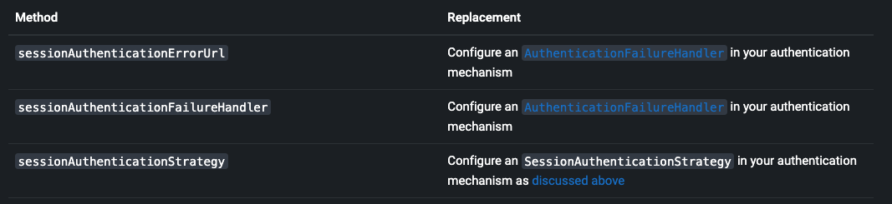

# Authentication Persistence and Session Management

İsteklerin kimliğini doğrulayan bir uygulamaya sahip olduğunuzda, ortaya çıkan kimlik doğrulamanın nasıl devam 
ettirileceğini ve gelecekteki isteklerde nasıl geri yükleneceğini düşünmek önemlidir. Kimlik doğrulama işlemi sonucunda 
elde edilen kimlik bilgileri ve yetkiler, bir SecurityContext içinde temsil edilir. Bu SecurityContext'in, gelecekteki 
isteklerde de korunması ve geri yüklenebilmesi önemlidir. Bu, varsayılan olarak otomatik olarak yapılır, bu nedenle 
ek bir kod gerekmez, ancak HttpSecurity'deki requireExplicitSave'in ne anlama geldiğini bilmek önemlidir.

HttpSecurity, Spring Security'nin yapılandırma sınıfıdır ve güvenlik ayarlarının yapılandırılmasına olanak tanır. 
requireExplicitSave ise HttpSecurity'nin bir ayarıdır ve SecurityContext'in açıkça kaydedilmesini gerektirip 
gerektirmediğini belirler. requireExplicitSave ayarı varsayılan olarak false olarak ayarlanır. 
Bu durumda, SecurityContextPersistenceFilter, SecurityContext'i otomatik olarak kaydetmek ve gelecekteki isteklerde 
geri yüklemek için gerekli adımları atar. Yani, bir değişiklik yapıldığında veya kimlik doğrulama gerçekleştiğinde 
SecurityContext otomatik olarak kaydedilir. Ancak, requireExplicitSave ayarı true olarak ayarlandığında, 
SecurityContext'in açıkça kaydedilmesi gerekmektedir. Bu durumda, SecurityContextHolder üzerindeki setSecurityContext() 
yöntemi çağrıldığında, SecurityContextPersistenceFilter otomatik olarak kaydetme işlemini gerçekleştirmez. 
Bunun yerine, SecurityContext'in açıkça kaydedilmesi için ek kodun yazılması gerekmektedir.

## Understanding Session Management’s Components

Session Management desteği, birkaç bileşenden oluşur ve işlevselliği sağlamak için birlikte çalışır. Bu componentler, 
SecurityContextHolderFilter, SecurityContextPersistenceFilter ve SessionManagementFilter'dır.

1 - SecurityContextHolderFilter: Bu, SecurityContext'in yüklenmesinden ve güncellenmesinden sorumludur. Her istek için 
SecurityContext'i SecurityContextRepository'den yükler ve SecurityContextHolder üzerindeki mevcut SecurityContext'i 
günceller. Böylece, her istekte doğru ve güncel bir SecurityContext sağlanır.

2 - SecurityContextPersistenceFilter: Bu filtre, SecurityContext'in istekler arasında korunması ve geri yüklenmesi 
işlemlerini gerçekleştirir. İsteğin işlenmesi sırasında, SecurityContext'in güncel hali olup olmadığı kontrol edilir. 
Eğer güncel bir SecurityContext varsa, bu SecurityContext SecurityContextPersistenceRepository aracılığıyla kaydedilir. 
Gelecekteki isteklerde bu kaydedilen SecurityContext geri yüklenir.

3 - SessionManagementFilter: Bu filtre, oturum yönetimi ile ilgili işlemleri gerçekleştirir. Oturum kontrolü ve oturum 
süresi gibi işlemleri sağlar. Örneğin, oturum süresi dolmuş bir kullanıcının isteği geldiğinde oturumu sonlandırabilir 
veya kullanıcıyı oturum sayfasına yönlendirebilir.

*** Spring Security 6'da SecurityContextPersistenceFilter ve SessionManagementFilter varsayılan olarak ayarlanmamıştır.
Buna ek olarak, herhangi bir uygulamada yalnızca SecurityContextHolderFilter veya SecurityContextPersistenceFilter 
ayarlanmış olmalıdır, her ikisi birden olmamalıdır

### The SessionManagementFilter

SessionManagementFilter, SecurityContextRepository'nin içeriğini, mevcut SecurityContextHolder içeriğiyle 
karşılaştırarak, bir kullanıcının geçerli istek sırasında kimlik doğrulamasının gerçekleşip gerçekleşmediğini kontrol 
eder. Bu genellikle önceden kimlik doğrulama veya hatırla beni gibi etkileşimli olmayan kimlik doğrulama 
mekanizmalarıyla gerçekleştirilir. SessionManagementFilter, bir isteğin işlenmesi sırasında, güncel SecurityContext 
içeriğini ve SecurityContextRepository'deki bilgileri karşılaştırır. Eğer SecurityContextHolder'daki SecurityContext 
boş ise veya SecurityContextRepository'deki bilgilerle eşleşmiyorsa, bu durum kullanıcının geçerli istek sırasında 
kimlik doğrulamasının gerçekleşmediğini gösterir. Repository bir Security Context içeriyorsa, filtre hiçbir şey yapmaz.
Eğer geçerli istek sırasında kimlik doğrulaması gerçekleşmediyse ve thread-local SecurityContext bir (non-anonymous) 
Authentication nesnesi içeriyorsa, filtre, bunun önceki bir filtre tarafından kimlik doğrulandığını varsayar. 
Ardından, yapılandırılmış SessionAuthenticationStrategy'yi çağırır.

Eğer kullanıcı şu anda kimlik doğrulanmamışsa, filtre, geçersiz bir session ID istenip istenmediğini kontrol eder 
(örneğin, zaman aşımı nedeniyle) ve yapılandırılmış InvalidSessionStrategy'yi çağırır, eğer bir tanesi belirlenmişse. 
En yaygın davranış, sabit bir URL'ye yönlendirmektir ve bu, standart SimpleRedirectInvalidSessionStrategy uygulamasında 
encapsule edilir. Bu, önceki bölümde açıklandığı gibi, isim alanı üzerinden geçersiz bir oturum URL'si 
yapılandırılırken de kullanılır.

### Moving Away From SessionManagementFilter (SessionManagerFilter'dan uzaklaşma)

Spring Security 5'de, varsayılan yapılandırma SessionManagementFilter'ı kullanarak kullanıcının yeni kimlik doğrulama 
yaptığını tespit eder ve SessionAuthenticationStrategy'yi çağırır. Bununla birlikte, bu durum, tipik bir yapılandırmada 
HttpSession'ın her istek için okunması gerektiği anlamına gelir. Bu durumda, her istekte HttpSession'ın okunması, 
performans açısından verimsiz olabilir. Özellikle yüksek trafikli uygulamalarda, her istekte HttpSession'a erişmek 
gerektiğinde kaynaklar ve işlem gücü kaybedilebilir. Bu, ölçeklenebilirlik sorunlarına ve performans düşüklüğüne yol 
açabilir. Bununla birlikte, bu varsayılan davranış, uygulamanın ihtiyaçlarına ve performans hedeflerine bağlı olarak 
değiştirilebilir. Spring Security, farklı oturum yönetimi stratejilerini ve filtreleri yapılandırmak için esnek bir 
yapı sunar. Örneğin, HttpSession bazlı oturum yönetimi yerine, token tabanlı bir kimlik doğrulama kullanarak 
HttpSession'a olan bağımlılığı azaltabilirsiniz. Böylece, her istekte HttpSession okuması gerekmeksizin kimlik 
doğrulama yapabilirsiniz. Bunun için Spring Security'de çeşitli token tabanlı kimlik doğrulama mekanizmaları mevcuttur, 
örneğin JWT (JSON Web Token) veya OAuth 2.0.

Spring Security 6'da, varsayılan olarak kimlik doğrulama mekanizmalarının kendileri SessionAuthenticationStrategy'yi 
çağırmalıdır. Bu, kimlik doğrulamasının ne zaman yapıldığını tespit etmeye gerek olmadığı anlamına gelir ve dolayısıyla 
her istek için HttpSession'ın okunmasına ihtiyaç duyulmaz. Bu değişiklik, performansı artırmak ve HttpSession'a olan 
bağımlılığı azaltmak için tasarlanmıştır. Artık SessionManagementFilter'ın kimlik doğrulama tespiti ve 
SessionAuthenticationStrategy'nin çağrılması gibi işlemlere gerek kalmaz. Bu yeni yaklaşım, özellikle token tabanlı 
kimlik doğrulama mekanizmaları kullanıldığında faydalıdır. Token tabanlı kimlik doğrulama yöntemlerinde, her istek için 
HttpSession okuması gerekmeksizin, token'ın kendisiyle kimlik doğrulaması gerçekleştirilebilir. Bu, performansı artırır 
ve ölçeklenebilirliği iyileştirir.

### SessionManagementFilter'dan Uzaklaşırken Dikkate Alınması Gerekenler

Spring Security 6'da, varsayılan olarak SessionManagementFilter kullanılmaz. Bu nedenle, sessionManagement DSL'deki 
bazı yöntemlerin etkisi olmayabilir.



## Authentication'ın Depolanacağı Yeri Özelliştirme

Varsayılan olarak, Spring Security sizin için SecurityContext'i HTTP session'ında depolar. Ancak, bunu özelleştirmek 
isteyebileceğiniz birkaç neden var:

- HttpSessionSecurityContextRepository instance'i üzerinde tek tek setterları çağırmak isteyebilirsiniz.

Bu örneğin üzerinde çağırabileceğiniz bazı yaygın setter metodları şunlardır:

setDisableUrlRewriting(boolean disableUrlRewriting): URL yeniden yazımını devre dışı bırakmak veya etkinleştirmek için 
kullanılır. Varsayılan olarak false'dur.

setAllowSessionCreation(boolean allowSessionCreation): Oturum oluşturmaya izin vermek veya izin vermemek için 
kullanılır. Varsayılan olarak true'dur.

setServletContext(ServletContext servletContext): Servlet bağlamını ayarlamak için kullanılır. Bu, HttpSession 
oluştururken veya elde ederken ServletContext'i kullanır.

setSaveContext(boolean saveContext): SecurityContext'in oturumla birlikte kaydedilip kaydedilmeyeceğini belirlemek 
için kullanılır. Varsayılan olarak true'dur.

setSpringSecurityContextKey(String springSecurityContextKey): SecurityContext'in HttpSession'da saklanırken 
kullanılacak anahtarın adını belirlemek için kullanılır. Varsayılan olarak "SPRING_SECURITY_CONTEXT"tir.

Bu setter metodları, HttpSessionSecurityContextRepository'nin davranışını özelleştirmenize ve ihtiyaçlarınıza uygun 
bir şekilde yapılandırmanıza olanak tanır. İlgili setterları çağırarak HttpSessionSecurityContextRepository örneğini 
yapılandırabilirsiniz.

- Yatay ölçeklendirmeyi mümkün kılmak için Security Contextnı bir önbelleğe veya veritabanına kaydetmek 
isteyebilirsiniz. yatay ölçeklendirmede, birden fazla sunucunun aynı oturumu paylaşması gerekebilir ve HttpSession 
kullanarak Security Contextnı paylaşmak mümkün olmayabilir. Bu durumda, Security Context'i bir önbelleğe veya 
veritabanına kaydetmek daha uygun olabilir. Bu, farklı sunucular arasında Security Contextnı paylaşmanızı ve yatay 
ölçeklendirme senaryolarında tutarlılığı sağlamanızı sağlar. Önbellek kullanımı için önbellek uygulamaları veya 
dağıtılmış önbellek çözümleri, Security Contextnı hızlı erişim sağlayan bir bellek ortamında depolamanıza olanak tanır. 
Örneğin, Redis, Memcached gibi önbellek sistemleri kullanılabilir. Veritabanı kullanımı için ise Security Context'i 
bir veritabanına kaydedebilirsiniz. Bu, Security Context'i sunucular arasında paylaşmanızı ve Security Context'i 
kalıcı bir şekilde depolanmasını sağlar. Bu durumda, veritabanı tabloları ve ilişkili işlemler için uygun bir 
veritabanı şeması oluşturmanız gerekebilir.

İlk olarak, SecurityContextRepository'nin bir implementasyonunu oluşturmanız veya HttpSessionSecurityContextRepository 
gibi mevcut bir implementasyonu kullanmanız gerekmektedir. Daha sonra, bu SecurityContextRepository implementasyonunu 
HttpSecurity içinde ayarlayabilirsiniz.

Customizing the SecurityContextRepository:
```
@Bean
public SecurityFilterChain filterChain(HttpSecurity http) {
    SecurityContextRepository repo = new MyCustomSecurityContextRepository();
    http
        // ...
        .securityContext((context) -> context
            .securityContextRepository(repo)
        );
    return http.build();
}
```
Yukarıdaki yapılandırma, SecurityContextHolderFilter üzerindeki SecurityContextRepository'yi ve 
usernamePasswordAuthenticationFilter gibi iştirak eden kimlik doğrulama filtrelerini ayarlar.

Stateless kimlik doğrulama durumunda, her istek için ayrı bir kimlik doğrulama yapılır ve Security Context sürekli 
olarak korunmaz. Bu nedenle, stateless filtrelerde SecurityContextRepository'yi ayarlamak için özel bir yapılandırmaya 
ihtiyaç vardır. 

### Kimlik Doğrulamayı Manual Olarak Kaydetme

Örneğin bazı durumlarda, Spring Security filtrelerine güvenmek yerine bir kullanıcının kimliğini manuel olarak 
doğruluyor olabilirsiniz. Bunu yapmak için özel bir filtre veya bir Spring MVC endpoint'i kullanabilirsiniz. Kimlik 
doğrulamasını istekler arasında, örneğin HttpSession'da kaydetmek istiyorsanız, bunu yapmanız gerekir:

```
private SecurityContextRepository securityContextRepository =
        new HttpSessionSecurityContextRepository(); 

@PostMapping("/login")
public void login(@RequestBody LoginRequest loginRequest, HttpServletRequest request, HttpServletResponse response) { 
    UsernamePasswordAuthenticationToken token = UsernamePasswordAuthenticationToken.unauthenticated(
        loginRequest.getUsername(), loginRequest.getPassword()); 
    Authentication authentication = authenticationManager.authenticate(token); 
    SecurityContext context = securityContextHolderStrategy.createEmptyContext();
    context.setAuthentication(authentication); 
    securityContextHolderStrategy.setContext(context);
    securityContextRepository.saveContext(context, request, response); 
}

class LoginRequest {

    private String username;
    private String password;

    // getters and setters
}
```
1 - SecurityContextRepository'i Controller'a ekle

2 - SecurityContext'i kaydedebilmek için HttpServletRequest ve HttpServletResponse'u inject edin

3 - Sağlanan kimlik bilgilerini kullanarak unauthenticated bir UsernamePasswordAuthenticationToken oluşturun

4 - Kullanıcının kimliğini doğrulamak için AuthenticationManager#authenticate çağırın

5 - Bir SecurityContext oluşturun ve içinde Kimlik Doğrulamayı ayarlayın

6 - SecurityContext'i SecurityContextRepository'ye kaydedin

### Bir Kimlik Doğrulamasını Doğru Şekilde Silme

Eğer Spring Security'nin Oturum Kapatma Desteği'ni kullanıyorsanız, otomatik olarak birçok işlemi sizin için halleder, 
bu işlemler arasında SecurityContext'i temizleme ve kaydetme de bulunur. Ancak, kullanıcıları el ile uygulamanızdan 
otomatik olarak çıkarmak isterseniz, SecurityContext'i doğru bir şekilde temizlemeniz ve kaydetmeniz gerekmektedir

### Stateless kimlik doğrulama için kalıcılığı yapılandırma
SecurityContextRepository'yi özelleştirmeniz gerekmektedir. SecurityContextRepository interface'ini uygulayan özel bir 
sınıf oluşturun ve ihtiyaçlarınıza göre SecurityContext'i saklanma ve geri yükleme mantığını kodlayın.

```
public class CustomSecurityContextRepository implements SecurityContextRepository {

    @Override
    public SecurityContext loadContext(HttpRequestResponseHolder requestResponseHolder) {
        // SecurityContext'inı yükleme mantığını burada uygulayın
    }

    @Override
    public void saveContext(SecurityContext context, HttpServletRequest request, HttpServletResponse response) {
        // SecurityContext'inı kaydetme mantığını burada uygulayın
    }

    @Override
    public boolean containsContext(HttpServletRequest request) {
        // İlgili SecurityContext'inın mevcut olup olmadığını kontrol etme mantığını burada uygulayın
    }
}
```

Durumsuz (stateless) kimlik doğrulama senaryolarında, oturum yönetimi ve SecurityContext'in saklanması gerekmeyebilir. 
Bu tür senaryolarda, SecurityContextRepository'nin özel bir uygulaması kullanılabilir veya mevcut uygulamaların 
stateless kimlik doğrulama için tasarlanmış olanları tercih edilebilir. Örneğin, HTTP Basic kimlik doğrulama 
kullanıyorsanız, her istekte kullanıcının kimlik bilgileri doğrulanır ve bu nedenle oturum yönetimi veya 
SecurityContext'i saklama ihtiyacı olmaz. Bu durumda, SecurityContextRepository yerine doğrudan kimlik doğrulama 
mekanizmasını kullanabilirsiniz. Oturum oluşturmak istemiyorsanız, şu şekilde SessionCreationPolicy.STATELESS 
kullanabilirsiniz:
```
@Bean
public SecurityFilterChain filterChain(HttpSecurity http) {
    http
        // ...
        .sessionManagement((session) -> session
            .sessionCreationPolicy(SessionCreationPolicy.STATELESS)
        );
    return http.build();
}
```
Yukarıdaki yapılandırma, SecurityContextRepository'yi bir NullSecurityContextRepository kullanacak şekilde 
yapılandırıyor ve ayrıca isteğin oturuma kaydedilmesini engelliyor. SessionCreationPolicy.NEVER kullanıyorsanız, 
uygulamanın hala bir HttpSession oluşturduğunu fark edebilirsiniz. Çoğu durumda bunun nedeni, isteğin, kimliği 
doğrulanmış kaynağın kimlik doğrulaması başarılı olduktan sonra yeniden istemesi için oturuma kaydedilmesidir.

### Stateless Authentication'i Session'da Saklamak

Herhangi bir nedenle stateless bir authentication mekanizması kullanıyorsanız, ancak yine de oturumda 
kimlik doğrulamasını saklamak istiyorsanız, NullSecurityContextRepository yerine HttpSessionSecurityContextRepository 
kullanabilirsiniz.

HTTP Basic için, BasicAuthenticationFilter tarafından kullanılan SecurityContextRepository'yi değiştiren bir 
ObjectPostProcessor ekleyebilirsiniz:

Store HTTP Basic authentication in the HttpSession:
```
@Bean
SecurityFilterChain web(HttpSecurity http) throws Exception {
    http
        // ...
        .httpBasic((basic) -> basic
            .addObjectPostProcessor(new ObjectPostProcessor<BasicAuthenticationFilter>() {
                @Override
                public <O extends BasicAuthenticationFilter> O postProcess(O filter) {
                    filter.setSecurityContextRepository(new HttpSessionSecurityContextRepository());
                    return filter;
                }
            })
        );

    return http.build();
}
```
Yukarıdaki açıklamalar ayrıca Bearer Token Authentication gibi diğer kimlik doğrulama mekanizmaları için de geçerlidir. 
Bearer Token Authentication'da da her istekte kullanıcı kimlik doğrulaması gerçekleştirilir ve stateless bir yaklaşım 
benimsenir.

## Require Explicit Save (Açıkça Kaydetme Gerektir) özelliği'ni anlama

Spring Security 5'te varsayılan davranış, SecurityContext'in SecurityContextPersistenceFilter kullanılarak 
SecurityContextRepository'ye otomatik olarak kaydedilmesi şeklindedir. Kaydetme işlemi, HttpServletResponse'in commit 
edilmeden hemen önce ve SecurityContextPersistenceFilter'den hemen önce gerçekleştirilmelidir. Ne yazık ki, 
HttpServletResponse'in tamamlanmasından (örneğin, HttpServletResponse'in commit edilmesinden) hemen önce 
SecurityContext'in otomatik olarak kalıcı hale getirilmesi kullanıcıları şaşırtabilir. Durumun takip edilmesi, 
güncel SecurityContext'in kaydedilip kaydedilmeyeceğini belirlemek için gereken ek mantık ve kontrol mekanizmalarını 
içerir. Bu, gereksiz yazma işlemlerine yol açabilir, çünkü her request'te durumu kontrol etmek ve kaydetme işlemini 
yapmak zorunda kalabilirsiniz, ancak her seferinde gerçekten değişiklik olmamış olabilir. Bu nedenlerden dolayı 
SecurityContextPersistenceFilter, SecurityContextHolderFilter ile değiştirilmek üzere kullanımdan kaldırılmıştır.
Spring Security 6'da varsayılan davranış, SecurityContextHolderFilter'ın yalnızca SecurityContext'i 
SecurityContextRepository'den okuyup SecurityContextHolder'a yerleştirmesidir. Bu değişiklikle birlikte, otomatik 
kaydetme işlemi kaldırılmıştır ve SecurityContextHolderFilter yalnızca SecurityContext'in güncel halini 
SecurityContextRepository'den alarak SecurityContextHolder'a yerleştirir. Bu sayede, her request'te SecurityContext'in 
kaydedilip kaydedilmeyeceğiyle ilgili gereksiz yazma işlemlerine gerek kalmaz. Bu yeni yaklaşım, stateless 
authentication (durumsuz kimlik doğrulama) senaryoları için daha uygundur. Kullanıcılar artık SecurityContext'in 
request'ler arasında kalıcı olmasını istiyorlarsa, SecurityContext'i açıkça SecurityContextRepository üzerinde 
kaydetmek zorundadırlar.Bu değişiklik, gerektiğinde yani SecurityContext'in kaydedilmesi gerektiğinde yalnızca 
SecurityContextRepository'ye (örneğin HttpSession) yazma işlemini gerektirdiği için belirsizliği ortadan kaldırır ve 
performansı artırır. Özetle, requireExplicitSave true olduğunda, Spring Security SecurityContextPersistenceFilter 
yerine SecurityContextHolderFilter'ı ayarlar.

## Configuring Concurrent Session Control

Bu basit yapılandırmadan sonra, Spring Security kullanarak kullanıcının oturum etkinliklerini dinleyebilir ve 
oturumunun durumunu takip edebilirsiniz. Bu sayede, özelleştirilmiş sınırlamalar uygulayabilir ve kullanıcının 
oturum açma yeteneğini kontrol edebilirsiniz.
```
@Bean
public HttpSessionEventPublisher httpSessionEventPublisher() {
    return new HttpSessionEventPublisher();
}
```
Ardından security configuration'a aşağıdaki satırları ekleyin:
```
@Bean
public SecurityFilterChain filterChain(HttpSecurity http) {
    http
        .sessionManagement(session -> session
            .maximumSessions(1)
        );
    return http.build();
}
```
Bu, bir kullanıcının birden çok kez oturum açmasını önleyecektir - ikinci bir oturum açma, ilkinin geçersiz olmasına 
neden olacaktır.

Spring Boot'u kullanarak yukarıdaki yapılandırma senaryosunu aşağıdaki şekilde test edebilirsiniz:
```
@SpringBootTest(webEnvironment = SpringBootTest.WebEnvironment.RANDOM_PORT)
@AutoConfigureMockMvc
public class MaximumSessionsTests {

    @Autowired
    private MockMvc mvc;

    @Test
    void loginOnSecondLoginThenFirstSessionTerminated() throws Exception {
        MvcResult mvcResult = this.mvc.perform(formLogin())
                .andExpect(authenticated())
                .andReturn();

        MockHttpSession firstLoginSession = (MockHttpSession) mvcResult.getRequest().getSession();

        this.mvc.perform(get("/").session(firstLoginSession))
                .andExpect(authenticated());

        this.mvc.perform(formLogin()).andExpect(authenticated());

        // first session is terminated by second login
        this.mvc.perform(get("/").session(firstLoginSession))
                .andExpect(unauthenticated());
    }

}
```

İkinci bir oturum açmayı engellemeyi tercih etmeniz de yaygındır, bu durumda şunları kullanabilirsiniz:
```
@Bean
public SecurityFilterChain filterChain(HttpSecurity http) {
    http
        .sessionManagement(session -> session
            .maximumSessions(1)
            .maxSessionsPreventsLogin(true)
        );
    return http.build();
}
```
İkinci giriş denemesi reddedilecektir. "Reddedilme" ile kastettiğimiz, eğer form tabanlı giriş kullanılıyorsa 
kullanıcının authentication-failure-url'ye yönlendirileceğidir.

İkinci kimlik doğrulama, "remember me" gibi etkileşimli olmayan başka bir mekanizma aracılığıyla gerçekleşirse, 
istemciye bir "unauthorized" (401) hatası gönderilir. Bunun yerine bir hata sayfası kullanmak istiyorsanız, 
session-authentication-error-url özniteliğini session-management öğesine ekleyebilirsiniz.

Spring Boot'u kullanarak yukarıdaki yapılandırmayı şu şekilde test edebilirsiniz:
```
@SpringBootTest(webEnvironment = SpringBootTest.WebEnvironment.RANDOM_PORT)
@AutoConfigureMockMvc
public class MaximumSessionsPreventLoginTests {

    @Autowired
    private MockMvc mvc;

    @Test
    void loginOnSecondLoginThenPreventLogin() throws Exception {
        MvcResult mvcResult = this.mvc.perform(formLogin())
                .andExpect(authenticated())
                .andReturn();

        MockHttpSession firstLoginSession = (MockHttpSession) mvcResult.getRequest().getSession();

        this.mvc.perform(get("/").session(firstLoginSession))
                .andExpect(authenticated());

        // second login is prevented
        this.mvc.perform(formLogin()).andExpect(unauthenticated());

        // first session is still valid
        this.mvc.perform(get("/").session(firstLoginSession))
                .andExpect(authenticated());
    }
}
```
Form tabanlı oturum açma için özelleştirilmiş bir kimlik doğrulama filtresi kullanıyorsanız, concurrent session 
denetimi desteğini açıkça yapılandırmanız gerekir. 

## Detecting Timeouts

Oturumların kendi kendine süresi dolar ve SecurityContext'in kaldırılmasını sağlamak için yapılması gereken 
bir şey yoktur. Spring Security, varsayılan olarak HttpSessionSecurityContextRepository aracılığıyla oturumları 
yönetir ve oturumun süresi dolduğunda veya kullanıcı oturumu kapatıldığında SecurityContext'i otomatik olarak kaldırır.
Spring Security bir oturumun ne zaman sona erdiğini algılayabilir ve belirttiğiniz belirli eylemleri 
gerçekleştirebilir. Örneğin, bir kullanıcı süresi dolmuş bir oturumla istekte bulunduğunda belirli bir endpoint'e 
yönlendirme yapmak isteyebilirsiniz. Bu, HttpSecurity'deki invalidSessionUrl aracılığıyla elde edilir:
```
@Bean
public SecurityFilterChain filterChain(HttpSecurity http) {
    http
        .sessionManagement(session -> session
            .invalidSessionUrl("/invalidSession")
        );
    return http.build();
}
```
Bu durum, kullanıcının oturum açtıktan sonra oturumun süresi dolmadan veya oturumu kapatmadan tarayıcıyı kapatmadığı 
durumlarda ortaya çıkabilir. Bu durumda, tarayıcı hala önceki oturuma ait oturum kimliğini ve diğer bazı bilgileri 
saklar. Kullanıcı tekrar giriş yaptığında, Spring Security, tarayıcıdaki eski oturum bilgilerini kullanarak oturumu 
yeniden oluşturabilir ve oturum süresi dolduğu veya oturum kapatıldığı için yanlış bir hata bildirebilir. Oturum 
geçersiz kılındığında, sunucu tarafında oturum bilgileri silinir ancak tarayıcıdaki session cookies hala geçerlidir. 
Bu durumda, tarayıcı herhangi bir istek gönderdiğinde session cookies otomatik olarak isteğe eklenir. Bu nedenle, 
kullanıcı çıkış yaptıktan sonra bile session cookies sunucuya gönderilecek ve sunucu tarafında oturumun geçerli olduğu 
yanılsaması oluşacaktır. Bu sorunu çözmek için, oturumu geçersiz kıldıktan sonra session cookiesi de temizlemelisiniz. 
Bu, tarayıcıdaki session cookies'in süresini veya geçerlilik tarihini ayarlayarak veya çerezi tamamen silerek 
yapılabilir.

Evet, eğer kullanıcı çıkış yaptıktan sonra session cookies'in temizlenmesini istiyorsanız, logout işlemini 
yapılandırabilirsiniz. Bu, kullanıcı çıkış yaptığında session cookies'in silinmesini sağlar ve tarayıcı otomatik 
olarak cookies'i isteklere eklemeyecektir.

### Invalid Session Stratejisini Customize Etme
invalidSessionUrl methodu, SimpleRedirectInvalidSessionStrategy implementasyonunu kullanarak InvalidSessionStrategy'yi 
ayarlamak için kullanılan bir kolaylık yöntemidir. Spring Security'de InvalidSessionStrategy, geçersiz bir oturum 
durumunda nasıl davranılacağını belirlemek için kullanılır. SimpleRedirectInvalidSessionStrategy ise basit bir 
yönlendirme yaparak kullanıcıyı belirtilen hedef URL'ye yönlendirir. Davranışı özelleştirmek istiyorsanız, 
InvalidSessionStrategy interface'ini uygulayabilir ve bunu invalidSessionStrategy methodunu kullanarak 
yapılandırabilirsiniz:
```
@Bean
public SecurityFilterChain filterChain(HttpSecurity http) {
    http
        .sessionManagement(session -> session
            .invalidSessionStrategy(new MyCustomInvalidSessionStrategy())
        );
    return http.build();
}
```

## Logout esnasında Session Cookies'leri Temizleme
JSESSIONID tanımlama bilgisini, örneğin oturum kapatma handler'ında ki Clear-Site-Data header'ini kullanarak, 
oturumu kapatırken açıkça silebilirsiniz:
```
@Bean
public SecurityFilterChain filterChain(HttpSecurity http) {
    http
        .logout((logout) -> logout
            .addLogoutHandler(new HeaderWriterLogoutHandler(new ClearSiteDataHeaderWriter(COOKIES)))
        );
    return http.build();
}
```
Clear-Site-Data header'i, bir tarayıcıya, belirli bir alan adına ilişkin tüm önbelleğe alınmış verileri temizlemesi 
gerektiğini söyler. Bu, oturumların ve diğer kullanıcı verilerinin temizlenmesi gibi, kullanıcının ilişkili bir 
oturumu sonlandırdığında veya çıkış yaptığında yapılması gereken önemli işlemleri gerçekleştirmek için kullanılabilir.

"Container agnostic" terimi, uygulamanın belirli bir konteynerle bağımlı olmadığı anlamına gelir. Yani, bu yöntem 
herhangi bir konteynerde çalışabilir, örneğin Apache Tomcat, Jetty, WebSphere veya başka bir konteyner.

Alternatif olarak, logout handler içerisinde aşağıdaki sözdizimini de kullanabilirsiniz:
```
@Bean
public SecurityFilterChain filterChain(HttpSecurity http) {
    http
        .logout(logout -> logout
            .deleteCookies("JSESSIONID")
        );
    return http.build();
}
```
Ne yazık ki, bunun her servlet container'i ile çalışması garanti edilemez, bu nedenle onu ortamınızda test etmeniz 
gerekir.

Note : Uygulamanızı bir proxy sunucunun arkasında çalıştırıyorsanız, proxy sunucusunu yapılandırarak session cookies'i 
kaldırmanız da mümkün olabilir. Proxy sunucular, gelen istekleri alır ve hedef sunucuya yönlendirirken, istek ve 
yanıtları değiştirebilir veya ek işlemler yapabilir. Bu özelliği kullanarak proxy sunucusunu yapılandırarak 
session cookies'i kaldırabilirsiniz. Örneğin, Apache HTTPD'nin mod_headers modülünü kullanarak, aşağıdaki yönerge 
JSESSIONID cookies'i siler. Bu yönerge, çıkış isteğine verilen yanıtta cookies süresi dolmuş olarak işaretler 
(uygulama /tutorial yolunda dağıtılmış varsayılarak).
```
<LocationMatch "/tutorial/logout">
Header always set Set-Cookie "JSESSIONID=;Path=/tutorial;Expires=Thu, 01 Jan 1970 00:00:00 GMT"
</LocationMatch>
```

## Understanding Session Fixation Attack Protection
Session Fixation Attack, kötü niyetli bir saldırganın bir siteye erişerek bir oturum oluşturabilmesi ve daha sonra 
başka bir kullanıcıyı aynı oturumla giriş yapmaya ikna edebilmesi (örneğin, oturum tanımlayıcısını bir parametre olarak 
içeren bir bağlantı göndererek) gibi potansiyel bir risktir. Spring Security, kullanıcı giriş yaptığında otomatik 
olarak yeni bir oturum oluşturarak veya oturum kimliğini değiştirerek buna karşı koruma sağlar. Spring Security, 
oturum kimliğini değiştirerek Session Fixation Attack'larını engeller. Kullanıcı giriş yaptığında veya 
kimlik doğrulaması gerçekleştiğinde, mevcut oturum kimliği değiştirilir veya yeni bir oturum oluşturulur. 
Bu, saldırganın mevcut oturumu kullanarak başka bir kullanıcıyı etkilemesini önler.

### Configuring Session Fixation Protection

Önerilen üç seçenek arasından seçim yaparak Session Fixation Protection stratejisini kontrol edebilirsiniz:

* changeSessionId - Yeni bir session oluşturmayın. Bunun yerine, Servlet konteynır tarafından sağlanan 
Session Fixation Protection kullanın (HttpServletRequest#changeSessionId()). HttpServletRequest#changeSessionId() 
methodu, mevcut oturum kimliğini değiştirerek yeni bir oturum kimliği oluşturur. Bu, oturum kimliğini daha güvenli bir 
şekilde yeniden oluşturarak Session Fixation Attack'a karşı ek bir koruma sağlar. 

Bu seçenek yalnızca Servlet 3.1 (Java EE 7) ve daha yeni container'larda mevcuttur. Daha eski container'larda 
belirtilmesi bir exception'a neden olur. Bu, Servlet 3.1 ve daha yeni container'larda varsayılandır.

* newSession - Mevcut oturum verilerini kopyalamadan yeni bir "clean" oturum oluşturun (Spring Security ile ilgili 
attribute'ler yine de kopyalanacaktır).

* migrateSession - Mevcut oturum verilerini kopyalamadan yeni bir "clean" oturum oluşturun (Spring Security ile ilgili 
attribute'ler yine de kopyalanacaktır). Bu, Servlet 3.0 veya daha eski container'larda varsayılandır.

Session Fixation Protection'ı aşağıdakileri yaparak yapılandırabilirsiniz:
```
@Bean
public SecurityFilterChain filterChain(HttpSecurity http) {
    http
        .sessionManagement((session) - session
            .sessionFixation((sessionFixation) -> sessionFixation
                .newSession()
            )
        );
    return http.build();
}
```
Session Fixation Protection gerçekleştiğinde, bir SessionFixationProtectionEvent etkinliği application context'de 
yayınlanır. changeSessionId yöntemini kullandığınızda, bu koruma ayrıca jakarta.servlet.http.HttpSessionIdListeners 
tarafından dinlenen eventlerin da bildirilmesine neden olur, bu nedenle kodunuz hem SessionFixationProtectionEvent'i 
dinliyor hem de HttpSessionIdListener eventlerini dinliyorsa dikkatli olmanız gerekir. Bu durumda, aynı olayın iki kez 
işlenmesini önlemek için uygun önlemleri almanız önemlidir. Örneğin, her iki olaya da aynı tepkiyi vermek veya gereksiz 
işlemleri önlemek için ilgili kodu kontrol etmek gibi. Ayrıca, projenizde kullanılan ilgili teknolojiye ve 
gereksinimlere bağlı olarak, doğru eventleri ve işlemleri doğru şekilde yönetmek önemlidir.

## Using SecurityContextHolderStrategy
```
UsernamePasswordAuthenticationToken token = new UsernamePasswordAuthenticationToken(
        loginRequest.getUsername(), loginRequest.getPassword());
Authentication authentication = this.authenticationManager.authenticate(token);
// ...
SecurityContext context = SecurityContextHolder.createEmptyContext(); (1)
context.setAuthentication(authentication); (2)
SecurityContextHolder.setContext(context); (3)
```
1 - SecurityContextHolder öğesine statik olarak erişerek boş bir SecurityContext örneği oluşturur.

2 - SecurityContext instance'inda Kimlik Doğrulama nesnesini set eder.

3 - SecurityContextHolder'da ki SecurityContext instance'ini static olarak ayarlar

Yukarıdaki kod sorunsuz çalışabilir, ancak bazı istenmeyen etkilere neden olabilir: component'ler SecurityContextHolder 
üzerinden SecurityContext'e statik olarak eriştiğinde,birden çok application context'in 
SecurityContextHolderStrategy'yi belirtmek istediği durumlarda race condution oluşabilir. Bunun nedeni, 
SecurityContextHolder'da application context başına bir strateji yerine classloader başına bir strateji olmasıdır.

Bunu ele almak için component'ler, SecurityContextHolderStrategy'yi application context'e bağlayabilir. 
Varsayılan olarak, component'ler hala SecurityContextHolder üzerinden stratejiyi arayacaktır.

Bu değişiklikler büyük ölçüde internal'dir, ancak uygulamalara SecurityContext'e statik olarak erişmek yerine 
SecurityContextHolderStrategy'yi otomatik olarak autowire etme fırsatı sunar. Bunu yapmak için kodu aşağıdaki gibi 
değiştirmelisiniz:
```
public class SomeClass {

    private final SecurityContextHolderStrategy securityContextHolderStrategy = 
    SecurityContextHolder.getContextHolderStrategy();

    public void someMethod() {
        UsernamePasswordAuthenticationToken token = UsernamePasswordAuthenticationToken.unauthenticated(
                loginRequest.getUsername(), loginRequest.getPassword());
        Authentication authentication = this.authenticationManager.authenticate(token);
        // ...
        SecurityContext context = this.securityContextHolderStrategy.createEmptyContext();  (1)
        context.setAuthentication(authentication);  (2)
        this.securityContextHolderStrategy.setContext(context); (3) 
    }
}
```
1 - Yapılandırılmış SecurityContextHolderStrategy'yi kullanarak boş bir SecurityContext örneği oluşturur.

2 - SecurityContext object'inin içerisinde Authentication set edilir

3 - SecurityContextHolderStrategy içerisinde ki SecurityContext set edilir

## Forcing Eager Session Creation
"Eager Session Creation" ifadesi, kimlik doğrulama sürecinde oturum oluşturmanın zorunlu hale getirilmesini ifade eder. 
Bu, istemciden ilk isteğin alınmadan önce bir oturumun oluşturulmasını sağlamak istediğiniz senaryolarda 
kullanışlı olabilir.

Bazı durumlarda, oturumların hemen oluşturulması değerli olabilir. Bu, ForceEagerSessionCreationFilter kullanılarak 
yapılabilir ve aşağıdaki şekilde yapılandırılabilir:
```
@Bean
public SecurityFilterChain filterChain(HttpSecurity http) {
    http
        .sessionManagement(session -> session
            .sessionCreationPolicy(SessionCreationPolicy.ALWAYS)
        );
    return http.build();
}
```