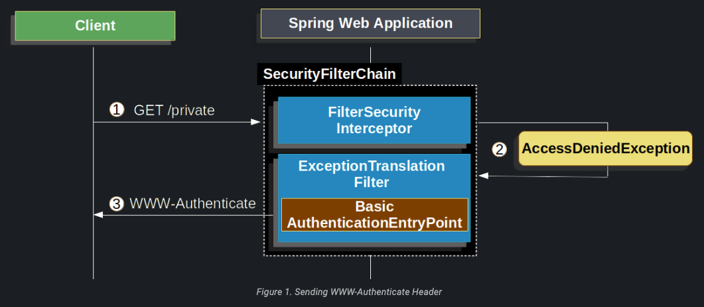

SpringSecurity HttpServletRequest üzerinden kullanıcı adı ve şifre okumak için aşağıdaki mekanizmaları kullanır;

- Form
- Basic
- Digest

# Form Login

SpringSecurity bir HTML formu aracılığıyla sağlanan username/password desteğini sağlar.


* 1 - Client ilk olarak yetkili olmadığı kaynağa (/private) not authorized şekilde istekte bulunur

* 2 - SpringSecurity'nin AuthorizationFilter'ı unathenticated bir request'in geldiğini AccessDeniedException fırlatarak
reddedildiğini belirtir.

* 3 - ExceptionTranslationFilter, yapılandırılmış AuthenticationEntryPoint'e yönlendirme yaparak kullanıcıya giriş
sayfasına gitmesi gerektiğini söyler. AuthenticationEntryPoint, kimlik doğrulama başlatıldığında kullanıcıyı
yönlendiren bir bileşendir. Bu genellikle bir login sayfasıdır. Çoğu durumda AuthenticationEntryPoint,
LoginUrlAuthenticationEntry point'in bir örneğidir

**ExceptionTranslationFilter**, Spring Security FilterChain'in de önemli bir konumda bulunur ve diğer 
SecurityFilter'lardan önce çalışır. Filtre, gelen istekleri işler ve güvenlik kontrolleri sırasında ortaya çıkabilecek 
istisnaları ele alır. Bir exception meydana geldiğinde, ExceptionTranslationFilter exception'ı ele alır ve iki önemli 
görevi yerine getirir:

1 - Kimlik doğrulama başlatma: Eğer bir kullanıcı kimlik doğrulaması gerektiren bir kaynağa erişmeye çalışıyorsa, 
ExceptionTranslationFilter, kimlik doğrulama başlatma işlemini başlatır. Bu genellikle kullanıcının oturum açma 
sayfasına yönlendirilmesini içerir. Bu işlem, AuthenticationEntryPoint aracılığıyla gerçekleştirilir.

2 - Erişim reddetme: Eğer bir kullanıcı yetkilendirme gerektiren bir kaynağa erişmeye çalışıyorsa, ancak gerekli 
yetkilere sahip değilse, ExceptionTranslationFilter erişimi reddeder. Bu durumda, kullanıcıya yetkisiz erişim hatası 
bildirimi yapılır.

Bu işlemler, ExceptionTranslationFilter'ın handleSpringSecurityException() yöntemi aracılığıyla gerçekleştirilir. 
Bu yöntem, uygun şekilde exception'ları ele alır ve ilgili işlemleri başlatır.

**LoginUrlAuthenticationEntry** :  Bu sınıf, kimlik doğrulama gerektiren bir kaynağa erişmeye çalışan bir kullanıcının 
yönlendirileceği giriş sayfasının URL'sini belirlemek için kullanılır. LoginUrlAuthenticationEntryPoint, yapılandırma 
sırasında bir giriş sayfası URL'si alır. Eğer kimlik doğrulaması gerektiren bir kaynağa erişmeye çalışan bir kullanıcı 
bulunursa, AuthenticationEntryPoint'in commence() methodu çağrılır. Bu yöntem, kullanıcıyı giriş sayfasına yönlendiren 
bir işlem gerçekleştirir.

### LoginUrlAuthenticationEntry Example

```
@Configuration
@EnableWebSecurity
public class SecurityConfig extends WebSecurityConfigurerAdapter {

    @Override
    protected void configure(HttpSecurity http) throws Exception {
        http
            .authorizeRequests()
                .antMatchers("/admin/**").hasRole("ADMIN")
                .anyRequest().authenticated()
                .and()
            .formLogin()
                .loginPage("/login") // Giriş sayfasının URL'si
                .and()
            .exceptionHandling()
                .authenticationEntryPoint(loginUrlAuthenticationEntryPoint());
    }

    @Bean
    public LoginUrlAuthenticationEntryPoint loginUrlAuthenticationEntryPoint() {
        return new LoginUrlAuthenticationEntryPoint("/login");
    }
}

```

Yukarıdaki örnekte, "/admin/**" yoluna erişmek için "ADMIN" rolü gereklidir. Kimlik doğrulaması gerektiren tüm diğer 
yollar için kullanıcı girişi sayfası "/login" olarak belirlenmiştir. LoginUrlAuthenticationEntryPoint, kullanıcı bu 
yollara erişmeye çalıştığında giriş sayfasına yönlendirecektir.

* 4 - Browser yönlendirildiği login sayfasını ister
* 5 - Login page olusturulmalıdır

Kullanıcı adı ve parola gönderildiğinde UsernamePasswordAutheticationFilter username ve password'un kimliğini doğrular
UsernamePasswordAutheticationFilter, AbstractAuthenticationProcessingFilter'i extends eder.


Yukarıda ki şekil SecurityFilterChain diagramımızı oluşturur

1 - Kullanıcı kullanıcı adı ve parolasını gönderdiğinde, UsernamePasswordAuthenticationFilter, Spring Security'nin bir 
parçası olarak, kimlik doğrulama isteğini işler. Bu filtre, kullanıcı adını ve parolayı HttpServletRequest örneğinden 
çıkararak UsernamePasswordAuthenticationToken nesnesini oluşturur.

2 - UsernamePasswordAuthenticationToken, kimlik doğrulama işlemi için AuthenticationManager örneğine iletilir. 
AuthenticationManager, gerçek kimlik doğrulama sürecini gerçekleştirmekten sorumludur. AuthenticationManager 
arabiriminde yalnızca tek bir method yer alır: authenticate(). Bu yöntem, Authentication türünde bir nesne alır ve 
AuthenticationException tipinde bir exception fırlatır. UsernamePasswordAuthenticationToken, Authentication 
interface'ini uyguladığı için AuthenticationManager'ın authenticate() methoduna bu token iletilir. 
AuthenticationManager, bu tokenı kullanarak kullanıcının kimlik doğrulamasını gerçekleştirir. Kimlik doğrulama süreci, 
kullanıcının sağladığı kimlik bilgilerinin geçerli olup olmadığını doğrulamak için çeşitli kontrolleri içerebilir. 
Bu kontroller, kullanıcı adı ve parolanın veritabanındaki kayıtlarla eşleşmesi, hesabın etkin olup olmaması gibi 
durumları kontrol etmek olabilir. AuthenticationManager, kimlik doğrulama işlemi sonucunda Authentication nesnesini 
döndürür. Bu nesne, kimlik doğrulamasının başarılı olduğunu ve kullanıcının yetkilerini ve diğer bilgilerini içerir. 
Eğer kimlik doğrulaması başarısız olursa, AuthenticationException fırlatılır.

3 - "Failure." ifadesi, kimlik doğrulama işleminin başarısız olduğunu veya istenen doğrulama kriterlerinin 
sağlanmadığını ifade eder. Bu durumda, kullanıcının giriş yapmasına izin verilmez ve uygun adımlar atılması gerekebilir
Failure olduğunda neler olur?

* SecurityContextHolder temizlenir
* RememberMeServices.loginFail() çağırılır. RememberMe yapılandırılmadı ise bu işlem yapılmaz
* AuthenticationFailureHandler çağırılır

**AuthenticationFailureHandler** : Kimlik doğrulama işlemi başarısız olduğunda çağrılan belirli bir yöntem olan 
onAuthenticationFailure() yöntemini tanımlar. AuthenticationFailureHandler arabirimi genellikle kimlik doğrulama 
başarısız olduğunda ne yapılacağını tanımlamak için uygulanır. Bu davranış, kullanıcıya gösterilecek hata mesajı, 
yönlendirme veya özel işlemler gibi çeşitli şekillerde özelleştirilebilir. onAuthenticationFailure() methodu, 
HttpServletRequest ve HttpServletResponse nesnelerini ve AuthenticationException exception'larını parametre olarak alır 
Bu yöntem, kimlik doğrulama işlemi başarısız olduğunda çağrılır ve belirtilen işlemleri gerçekleştirir. Bu işlemler 
arasında hata mesajlarının ayarlanması, kullanıcı yönlendirmelerinin yapılması, loglara kayıt eklenmesi veya başka 
özel işlemler bulunabilir.

4 - "Success." ifadesi, kimlik doğrulama işleminin başarılı olduğunu ve istenen doğrulama kriterlerinin sağlandığını 
ifade eder. Bu durumda, kullanıcıya erişim veya belirli bir yetki verilebilir ve uygun adımlar atılabilir.

1 - Bir kullanıcı başarılı bir şekilde kimlik doğrulandığında, SessionAuthenticationStrategy, session tabanlı kimlik 
doğrulama stratejilerini uygulamak ve ilgili oturum ile ilgili işlemleri gerçekleştirmek üzere bildirilir. Bu işlemler 
oturum yönetimi, oturum süresinin ayarlanması, oturum süresinin uzatılması veya oturumun sonlandırılması gibi oturum 
tabanlı işlemleri içerebilir. Örneğin, session tabanlı kimlik doğrulama stratejisi, kullanıcının kimlik doğrulaması 
başarılı olduğunda yeni bir oturum oluşturabilir veya mevcut oturumu güncelleyebilir. Ayrıca, oturumun süresini 
belirleyebilir veya oturumun sonlandırılması gerektiğinde oturumu sonlandırabilir.

2 - "The Authentication is set on the SecurityContextHolder." ifadesi, kimlik doğrulama işlemi başarılı olduğunda 
Authentication nesnesinin SecurityContextHolder üzerine ayarlandığını ifade eder. SecurityContextHolder, iş parçacığına 
bağlı bir yaklaşımı izler, yani mevcut iş parçacığıyla ilişkili güvenlik bağlamını depolar. Bu, diğer uygulama 
bileşenlerinin, örneğin denetleyicilerin veya servislerin, güvenlik bağlamına erişmesine olanak tanır ve güvenlikle 
ilgili bilgileri almasını sağlar.

**SecurityContextPersistenceFilter** : SecurityContextPersistenceFilter, Spring Security tarafından sağlanan bir 
filtredir ve SecurityContext'in birden fazla request boyunca kalıcı olarak yönetilmesinden sorumludur. Bu filtre, 
kullanıcının oturumunun ömrü boyunca SecurityContext'i yükler ve kaydeder.

SecurityContextPersistenceFilter'ın temel görevleri şunlardır:

* Request başladığında: SecurityContextPersistenceFilter, mevcut request'in SecurityContext'i taşıyıp taşımadığını 
kontrol eder. Eğer SecurityContext taşınmışsa, geçerli isteğin SecurityContext'ini ayarlar.
* Request tamamlandığında: SecurityContextPersistenceFilter, güncellenmiş SecurityContext'i oturumun kalıcı depolama 
alanına kaydeder. Bu, kullanıcının kimlik doğrulama durumunu ve yetkilerini diğer request'ler arasında korumak 
için önemlidir.

SecurityContextPersistenceFilter, oturum tabanlı kimlik doğrulama sürecinde önemli bir rol oynar. Kullanıcının kimlik 
doğrulaması başarılı olduğunda, SecurityContext içindeki Authentication nesnesi oturumun başında oluşturulur ve bu 
filtre, bu nesnenin diğer istekler arasında korunmasını sağlar.

3 - RememberMeServices.loginSuccess çağırılır. RememberMeServices yapilandırılmadıysa bu işlem yapılmaz

RememberMeServices.loginSuccess() method, Spring Security tarafından sağlanan Remember Me özelliğiyle ilgili 
özelleştirme yapmak için kullanılan bir yöntemdir. Bu yöntem, Remember Me özelliği etkinleştirilmiş bir kullanıcının 
başarılı bir şekilde giriş yapması durumunda çağrılır ve Remember Me kimlik doğrulamasına özgü mantığı işler.

loginSuccess() yöntemi, genellikle şu işlemleri içerir:

* Remember Me işaretlemesi: Kullanıcı başarılı bir şekilde giriş yaptığında, Remember Me hizmeti bu durumu 
işaretleyebilir. Bu işaretleme, kullanıcının tarayıcısına bir hatırlatıcı (remember-me cookie veya benzeri bir 
mekanizma) yerleştirilmesiyle gerçekleştirilebilir.

* Remember Me kimlik doğrulamasının kaydedilmesi: Kullanıcı başarılı bir şekilde Remember Me işaretlemesi yapıldığında, 
Remember Me kimlik doğrulaması verileri kaydedilebilir. Bu, kullanıcının oturum açmadan sonraki erişimlerinde kimlik 
doğrulamasının otomatik olarak gerçekleştirilmesini sağlar.

4 - ApplicationEventPublisher bir InteractiveAuthenticationSuccessEvent yayınlar.

**ApplicationEventPublisher** - ApplicationEventPublisher, uygulama bileşenlerinin olayları yayınlamasına olanak tanır 
ve bu olayları dinleyen diğer bileşenlerin bu olaylara tepki vermesini sağlar. Olay yayınlandığında, 
ApplicationEventPublisher, olayı dinlemek için kaydedilen tüm dinleyicilere (event listener) olayı bildirir. Örneğin, 
bir kullanıcının kaydolma işlemi tamamlandığında, bir KaydolmaOlayı (SignUpEvent) yayınlanabilir. Bu olayı dinleyen 
diğer bileşenler, kaydolma işlemiyle ilgili ek işlemler gerçekleştirebilir, örneğin kullanıcıya hoş geldin e-postası 
göndermek veya kaydolma işlemine ilişkin istatistikleri güncellemek gibi.

**InteractiveAuthenticationSuccessEvent** - Spring Security tarafından yayınlanan bir olaydır. Bu olay, kullanıcının 
etkileşimli (interactive) kimlik doğrulama işlemi sonucunda başarılı bir şekilde oturum açması durumunda tetiklenir.
InteractiveAuthenticationSuccessEvent, AbstractAuthenticationEvent sınıfından türetilir ve kimlik doğrulama başarılı 
olduğunda bu olay yayınlanır. Bu olay, kullanıcının oturum açma işlemi tamamlandığında ve kimlik doğrulama başarılı 
olduğunda gerçekleşir. Örneğin, bir kullanıcı adı ve parola ile giriş yaptığında veya sosyal medya hesabıyla kimlik 
doğrulaması gerçekleştirdiğinde bu olay yayınlanır. Bu olayı dinleyen diğer bileşenler, kullanıcının oturum açma 
işlemi sonrasında belirli bir işlemi gerçekleştirebilir. Örneğin, hoş geldin mesajı göstermek, kullanıcının profilini 
güncellemek, oturum süresini belirlemek veya oturumla ilişkili diğer işlemleri gerçekleştirmek gibi.

5 - AuthenticationSuccessHandler çağrılır

Bu ifade, genellikle bir SimpleUrlAuthenticationSuccessHandler sınıfının kullanıldığını ve bu sınıfın, kullanıcının 
başarılı bir şekilde giriş yaptıktan sonra yönlendirileceği hedef URL'yi belirlediğini ifade eder. Normalde, kullanıcı 
giriş yapmadan önce erişmeye çalıştığı bir sayfaya erişim izni olmadığında, ExceptionTranslationFilter tarafından 
yönlendirme yapılır ve kullanıcı giriş sayfasına yönlendirilir. Kullanıcı giriş yaptıktan sonra, 
SimpleUrlAuthenticationSuccessHandler sınıfı, kullanıcının yönlendirileceği hedef URL'yi belirler. 
SimpleUrlAuthenticationSuccessHandler, genellikle bir önceki sayfaya veya belirli bir varsayılan sayfaya yönlendirme 
yapar. Bu, kullanıcının giriş yapmadan önce erişmeye çalıştığı sayfaya geri dönmesini veya belirli bir başlangıç 
sayfasına yönlendirilmesini sağlar. Bu yaklaşım, kullanıcı deneyimini geliştirmek ve kullanıcının oturum açtıktan sonra 
kaldığı yerden devam etmesini sağlamak için yaygın olarak kullanılır. ExceptionTranslationFilter, giriş yapmadan 
erişilmeye çalışılan sayfayı hafızada tutar ve giriş yapıldıktan sonra bu sayfaya yönlendirme yapılmasını sağlayarak 
kullanıcının işlemlerini kesintiye uğratmadan devam etmesini sağlar.

**SimpleUrlAuthenticationSuccessHandler** - Spring Security tarafından sağlanan ve AuthenticationSuccessHandler 
arabirimini uygulayan bir sınıftır. Başarılı bir kimlik doğrulama işleminden sonra kullanıcının yönlendirilmesinden 
sorumludur. Bu sınıfın temel işlevi, kullanıcının başarılı bir şekilde kimlik doğrulamasını tamamlamasının ardından 
yönlendirme işlemini gerçekleştirmektir. Yönlendirme, genellikle belirli bir URL'ye veya bir önceki isteğe (referrer) 
yapılır. SimpleUrlAuthenticationSuccessHandler, yönlendirme işlemini basit bir URL tabanlı şekilde gerçekleştirir. 
Genellikle setDefaultTargetUrl() yöntemi aracılığıyla varsayılan hedef URL'sini belirleyebilir veya 
setTargetUrlParameter() yöntemiyle hedef URL'sini dinamik olarak alabilir.

Spring Security varsayılan olarak form tabanlı girişi etkin olarak sunar. Ancak, herhangi bir servlet tabanlı 
yapılandırma sağlandığında, form tabanlı girişin açıkça yapılandırılması gerektiğini ifade eder.

```
@Configuration
@EnableWebSecurity
public class SecurityConfig extends WebSecurityConfigurerAdapter {

    @Override
    protected void configure(HttpSecurity http) throws Exception {
        http
            .authorizeRequests()
                .anyRequest().authenticated()
                .and()
            .formLogin()
                .and()
            .csrf().disable(); // CSRF korumasını devre dışı bırakmak için
    }

    @Autowired
    public void configureGlobal(AuthenticationManagerBuilder auth) throws Exception {
        auth
            .inMemoryAuthentication()
            .withUser("user")
            .password("{noop}password")
            .roles("USER");
    }
}

```

Bu yapılandırma örneği, form tabanlı kimlik doğrulama yapısını açıkça belirtir. configure(HttpSecurity http) 
yöntemi üzerinden yapılandırma yapılırken, .formLogin() metodu kullanılarak form tabanlı giriş ayarları yapılandırılır.
Ayrıca, configureGlobal(AuthenticationManagerBuilder auth) yöntemi üzerinden kullanıcı kimlik doğrulama yapılandırması
yapılır. Bu örnekte, **inMemoryAuthentication()** kullanılarak bellekte kullanıcı bilgileri tanımlanır. Bu minimal 
yapılandırma örneği, Spring Security'yi form tabanlı kimlik doğrulama için yapılandırmak için temel bir başlangıç 
noktası sağlar. Diğer özel gereksinimlere göre bu yapılandırma örneği değiştirilebilir veya genişletilebilir.

```
@Configuration
@EnableWebSecurity
public class DefaultSecurityConfig {
    public SecurityFilterChain filterChain(HttpSecurity http) throws Exception {
        http
                .formLogin(form ->
                        form.loginPage("/login")
                                .permitAll()
                );

        return http.build();
    }
}

```
Yukarıda ki örnekte SecurityFilterChain'de login sayfası belirtildiği için sayfayı oluşturmak bizim sorumluluğumuzdadır
Aşağıda ki Thymeleaf template'i /login sayfasıyla uyumlu bir HTML oturum açma formu üretmektedir.

resources/templates/login.html şeklinde create edilir

```
<!DOCTYPE html>
<html xmlns="http://www.w3.org/1999/xhtml" xmlns:th="https://www.thymeleaf.org">
	<head>
		<title>Please Log In</title>
	</head>
	<body>
		<h1>Please Log In</h1>
		<div th:if="${param.error}">
			Invalid username and password.</div>
		<div th:if="${param.logout}">
			You have been logged out.</div>
		<form th:action="@{/login}" method="post">
			<div>
			<input type="text" name="username" placeholder="Username"/>
			</div>
			<div>
			<input type="password" name="password" placeholder="Password"/>
			</div>
			<input type="submit" value="Log in" />
		</form>
	</body>
</html>

```
* "The form should perform a post to /login" ifadesi, bir web sayfasında bulunan bir formun, HTTP POST yöntemini 
kullanarak "/login" endpoint'ine veri göndermesi gerektiğini ifade eder. Web geliştirmede, formlar kullanıcıdan veri 
almak veya belirli bir işlemi gerçekleştirmek için kullanılır. Bir formun, kullanıcının girdiği verileri belirli bir 
hedefe iletmek için belirli bir HTTP yöntemi kullanması gerekir. "POST" yöntemi, bir formun verileri belirtilen 
hedefe göndermek için kullanılan yöntemdir.
* Form'un, Thymeleaf tarafından otomatik olarak dahil edilen CSRF Token'i içermesi gerekmektedir. 
Cross-Site Request Forgery (CSRF) saldırılarını önlemek için formun bir CSRF token içermesi gerektiğini ve Thymeleaf'in 
bu tokeni otomatik olarak eklediğini bilmeliyiz. Bir CSRF tokeni, kullanıcının oturum açtığı ve sunucuyla iletişimde 
bulunduğu sürece geçerli olan rastgele bir değerdir. Thymeleaf, bir Java tabanlı template motoru olduğundan, sunucu 
tarafında çalışır ve dinamik olarak HTML belgeleri oluşturur. Thymeleaf, form oluştururken otomatik olarak 
CSRF tokenini ekleyerek güvenlik önlemlerine katkıda bulunur. Bu, form gönderildiğinde sunucunun, gelen isteği 
doğrulayabilmesi ve CSRF saldırılarını önleyebilmesi için gereklidir.
* Form gönderildiğinde, kullanıcı adının "username" adında bir parametre olarak belirtilmesi gerekmektedir. 
Örneğin, formda bir kullanıcı adı alanı (username input field) bulunabilir ve kullanıcı bir kullanıcı adı girerek formu 
gönderdiğinde, bu kullanıcı adı "username" parametresiyle sunucuya gönderilir.
* Form gönderildiğinde, girilen şifrenin "password" adında bir parametre olarak belirtilmesi gerekmektedir. 
Örneğin, formda bir şifre alanı (password input field) bulunabilir ve kullanıcı bir şifre girdikten sonra formu 
gönderdiğinde, bu şifre "password" parametresiyle sunucuya gönderilir.
* Eğer error adında bir HTTP parametresi bulunursa, bu kullanıcının geçerli bir kullanıcı adı veya şifre sağlamadığını 
gösterir.
* Eğer logout adında bir HTTP parametresi bulunursa, bu kullanıcının başarıyla oturumu kapattığını gösterir.

# Basic Authentication

Bu bölüm, Spring Security içinde HTTP Basic Authentication'ın nasıl çalıştığını açıklar. İlk olarak, kimlik doğrulaması 
yapılmamış bir client'a sunucu tarafından "WWW-Authenticate" header'i gönderilir.



1 - lk olarak, bir kullanıcı unauthenticated bir şekilde /private kaynağına kimlik doğrulaması yapılmamış bir 
request gönderir. Bu durumda, sunucu genellikle bir "401 Unauthorized" response'u ile isteği reddeder ve kullanıcıya 
yetkisiz olduğunu bildirir.

2 - Spring Security'nin AuthorizationFilter'ı, kimliği doğrulanmamış isteğin bir AccessDeniedException fırlatarak 
Reddedildiğini belirtir.

3 - Kullanıcı kimlik doğrulaması yapılmadığından dolayı, ExceptionTranslationFilter, StartAuthentication işlemini 
başlatır. Yapılandırılmış AuthenticationEntryPoint, genellikle BasicAuthenticationEntryPoint sınıfından bir örnektir 
ve bir WWW-Authenticate başlığı gönderir. HTTP Basic Authentication kullanılıyorsa, bu başlık genellikle "Basic realm" 
şeklinde gönderilir.RequestCache genellikle NullRequestCache olarak yapılandırılmıştır ve istemci, başlangıçta talep 
ettiği istekleri yeniden yayınlayabildiği için isteği kaydetmez.

Client WWW-Authenticate header'ini aldığında, bir username ve password ile yeniden denemesi gerektiğini bilir. 
Aşağıda ki resim username ve password flow şemasını göstermektedir.


1 - Kullanıcı kullanıcı adını ve şifresini gönderdiğinde, BasicAuthenticationFilter HttpServletRequest üzerinden 
kullanıcı adı ve şifreyi çıkararak bir UsernamePasswordAuthenticationToken oluşturur. Bu, Authentication türündeki 
bir nesnedir. UsernamePasswordAuthenticationToken, Spring Security tarafından kullanılan ve kullanıcının kimlik 
doğrulamasını temsil eden bir türdür. Bu nesne, kimlik doğrulama işlemi sırasında kullanıcı adı ve şifre bilgilerini 
tutar. Oluşturulan bu token, kimlik doğrulama sürecinin bir parçası olarak kullanılır ve ilgili kullanıcıyı temsil eder

2 - Daha sonra, kullanıcının kimlik bilgilerini içeren UsernamePasswordAuthenticationToken, kimlik doğrulaması için 
AuthenticationManager'a iletilir. AuthenticationManager, sağlanan kimlik bilgilerine göre kullanıcının kimliğini 
doğrulamaktan sorumludur. AuthenticationManager'ın nasıl göründüğü, kullanıcı bilgilerinin nasıl saklandığına bağlı 
olarak değişebilir. Tipik bir senaryoda, AuthenticationManager, bir kullanıcı deposuyla veya kimlik doğrulama hizmeti 
sunan başka bir bileşenle etkileşimde bulunabilir. Örneğin, kullanıcı bilgileri bir veritabanında depolanıyorsa, 
AuthenticationManager, veritabanından kullanıcıyı bulup kimlik doğrulamasını gerçekleştirebilir.

3 - Kimlik doğrulama başarısız olursa, bu, sağlanan kimlik bilgilerinin geçersiz veya beklenen değerlerle eşleşmediği 
anlamına gelir. Bu durum, kullanıcı adı veya şifrenin yanlış olması veya kullanıcı hesabının kilitli, süresi dolmuş
veya devre dışı olması gibi durumlarda meydana gelebilir. Bu durumda neler olur;

* SecurityContextHolder temizlenir
* RememberMeServices.loginFail çağırılır. RememberMe yapılandırılmadıysa bu işlem yapılmaz
* Kimlik doğrulama başarısız olduğunda, AuthenticationEntryPoint, WWW-Authenticate header'inin tekrar gönderilmesini 
tetiklemek için çağrılır. AuthenticationEntryPoint arayüzü, bu davranışı özelleştirmek için Spring Security'de 
kullanılır.

4 - Kimlik doğrulama işlemi başarılı olduğunda, sağlanan kimlik bilgilerinin geçerli ve beklenen değerlerle eşleştiği 
anlamına gelir. Bu durum, kullanıcının başarılı bir şekilde kimlik doğrulandığı ve kimliğinin doğrulandığı anlamına 
gelir.

* Kimlik doğrulama, SecurityContextHolder'da ayarlanır
* RememberMeServices.loginSuccess çağırılır
* BasicAuthenticationFilter, geri kalan uygulama mantığıyla devam etmek için FilterChain.doFilter(request, response) 
yöntemini çağırır.

Spring Security'nin HTTP Temel Kimlik Doğrulaması desteği varsayılan olarak etkindir. Ancak, herhangi bir servlet 
tabanlı yapılandırma sağlanır sağlanmaz, HTTP Basic'in açıkça sağlanması gerekir.

# Digest Authentication

DigestAuthenticationFilter, Spring Security tarafından sunulan bir filtre olup Digest Kimlik Doğrulama protokolünü 
uygular. Digest Kimlik Doğrulama, istemci ve sunucu arasında kimlik doğrulama sürecini gerçekleştiren bir mekanizmadır. 
Bu mekanizma, kullanıcı adı ve şifrenin sunucu tarafından depolanan bir özete (digest) dayalı olarak doğrulanmasını 
sağlar.

DigestAuthentication modern uygulamalarda kullanmamalısınız, çünkü güvenli sayılmaz. En bariz sorun, şifrelerinizi 
düz metin veya şifreli veya MD5 formatında saklamanız gerektiğidir. Bu depolama biçimlerinin tümü güvensiz kabul edilir.
Bunun yerine, DigestAuthentication tarafından desteklenmeyen tek yönlü uyarlanabilir parola karması 
(bCrypt, PBKDF2, SCrypt ve diğerleri) kullanarak kimlik bilgilerini saklamanız gerekir.DigestAuthentication, 
özellikle kimlik bilgilerinin kablo üzerinden hiçbir zaman açık metin olarak gönderilmemesini sağlayarak, 
Temel kimlik doğrulamanın birçok zayıflığını çözmeye çalışır.