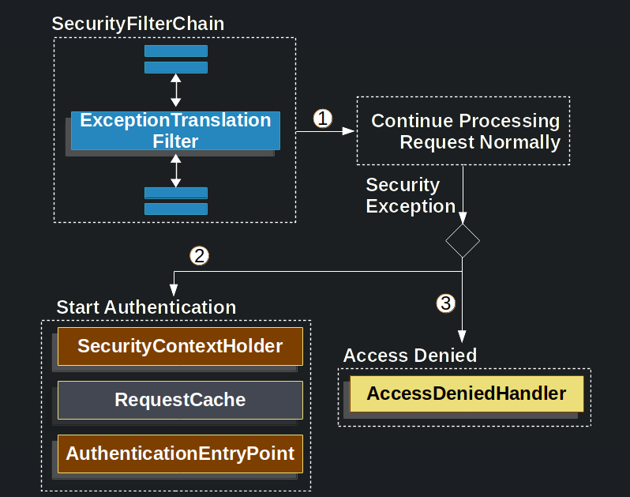

# Spring Security Architecture

Bir http Request'inin tipik olarak nasil handle edildigi asagida gosterilmistir;

Client application'a bir request gonderir ve container istek uri'sine gore request'i islemesi gereken Filter orneklerini
ve Servlet iceren bir FilterChain olusturur.

Spring MVC uygulamasinda Servlet DispatcherServlet'in instance'i dir

Bir servlet, tek bir HttpServletRequest ve HttpServletResponse isleyebilir

## DelegatingFilterProxy

Servlet container kendi standartlarini kullanarak Filter instance'larinin register olmasina izin verir, ancak Spring-
Defined Bean'lerinin farkinda degildir

Spring Servlet container'inin lifecycle'i ile Spring'in ApplicationContext'i arasinda bir kopru kurmaya izin veren,
DelegatingFilterProxy adli bir Filtre implementasyonu saglar

DelegationFilterProxy ApplicationContext'den Bean Filter0'i arar ve ardindan Bean Filter0'i cagirir

Spring genellikle Spring Beans'i yüklemek için bir ContextLoaderListener kullanır ve bu işlem Filter örneklerinin
kaydedilmesi gerekene kadar yapılmaz.

## FilterChainProxy

Spring Security'nin Servlet desteği, FilterChainProxy içinde bulunur. FilterChainProxy, Spring Security tarafından
sağlanan ve SecurityFilterChain aracılığıyla birçok Filtre örneğine yetki vermeye izin veren özel bir Filtredir.

FilterChainProxy bir Bean olduğundan, tipik olarak bir DelegatingFilterProxy ile wrap edilir (sarmalanır)

## SecurityFilterChain

SecurityFilterChain FilterChainProxy tarafından geçerli istek için hangi Spring Security Filter örneklerinin çağrılması
gerektiğini belirlemek için kullanılır.

SecurityFilterChain icerisinde ki SecurityFilter'lar tipik olarak @Bean'dir. DelegatingFilterProxy yerine
FilterChainProxy'e register edilirler. FilterChainProxy dogrudan servlet container'ina ve DelegatingFilterProxy'ye
register olabilmek icin bir dizi avantaj saglar. İlk olarak SpringSecurity'nin tüm servlet desteği için bir
başlangıç noktası sağlar. Bu nedenle SpringSecurity'nin Servlet desteği ile ilgili sorunları gidermeye çalışırsak,
FilterChainProxy'de bir debug point eklemek hatanın çözümü için en iyi noktadır.İkincisi FilterChainProxy Spring
Security'nin merkezinde oldugundan, isteğe bağlı olarak görülmeyen görevleride gerçekleyebilir.

Örneğin memory leaks'leri önlemek için SecurityContext'i temizler. Uygulamayı belirli saldırı türlerinden korumak
için SpringSecurity'nin HttpFirewall özelliğini uygular.

Ek olarak bir SecurityFilterChain'in ne zaman çağırılması gerektiğini belirlemede daha fazla esneklik sağlar. Bir
Servlet Container'ın da Filtre instance'lari yanlızca URL'ye göre çağırılır.

Ancak, FilterChainProxy, RequestMatcher arabirimini kullanarak HttpServletRequest'deki her hangi bir şeye dayalı
çağrıyı belirleyebilir.

Yukarıda ki örnekte görüldüğü üzere FilterChainProxy hangi SecurityFilterChain'in kullanılacağına karar verir
Yanlızca eşleşen ilk SecurityFilterChain çağırılır

/api/messages URL'si istenirse once /api/ SecurityFilterChain0 modeliyle eşlenir, SecurityFilterChainN ile de
eşleşmesine rağmen yanlızca SecurityFilterChain0 çağırılır

Bir /message URL'si istenirse, /api/ SecurityFilterChain0 modeliyle eşleşmez. Bu nedenle FilterChainProxy her bir
SecurityFilterChain'i denemeye devam eder. Başka hiçbir SecurityFilterChain örneğinin eşleşmediğini varsayarsak,
SecurityFilterChainN çağırılır. SecurityFilterChain0'in yapılandırılmış yanlızca 3 SecurityFilter'a sahip olduğuna
dikkat edin. SecurityFilterChainN'de 4 adet yapılandırılmış SecurityFilter vardır. Her SecurityFilterChain'in

unique olabileceğini ve ayrı olarak yapılandırılabileceğini not etmek önemlidir.

Aslında application Spring Security'nin belirli istekleri yoksaymasını istiyorsa bir SecurityFilterChain sıfır
SecurityFilter instance'larına sahip olabilir

## Security Filters

SecurityFilter'lar SecurityFilterChain API ile FilterChainProxy'e eklenirler. Filtre instance'larının sırası önemlidir.
Spring Security'nin Filtre instance'larının sırasını bilmek genellikle gerekli değildir. Ancak sıralamayı bilmenin
faydalı olduğu zamanlar da vardır.Spring Security Filtre'lerinin sıralaması aşağıda ki şekildedir.

- ForceEagerSessionCreationFilter
- ChannelProcessingFilter
- WebAsyncManagerIntegrationFilter
- SecurityContextPersistenceFilter
- HeaderWriterFilter
- CorsFilter
- CsrfFilter
- LogoutFilter
- OAuth2AuthorizationRequestRedirectFilter
- Saml2WebSsoAuthenticationRequestFilter
- X509AuthenticationFilter
- AbstractPreAuthenticatedProcessingFilter
- CasAuthenticationFilter
- OAuth2LoginAuthenticationFilter
- Saml2WebSsoAuthenticationFilter
- UsernamePasswordAuthenticationFilter
- DefaultLoginPageGeneratingFilter
- DefaultLogoutPageGeneratingFilter
- ConcurrentSessionFilter
- DigestAuthenticationFilter
- BearerTokenAuthenticationFilter
- BasicAuthenticationFilter
- RequestCacheAwareFilter
- SecurityContextHolderAwareRequestFilter
- JaasApiIntegrationFilter
- RememberMeAuthenticationFilter
- AnonymousAuthenticationFilter
- OAuth2AuthorizationCodeGrantFilter
- SessionManagementFilter
- ExceptionTranslationFilter
- AuthorizationFilter
- SwitchUserFilter

## Handling Security Exceptions

ExceptionTranslationFilter, AccessDeniedException ve AuthenticationException'ın HTTP response'larına çevirilmesine izin
verir

ExceptionTranslationFilter, Security Filters'lardan biri olarak FilterChainProxy'e eklenir.

1 - ilk olarak ExceptionTranslationFilter uygulamanın geri kalanını çağırmak için FilterChain'in 
doFilter(request,response) methodunu çağırır

2 - Kullanıcının kimliği doğrulanmamışsa veya bu bir AuthenticationException ise Authentication'i başlatır

- SecurityContextHolder temizlenir
- HttpServletRequest, kimlik doğrulama başarılı olduğunda orjinal isteği yeniden yayınlamak için kullanabilecek
  şekilde kaydeder
- AuthenticationEntryPoint client'dan kimlik bilgilerini istemek için kullanılır. Örneğin bir oturum açma sayfasına
  yönlendirebilir yada WWW-Authenticate header'i gönderebilir

3 - Aksi takdirde bir AccessDeniedException ise Erişim Reddedildi. AccessDeniedHandler, reddelilen erişimi
işlemek için çağırılır

- Eğer uygulama bir AccessDeniedException yada AuthenticationException fırlatmazsa ExceptionTranslationFilter
  hiçbir şey yapmaz

1 - FilterChain.doFilter(request,response) methodunu çağırmak uygulamanın geri kalanını çağırmakla eşdeğerdir. Bu,
uygulamanın başka bir parçası (FilterSecurityInterceptor veya method security) bir AuthenticationException veya
AccessDeniedException fırlatırsa, burada yakalanıp işlendiği anlamına gelir

2 - Kullanıcının kimliği doğrulanmamışsa veya bu bir AuthenticationException ise Authentication() başlatılır

3 - Aksi takdirde Access Denied

## RequestCache

HttpServletRequest RequestCache'e kaydedilir. Kullanıcı başarılı bir şekilde kimlik doğrulaması yaptığında,
orjinal isteği yeniden yayınlamak için RequestCache kullanılır. RequestCacheAwareFilter,HttpServletRequest'i kaydetmek 
için RequestCache'i kullanan şeydir.

Varsayılan olarak bir HttpSessionRequestCache kullanılır. Aşağıda ki code requestCache'in customize olarak nasıl
implemente edildiğini göstermektedir.

Bir linke tiklandiginda login degilsen seni ilk login sayfasina atar sonra sifre girersin kaldigin yerden devam
edersin. Burada requestCache zaten yaptığın requesti devam ettirmek icin kullanilir.

### Prevent the request from being saved

Request'in kaydedilmesini engelleme

Kullanicinin request'i unauthenticated ise sessionda saklamamak icin bir kac neden vardir. Kullanıcının 
tarayıcısında ki storage'i bosaltmak isteyebilirsiniz, ya da bir database'de depolamak isteyebilirsiniz. Veya kullaniyi
giris yapmadan once ziyaret etmeye calistigi sayfa yerine her zaman ana sayfaya yonlendirmek istediginiz zaman bu 
ozelligi kapatmak isteyebilirsiniz.

Bunu yapabilmek icin **NullRequestCache** kullanabilirsiniz.

## RequestCacheAwareFilter

RequestCacheAwareFilter, HttpServletRequest'i kaydetmek icin RequestCache'i kullanir

